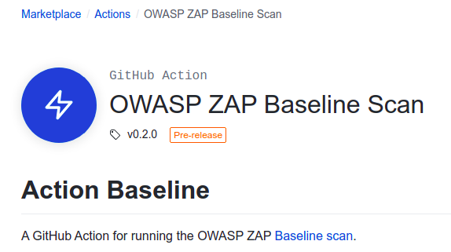

[](https://github.com/marketplace/actions/owasp-zap-baseline-scan)

With the increasing number of web application security breaches, it is essential to keep your web application secure at all times. 
Furthermore having security integrated into your CI/CD pipeline (DevSecOps) will become a lifesaver if you are actively 
developing the application. To cater to this need ZAP provides a baseline scan feature to find common security faults in 
a web application without doing any active attacks. 

[GitHub Actions](https://github.com/features/actions) makes it easier to automate how to scan and secure 
web applications at scale. Actions let you write scripts that are triggered based on certain events in your GitHub repo 
such as — creating a new issue, pushing a commit, or on a scheduled basis. This makes it convenient and easy to automate security testing and to run ZAP scans 
without involving any of your own infrastructures. The ZAP baseline action is available in the GitHub Marketplace under 
the actions/security category.

The [ZAP baseline-action](https://github.com/marketplace/actions/owasp-zap-baseline-scan) can be configured to periodically 
scan a publicly available web application. Also, ZAP baseline-action can be configured to public and private repositories as well.
Based on the scan results ZAP will maintain an active issue in GitHub repository. The action will update the issue if it identifies 
any new or resolved alerts and will close the issue if all the alerts have been resolved. A detailed report is attached to the 
[workflow run](https://github.com/zaproxy/zaproxy-website/actions/runs/74379241) to get more information regarding the identified alerts. 
The report is available in HTML and Markdown formats.

The following [issue](https://github.com/zaproxy/zaproxy-website/issues/93) shows how the GitHub Baseline Action scans the 
[https://www.zaproxy.org/](https://www.zaproxy.org/) website and notifies the users via opening an issue in the ZAP website repository. 
The issue will be created by the GitHub Actions bot and will list the alerts as issue comments.

[](https://github.com/zaproxy/zaproxy-website/issues/93#issue-597219582)


During the second scan we are ignoring few alerts via ZAP rules and the action bot updates the issue with the newly ignored/resolved alerts. 
[](https://github.com/zaproxy/zaproxy-website/issues/93#issuecomment-611490632)


During the last scan we are ignoring all the alerts, thus resulting in finding zero vulnerabilities. Based on the scan results 
the actions bot will close the ongoing open issue.
[](https://github.com/zaproxy/zaproxy-website/issues/93#issuecomment-611496321)

The ZAP baseline action scan runs the ZAP spider against the specified web application for (by default) 1 minute and 
then waits for the passive scanning to complete before reporting the results. This means that the script doesn't 
perform any actual ‘attacks’ and will run for a relatively short period of time (a few minutes at most).   

The following YAML config shows how to configure the action to scan a publicly accessible web application. 
In order to start scanning, create a file called `zap_scan.yaml` inside the `.github/workflows` 
folder in your repository. 

```yaml
on:
  schedule:
    # Runs every day At 01:00.
    - cron:  '0 1 * * *'

jobs:
  zap_scan:
    runs-on: ubuntu-latest
    name: Scan ZAP website
    steps:
      - name: ZAP Scan
        uses: zaproxy/action-baseline@v0.2.0
        with:
          token: ${{ secrets.GITHUB_TOKEN }}
          target: 'https://www.zaproxy.org/'
```

The ZAP baseline action can be also used to scan a locally built web application. The general idea is to build and serve your web 
application and make it available locally so ZAP can access the site via the localhost.

By default, baseline scan reports all alerts as WARNings but you can specify a config file that can change any rules to FAIL or IGNORE.
The following shows a sample rules file. Create the `rules.tsv` file inside your repository (example: inside `.zap` folder) and make sure to update the action 
file with the relative path to the rule file. Also, you can supply additional baseline [command-line options](https://github.com/zaproxy/zaproxy/wiki/ZAP-Baseline-Scan) 
via the `cmd_options` parameter. For example passing `-a` as a command-line argument will include the alpha passive scan rules as well.

```tsv
10035	IGNORE	(Strict-Transport-Security Header Not Set)
10098	IGNORE	(Cross-Domain Misconfiguration)
```

```yaml
jobs:
  zap_scan:
    runs-on: ubuntu-latest
    name: Scan ZAP website
    steps:
      - name: Checkout
        uses: actions/checkout@v2
        with:
          ref: master
      - name: ZAP Scan
        uses: zaproxy/action-baseline@v0.2.0
        with:
          token: ${{ secrets.GITHUB_TOKEN }}
          target: 'https://www.zaproxy.org/'
          rules_file_name: '.zap/rules.tsv'
          cmd_options: '-a'
```

Also, you can view the scan logs by navigating to the ZAP [scan job](https://github.com/zaproxy/zaproxy-website/runs/573792586?check_suite_focus=true).


We are excited to hear your thoughts and feedback for the new ZAP Baseline Action. Reach us through the [dev group](https://groups.google.com/group/zaproxy-develop) 
or for any additional enhancements please feel free to create an issue in the [following repository](https://github.com/zaproxy/action-baseline).
