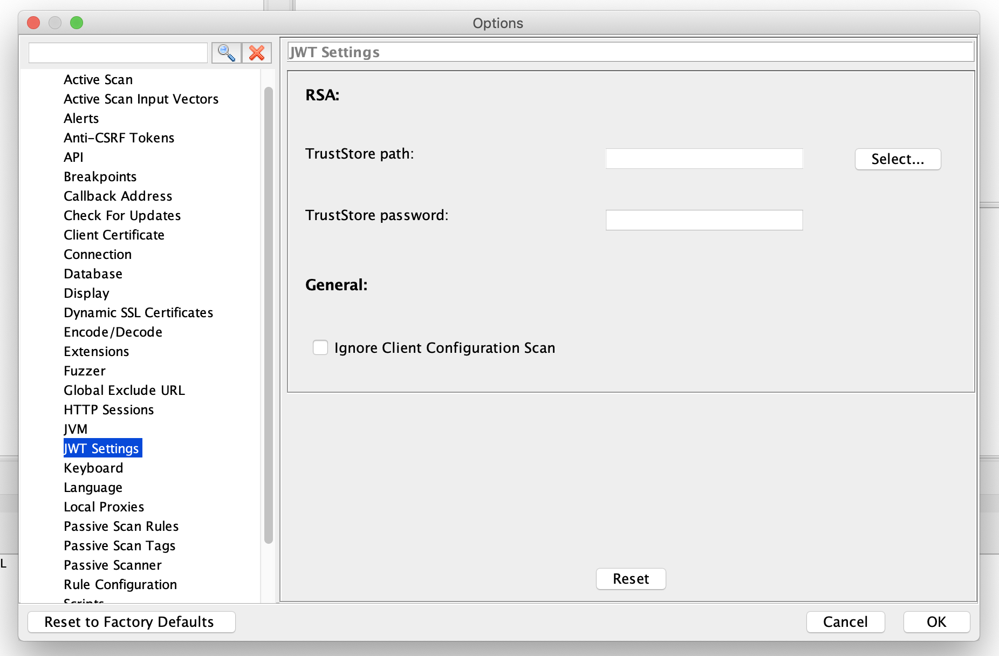

With the popularity of JSON Web Tokens there comes the need to secure them so that they are not misused because of bad configuration or older libraries or buggy implementations. So JWT Scanner Addon is used to find such vulnerabilities and this blog explains on how to use JWT Scanner Addon.

## Configuration
### TLDR:
As JWT Scanner runs with Active Scanner so most of the configurations are same as Active Scanner but there are certain configurations which are specific for JWT Scanner.
Under Options tab you will find JWT settings section as shown below:
[]

### Explanation
In case the application which you are trying to scan is using RSA or more specifically RS* algorithm then please mention the public certificate TrustStore path and TrustStore password.

Ignore Client Configuration flag is used to ignore client side validations like JWT token is  passed to browser in an insecure way or non-recommended way.

### Vulnerabilities covered by the scanner:
JWT scanner covers 2 kind of vulnerabilities in JWT implementation
1. Client/Browser side Vulnerabilities
2. Server/Library side Vulnerabilities

For Client side it covers most of the vulnerabilities mentioned in []

For Server side it mainly covers following vulnerabilities:
1. []
2. []
3. [![Trusting JWK key provided with the Token(https://nvd.nist.gov/vuln/detail/CVE-2018-0114)]
4. Empty JWT Token
5. Null Byte Injection attack

## Conclusion
This is the part one of the JWT Scanner for finding vulnerabilities and next we are planning to provide a JWT fuzzer and bruteforce attack on HMac based JWT. 
1. JWT fuzzer will be helpful for finding vulnerabilities like SQL Injection/SSRF based on JWT Field values.
2. Bruteforce attack is useful to find the unsecure/small key length sizes for HMac based JWT token.
