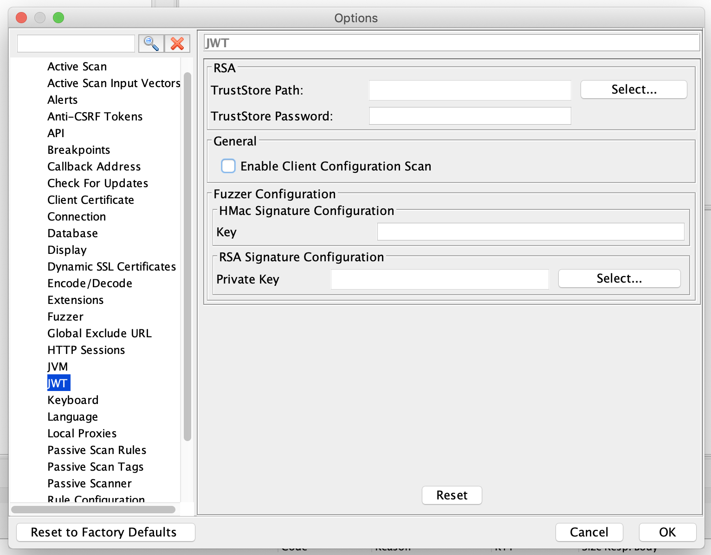

With the popularity of JSON Web Tokens (JWTs)there comes the need to secure their use so that they are not misused because of bad configuration, older libraries, or buggy implementations. So the JWT Scanner Addon is used to find such vulnerabilities and this blog explains on how to use it.

## Configuration
As JWT add-on includes a rule for the Active Scanner but there are configuration details which are specific for the JWT add-on
Under ZAP's Options dialog you will find a JWT section as shown below:
[]

### Explanation
In case the application which you are trying to scan is using RSA or more specifically RS* algorithm then please configure the public certificate TrustStore path and TrustStore password. These fields are used to find certain vulnerabilities related to RS* based JWTs.

Ignore Client Configuration Scan flag is used to ignore client side validations like JWT being sent to the browser in an insecure or non-recommended way.

### Vulnerability Coverage
The JWT add-on's scan rule attempts to identified vulnerabilities in both Client/Browser and Server/Library implementations.

For the Client side it covers most of the vulnerabilities mentioned in the [OWASP JWT CheatSheet](https://cheatsheetseries.owasp.org/cheatsheets/JSON_Web_Token_Cheat_Sheet_for_Java.html#token-storage-on-client-side).

For Server side it mainly covers following vulnerabilities:
1. [None Algorithm attack](https://auth0.com/blog/critical-vulnerabilities-in-json-web-token-libraries/#Meet-the--None--Algorithm)
2. [Algorithm Confusion attack](https://auth0.com/blog/critical-vulnerabilities-in-json-web-token-libraries/#RSA-or-HMAC-)
3. [Trusting JWK provided with the Token](https://nvd.nist.gov/vuln/detail/CVE-2018-0114)
4. Empty JWT
5. Null Byte Injection attack

## Conclusion
This is part one of the JWT add-on for finding vulnerabilities, next we are planning to provide a JWT fuzzer and bruteforcer.
1. JWT fuzzer will be helpful for finding vulnerabilities like SQL Injection/SSRF in JWT field values.
2. Bruteforce attack will be helpful in finding vulnerabilities related to Secret Keys which are used for signing the tokens.
