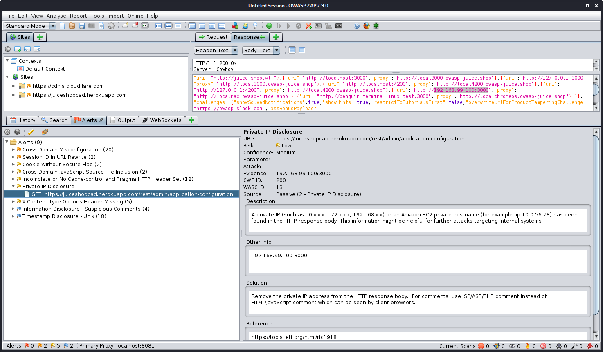
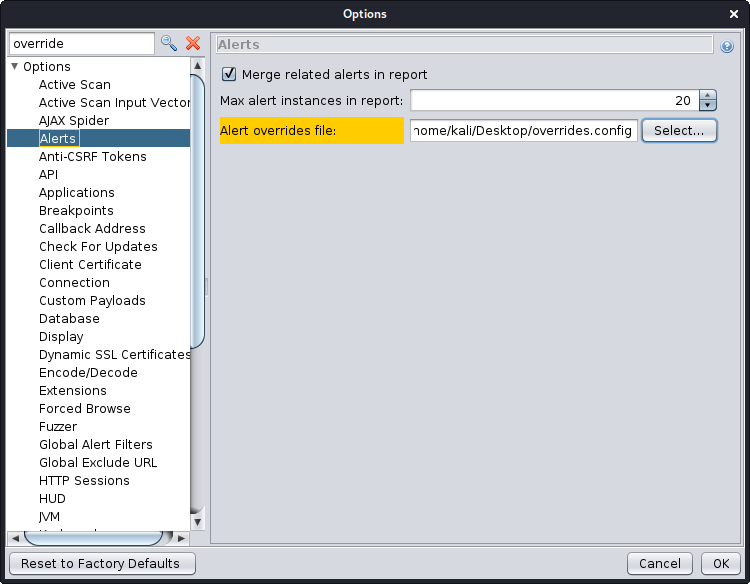
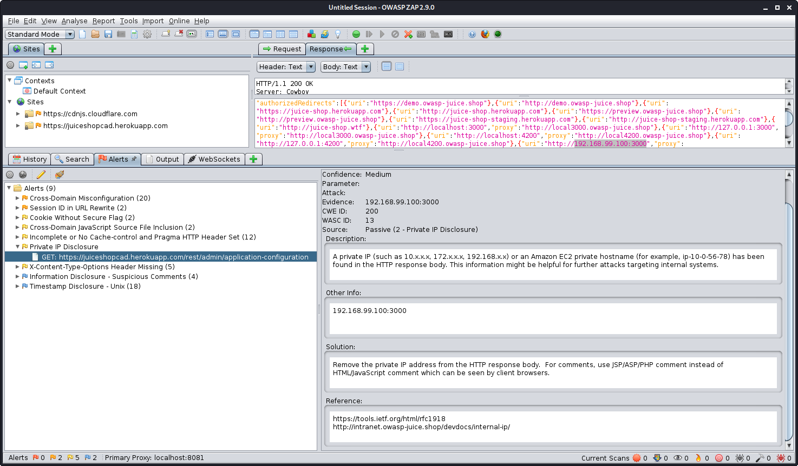

Did you know that you or your company/organization could customize the generic details of the alerts that ZAP raises?

Alerts raised by ZAP contain a variety of information, some generic, some specific to the issue at hand. Specific details may include things such as
URL, parameter, values, etc. While generic details include things like a description, solution, and links to related background material and resources.

Using 'Alert Overrides' functionality you can replace or add generic information, allowing you to include details that may be more relevant to your
company or organization. This is accomplished by creating and using an 'alerts overrides' configuration file.

An alert override config file is a UTF-8 property file containing the information you would like to change. The file may contain comments for
convenience by pre-pending `#` on the line, ex: `# 2 - Private IP Disclosure`. Such comments will be ignored when ZAP uses the file.

## How-to

The format of entries in the file is:

`<alertid>.<property> = [ + | - ] <your information>`

With the following properties supported: `name`, `description`, `solution`, `otherInfo`, and `reference`. Alert details can be added, replaced, or removed:

```text
If the value starts with a ‘+’ then it is appended to the existing information.
If it starts with a ‘-’ then it is prepended to the existing information.
If it does not start with a ‘+’ or ‘-’ then it replaces the existing information.
```

For example:

```text
# 40012 = Reflected XSS
40012.solution = Follow our company specific guidelines at http://internet.example.com/xss.html
```

## Example Usage

Let's say you work for Juice Shop corporation, and the organization is particular sensitive to disclosure of internal IP addresses, etc. After an initial scan with ZAP
you decide that your developers and security team should have some additional information when reading reports and addressing certain issues.



So you establish an overrides files such as:

```text
# 2 - Private IP Disclosure
2.reference = +\nhttp://intranet.owasp-juice.shop/devdocs/internal-ip/
# 10096 - Timestamp Disclosure
10096.solution = If this timestamp evaluates to a date before 2014-10-04 (First release) then the finding is almost definitely a false positive.
```

This file can be leveraged by:

- Specifying its use (location) in ZAP's Options dialog.
- Via the [API](/docs/desktop/start/features/api/)
- From the command line: `-config alert.overridesFilename=/path/to/filename`

Setting the file via the Options dialog:


Overridden details:



For further details see this [help entry](/docs/desktop/start/features/alerts/#alert-overrides).
