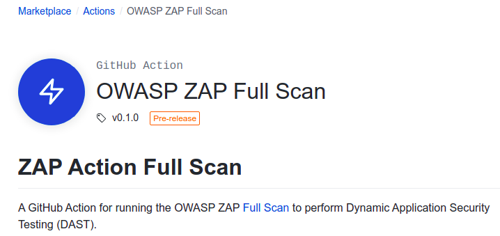
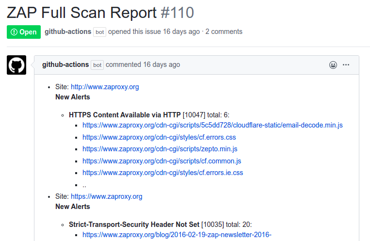
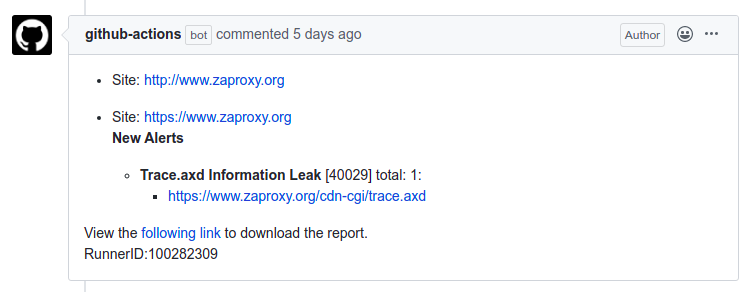
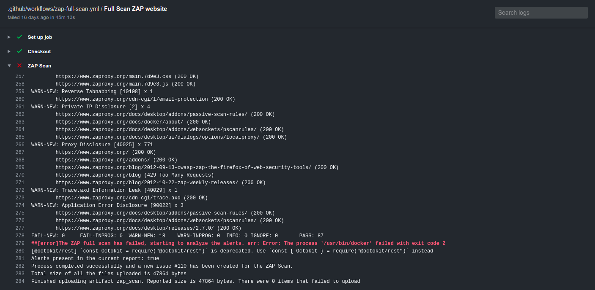

[](https://github.com/marketplace/actions/owasp-zap-full-scan)

[ZAP full scan GitHub action](https://github.com/marketplace/actions/owasp-zap-full-scan) provides free dynamic application 
security testing (DAST) of your web applications. DAST is also known as black-box testing, which allows ZAP to identify 
potential vulnerabilities in your web applications. We previously introduced the [ZAP baseline scan GitHub action](https://github.com/marketplace/actions/owasp-zap-baseline-scan) 
to passively identify potential alerts in a web application. However, unlike the baseline scan, ZAP full scan attacks the web application 
to find additional vulnerabilities.

The ZAP full scan action runs the ZAP spider against the specified target (by default with no time limit) followed by an optional ajax spider scan and then a full active scan before reporting the results. The alerts will be maintained as a GitHub issue in the corresponding repository. This means that the script does perform actual ‘attacks’ and can potentially run for a long period of time.

**Warning:** 
As a full scan will perform attacks against the target you should only use the full scan against targets that you have 
permission to test. You should also check with your hosting company and any other services such as CDNs that may be 
affected before running this action. ZAP will submit forms and exercise functionality which could result in a 
[large number of messages](/faq/how-can-i-prevent-zap-from-sending-me-1000s-of-emails-via-a-contact-us-form/) via, 
for example, 'Contact us' or 'comment' forms.

The ZAP full scan action can be used in multiple ways. The action can be configured to run against a publicly available 
web application or against a locally available web application. The ZAP team use the action to scan our 
website on a weekly basis. Similar to the baseline scan, a full scan action will also maintain an active issue in the 
GitHub repository. The action will update the issue if it identifies any new or resolved alerts and will close the 
issue if all the alerts have been resolved. A detailed report is attached to the workflow run to get more information 
regarding the identified alerts. The report is available in HTML and Markdown formats.

The following issue shows how the GitHub full scan action scans the [https://www.zaproxy.org](https://www.zaproxy.org) 
website and notifies the users via opening an issue in the ZAP website repository (Scan time: 45 Mins). The issue will be created by the 
GitHub Actions bot and will list the alerts as issue comments. Compared to our [baseline scan results](https://github.com/zaproxy/zaproxy-website/issues/93#issue-597219582) 
you can see the full scan has identified additional alerts in the zaproxy website.

[](https://github.com/zaproxy/zaproxy-website/issues/110#issue-609117077)

In consequent scans if it identifies a fixed issue or newly raised alerts the action will update the issue with the required information.
[](https://github.com/zaproxy/zaproxy-website/issues/110#issuecomment-626256038)

If you have resolved/ignored all the alerts then, the action will close the ongoing open issue. You can also use the 
rules file to ignore false positives which occur during the ZAP scan. Please check out our previous blog on the 
[baseline scan](/blog/2020-04-09-automate-security-testing-with-zap-and-github-actions/) which covers how to exclude false positive from your issues.

The following YAML config shows how to configure the action to scan a publicly accessible web application. 
In order to start scanning, create a file called `zap_scan.yaml` inside the `.github/workflows` 
folder in your repository. 

```yaml
on:
  schedule:
    # Runs every day At 01:00.
    - cron:  '0 1 * * *'

jobs:
  zap_scan:
    runs-on: ubuntu-latest
    name: Scan ZAP website
    steps:
      - name: ZAP Scan
        uses: zaproxy/action-full-scan@v0.1.0
        with:
          target: 'https://www.zaproxy.org/'
```

Also, you can view the scan logs by navigating to the ZAP [scan job](https://github.com/zaproxy/zaproxy-website/runs/629858267?check_suite_focus=true).

[](https://github.com/zaproxy/zaproxy-website/runs/629858267?check_suite_focus=true)

We are excited to hear your thoughts and feedback for the ZAP full scan action. If you find the action useful please star 
the action. Reach us through the [dev group](https://groups.google.com/group/zaproxy-develop) or for any additional enhancements 
please feel free to create an issue in the [following repository](https://github.com/zaproxy/action-full-scan).
