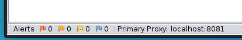

Do you know what interesting bits were added to ZAP 2.9.0?
Don't read release notes?

This blog post is for you!

Of course I can't cover absolutely everything, but here's some details on some notable items.
For full details see the [2.9.0 release notes](/docs/desktop/releases/2.9.0/).

To be clear ZAP 2.9.0 was released back in Jan of 2020. &#128521;, so this post is kind of playing catch-up.

## Proxy Info Display

Contributed by: [Rick Mitchell (kingthorin)](https://twitter.com/kingthorin_rm).

The primary ZAP proxy is now displayed in the left footer area of the main window:



Futher if you have additional proxies setup, they'll be displayed in the tooltip text when you hover your cursor over the primary proxy display:


## Proxy Port Reservation Failure Handling

Contributed by: [Rick Mitchell (kingthorin)](https://twitter.com/kingthorin_rm).

Have you ever had ZAP complain at startup that it can't bind to the default port (8080), because you're running Tomcat (or something else) locally? No problem
ZAP will now suggest a port that you could use.


## Options Panel(s) Filter

Contributed by: [Dennis Kniep](https://twitter.com/dennis_kniep)

ZAP has a quite extensive options interface, sometimes it's not straight forward to locate the setting you want/need. Now you can search settings
and have things highlighted for you:

In the following example the user searched the Options panel for "proxy", you can see all the panels names outlined in yellow where the panel contains the word "proxy"


Selecting one of those panels the applicable labels/fields will be highlighted:


This functionality is available in multiple places including the Active Scan Policy interface:


## Active Scan Filter

Contributed by: [Karan Preet Singh Sasan (@preetkaran20)](https://github.com/preetkaran20).

ZAP has plenty of options of targeting or refining Active Scan this feature makes it even more flexible. When starting an active scan users can now define filter criteria for inclusion/exclusion of various requests. The available criteria include:

- Defining which HTTP methods/verbs should be included.
- Defining which HTTP requests should be included, based on the existing response code.
- Defining which HTTP requests should be included or excluded based on the assigned Passive Scan Tags (as seen in the History table).
- Identifying which HTTP requests should be included or excluded based on Regex.

In the following example only successful (200 - Ok) requests which use the POST method will be included for active scanning.


## Session Management Scripts

Contributed by: [Simon Bennetts (@psiinon)](https://twitter.com/psiinon)

Prior to ZAP 2.9 the only options for session management were cookie based or HTTP authentication based. It had been possibe to work around these limitations through 
the use of HttpSender scripts which harvested tokens and set them into subsequent requests, however that was not terribly user friendly. Therefore in order to 
accommodate technologies such as JWT, bearer tokens, etc. With 2.9 comes the concept of Session Management Scripts which greatly simplify the process of maintaining 
authenticated sessions for more modern applications.

ZAP now ships with a JavaScript template for scripted session management, as well as an [OWASP Juice Shop](https://owasp.org/www-project-juice-shop/) example script. 
It is the Juice Shop example that we will discuss here.

```JavaScript
/*
 * Session Management script for OWASP Juice Shop
 * 
 * For Authentication select:
 * 		Authentication method:		JSON-based authentication
 * 		Login FORM target URL:		http://localhost:3000/rest/user/login
 * 		URL to GET Login Page:		http://localhost:3000/
 * 		Login Request POST data:	{"email":"test@test.com","password":"test1"}
 * 		Username Parameter:			email
 * 		Password Parameter:			password
 * 		Logged out regex:			\Q{"user":{}}\E
 * 
 * Obviously update with any local changes as necessary.
 */

var COOKIE_TYPE   = org.parosproxy.paros.network.HtmlParameter.Type.cookie;
var HtmlParameter = Java.type('org.parosproxy.paros.network.HtmlParameter')
var ScriptVars = Java.type('org.zaproxy.zap.extension.script.ScriptVars');

function extractWebSession(sessionWrapper) {
	// parse the authentication response
	var json = JSON.parse(sessionWrapper.getHttpMessage().getResponseBody().toString());
	var token = json.authentication.token;
	// save the authentication token
	sessionWrapper.getSession().setValue("token", token);
	ScriptVars.setGlobalVar("juiceshop.token", token);
}
    	
function clearWebSessionIdentifiers(sessionWrapper) {
	var headers = sessionWrapper.getHttpMessage().getRequestHeader();
	headers.setHeader("Authorization", null);
	ScriptVars.setGlobalVar("juiceshop.token", null);
}
    	
function processMessageToMatchSession(sessionWrapper) {
	var token = sessionWrapper.getSession().getValue("token");
	if (token === null) {
		print('JS mgmt script: no token');
		return;
	}
	var cookie = new HtmlParameter(COOKIE_TYPE, "token", token);
	// add the saved authentication token as an Authentication header and a cookie
	var msg = sessionWrapper.getHttpMessage();
	msg.getRequestHeader().setHeader("Authorization", "Bearer " + token);
	var cookies = msg.getRequestHeader().getCookieParams();
	cookies.add(cookie);
	msg.getRequestHeader().setCookieParams(cookies);
}

function getRequiredParamsNames() {
	return []; 
}

function getOptionalParamsNames() {
	return [];
}
```

The example starts out with a documentation block explaining the assumptions for the Context setup and user being authenticated. The next few lines define the 
imports/types that will be used by the script. Then we get to the business part of the script.

The `extractWebSession` function extracts the token value and saves it into a Global variable where it can later be retrieved by other scripts/functions, as well as saving it into the session (which is used internally when processing messages).

The next function `clearWebSessionIdentifiers` is setup to remove or invalidate a token from within ZAP.

`processMessageToMatchSession` is responsible for inserting the token where necessary, in the case of Juice Shop both the `Authorization` header value and a 
cookie value.

The functions `getRequiredParamsNames` and `getOptionalParamsNames` are un-used for Juice Shop session management.
These functions are called during the script loading to obtain a list of the names of the required (or optional, as applicable) configuration parameters, 
that will be shown in the Session Properties -> Session Management panel for configuration. They can be used to input dynamic data into the script, 
from the user interface or API (e.g. a JSONPath expression for extracting values from a JSON response, the name of a header, a login URL, or name of POST parameters, etc.)

For more information about getting familiar with ZAP and setting up/managing authentication for ZAP scans refer to the 
[ZAP in Ten](https://www.alldaydevops.com/zap-in-ten) series.

## Conclusion

This blog post delved into specific of some of the features that were new to ZAP in 2.9.0. ZAP is constantly being improved by a Global community 
of volunteers. Watch for more of these blogs in the future.

For further details see the [2.9.0 release notes](/docs/desktop/releases/2.9.0/).

