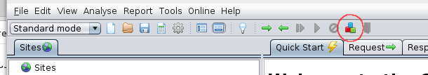
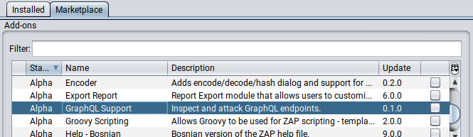
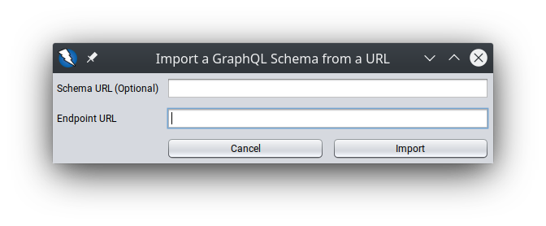
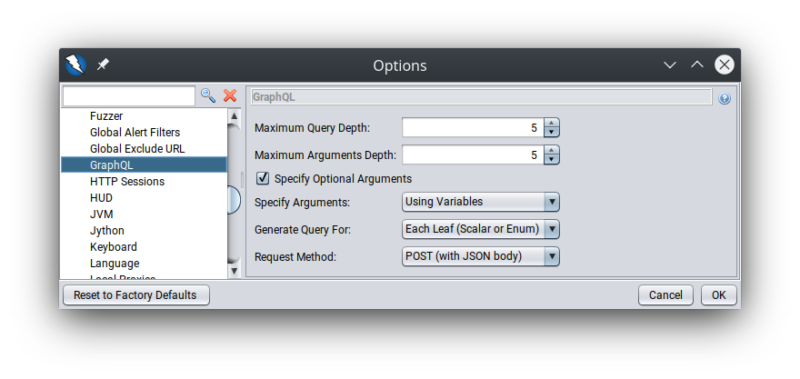

GraphQL Schemas can be very large and testing them can be a very time-consuming process. Currently, there is a lack of tools that allow developers to launch and automate attacks on these endpoints. The GraphQL add-on for ZAP intends to fill this gap. 

The add-on is still in an early stage, so the range of its functionality is limited. However, you can combine it with existing ZAP functionality to abuse GraphQL endpoints in many different ways. 

This post will first highlight the core features of the add-on, and then go on to describe how easy it is for a newbie programmer (with a passion for learning) to begin contributing to ZAP.

## Installing the Add-on

If you are using the latest version of ZAP then you can browse and download add-ons from within ZAP by clicking on this button in the toolbar:



The *Manage Add-ons* window will open.



Under the *Marketplace* tab, you will find the GraphQL Support add-on. Toggle the checkbox next to it and click on "Install Selected".

## Import a GraphQL Schema into ZAP

If you look under the Import option in the menu bar, you will find two new entries:

1. Import a GraphQL Schema from a File
2. Import a GraphQL Schema from a URL

Put simply, both of these options allow you to import a GraphQL schema into ZAP. If you have the schema on your computer, use Option 1. If the schema is in a remote location, pick Option 2.

If you do not have the schema, no worries at all! Chances are, the endpoint you want to attack has [Introspection](https://graphql.org/learn/introspection/) enabled by default. That will allow us to generate the schema locally by sending a single large introspection query to the endpoint. ZAP will do this automatically. You just have to specify the endpoint URL via the second option.



The add-on also adds rules for the ZAP Spider. So, if during a scan you inadvertently come across a GraphQL endpoint, an introspection query will be sent to it automatically. Note that this will only work with recent weeklies or version 2.10.0 when it is released.

You can also import a GraphQL Schema via the API or the CLI.

Regardless of how a Schema is obtained, if everything is valid and correctly specified, it will be ready for the next stage: query generation.

## Query Generation

The imported schema will be parsed and queries will be generated from it.

What exactly do we mean by *generated*? 

Basically, ZAP parses the imported schema and tries to create all possible valid queries from it. Allow me to explain this with the help of an example.

For example: If the imported schema is,

```
type  Query {
   polygon (sides: Int, regular: Boolean): Polygon
}

type  Polygon {
   perimeter: Float
   area: Float
}
```

Then one possible generated query is,

```
query {
  polygon(sides: 1, regular: true) {
	perimeter
	area
  }
}
```

This is in fact a [unit test](https://github.com/zaproxy/zap-extensions/blob/3cb399a8e8a3b998e4b90cf8bffba99501ef00f0/addOns/graphql/src/test/java/org/zaproxy/addon/graphql/GraphQlGeneratorUnitTest.java#L72) for the add-on. You can look at the other tests for more examples.

Now, if you go to *Tools -> Options -> GraphQL*, you will find the following settings panel:



These settings allow you to control the output of the add-on's Query Generator. Based on the combination of your chosen values for the above options, you will be able to send unique queries to the endpoint.

For example, by increasing the maximum query depth, you may be able to exhaust the server's resources. Or if you specify arguments using variables, you could perform injection attacks by making use of ZAP's input vectors. You may also be able to bypass authorization and discover IDORs by generating queries with or without certain arguments and fields. The possibilities are endless!

I did say before, that the add-on is still in an early stage. If you face any problems or have any feature requests, feel free to join in the discussion on the [ZAP User Group](https://groups.google.com/group/zaproxy-users) or contact me directly. You can also ping us on the irc channel ([#zaproxy on Freenode](https://webchat.freenode.net/#zaproxy)) or raise a GitHub issue for bugs.

## The Story Behind this Add-On

Developing this add-on was my project this summer, as part of Google Summer of Code 2020. The summer will soon turn to autumn, but I'm going to continue working on the project. Yes, that's how fun it was! Over the course of 3 months, under the guidance of Simon, Ricardo and Rick, I was able to learn a lot. I was a complete beginner a few months ago - I didn't even know what an API was! If I was able to develop an add-on, then you can too!

I primarily worked on the [zap-extensions](https://github.com/zaproxy/zap-extensions/) GitHub repository. Here are all the major pull requests I made:

- PR [#2396](https://github.com/zaproxy/zap-extensions/pull/2396) - Bare bones add-on
- PR [#2420](https://github.com/zaproxy/zap-extensions/pull/2420) - Import Dialog
- PR [#2431](https://github.com/zaproxy/zap-extensions/pull/2431) - Import Functionality
- PR [#2485](https://github.com/zaproxy/zap-extensions/pull/2485) - Generate GraphQL Queries from Schema
- PR [#2521](https://github.com/zaproxy/zap-extensions/pull/2521) - Add Option for Separated Arguments
- PR [#6044](https://github.com/zaproxy/zaproxy/pull/6044) - Call default spider filter after custom filters

The released add-on package can be found [here](https://github.com/zaproxy/zap-extensions/releases/tag/graphql-v0.1.0).

If you'd like to know more about the implementation details of this add-on, you can go to the [blog](https://akshathkothari.com/gsoc/) for this project. If you are also interested in contributing to ZAP, I urge you to read the "[Hacking ZAP](/blog/2014-03-10-hacking-zap-1-why-should-you/)" series of blog posts or go through the recently released "[ZAP in Ten](https://www.alldaydevops.com/zap-in-ten)" videos. Finally, go check out [CONTRIBUTING.md](https://github.com/zaproxy/zaproxy/blob/develop/CONTRIBUTING.md).
