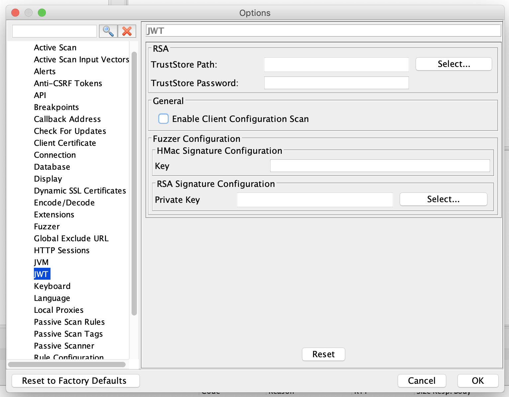
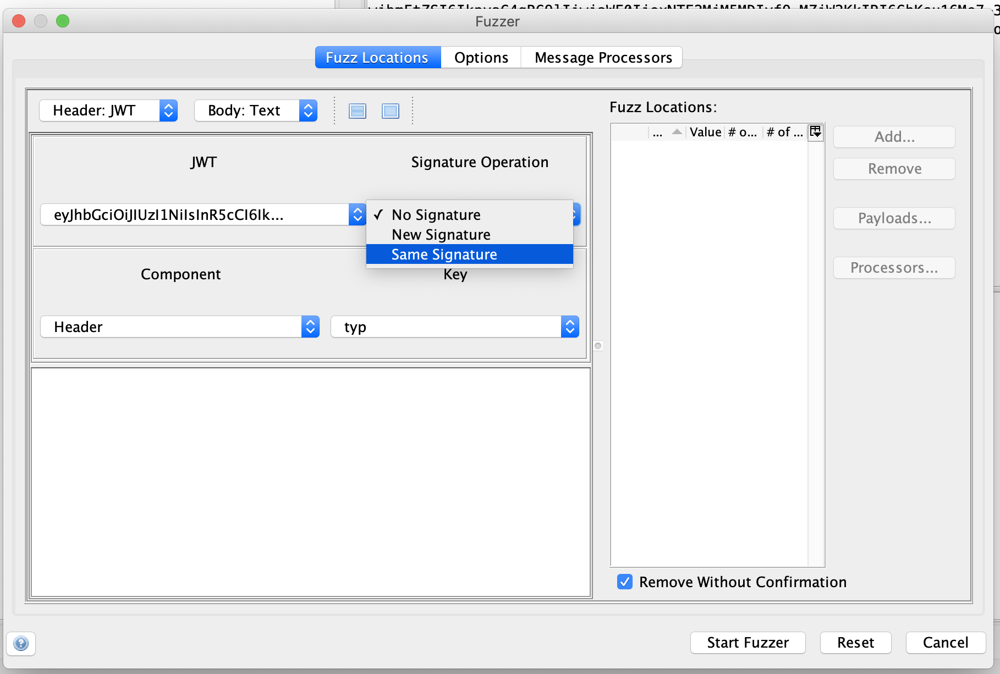
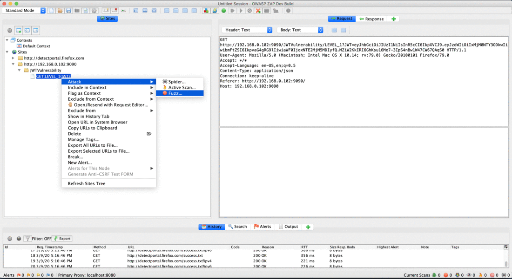

With the popularity of JSON Web Tokens (JWTs) there comes the need to secure their use so that they are not misused because of bad configuration, older libraries, or buggy implementations. So the JWT Support add-on is used to find such vulnerabilities and this blog explains on how to use it.

## Configuration
As the JWT add-on includes a rule for the Active Scanner as well as Fuzzer functionality, there are configuration details which are specific for the JWT add-on.
Under ZAP's Options dialog you will find a JWT section as shown below:

 
### Explanation

#### Scanner Configuration: 

In case the application which you are trying to scan is using RSA or more specifically RS* algorithm then please configure the public certificate TrustStore path and TrustStore password. These fields are used to find certain vulnerabilities related to RS* based JWTs.

The Enable Client Configuration Scan option is used to enable client-side validations like JWT being sent to the browser in an insecure or non-recommended way.

#### Fuzzer Configuration:

Since JWT is a signed token; fuzzing field values requires resigning the JWT therefore the fuzzer requires an HMac secret key or RSA private key as per the algorithm header field of the JWT. So that the Fuzzer configuration corresponds to the same.

### Scanner Vulnerability Coverage
The JWT add-on's scan rule attempts to identified vulnerabilities in both Client/Browser and Server/Library implementations.

For the Client-side it covers most of the vulnerabilities mentioned in the [OWASP JWT CheatSheet](https://cheatsheetseries.owasp.org/cheatsheets/JSON_Web_Token_for_Java_Cheat_Sheet.html#token-storage-on-client-side).

For Server-side it mainly covers following vulnerabilities:
1. [None Algorithm attack](https://auth0.com/blog/critical-vulnerabilities-in-json-web-token-libraries/#Meet.the..None..Algorithm)
2. [Algorithm Confusion attack](https://auth0.com/blog/critical-vulnerabilities-in-json-web-token-libraries/#RSA.or.HMAC.)
3. [Trusting JWK provided with the Token](https://nvd.nist.gov/vuln/detail/CVE-2018-0114)
4. Empty JWT
5. Null Byte Injection attack

### Fuzzer View
JWT Fuzzer view is different from HTTP Fuzzer view as JWT's need to be parsed, then JWT field values can be fuzzed. The following is the Fuzzer view:

The **Signature Operation** drop down is used to control the operations on the Signature field of JWT.
1. **No Signature**: This value is used to remove the signature component from the newly fuzzed JWT.
2. **Same Signature**: This value is used to use the same signature for the newly fuzzed JWT.
3. **New Signature**: This value is used to generate new signature for the newly fuzzed JWT.

The **Component** drop down is used to choose the **Header** or the **Payload** components of the JWT.

The **Key** drop down is used to choose the fields to be fuzzed in the **Header** or **Payload** components of the JWT.

### Fuzzer View Animation

The JWT add-on is available in the marketplace and can be installed from within ZAP.
For more information please visit [JWT Support](https://github.com/SasanLabs/owasp-zap-jwt-addon)
