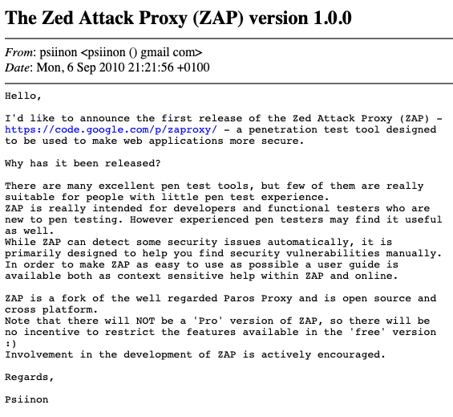

## Ten Years Ago

On September 6th 2010 I posted this message to Bugtraq:

From those very humble beginnings ZAP has now become what we believe is the world’s [most frequently used web application scanner](/blog/2020-04-02-is-zap-the-worlds-most-popular-web-scanner/).

I started hacking on the Paros code to help me learn more about web security.
However I also wanted to start contributing to open source software, and looked for an active community based security project I could contribute to. Surprisingly there were not any at that time and so I ended up releasing ZAP in an attempt to create the community project that I wanted to join.

## The Community

I’m convinced that ZAP’s success is down to this community focus and all of the [contributors](/docs/desktop/credits/) who’ve helped make ZAP what it is today.

I especially want to thank all of the members of the ZAP Core Team, past and present. It just wouldn’t have been possible without all of their efforts.

I’m also very proud of all of the students who have helped improve ZAP through initiatives such as Google Summer of Code, Mozilla Winter of Security and as part of their courses. For more details see the [ZAP Student Hall of Fame](/student-hall-of-fame/).

## ZAP Innovations

Despite being maintained by volunteers, ZAP has led the way in many areas, introducing support for websockets, launching browsers, automating browsers for crawling applications and introducing an online marketplace for add-ons significantly earlier than much better funded commercial security tools.

ZAP is arguably still leading the field when it comes to API support and scripting integration, and no other security tools have anything to compare with Zest scripting and our innovative [Heads Up Display](https://github.com/zaproxy/zap-hud).

## The Future

I’ve spent a lot of time working on ZAP, but that commitment has been repaid many times over.

My work on ZAP enabled me to move into the security industry, present at conferences all over the world, meet and work with some incredible people.

It was the reason I was offered a job at Mozilla, a company I had always admired and whose philosophy I was trying to replicate in the ZAP community. It turned out that my first boss at Mozilla had seen that very first Bugtraq post and had been following my progress ever since before getting in touch with me about a possible job.

It is also the reason that I’ve now joined [StackHawk](https://www.stackhawk.com/) who are building a business around offering ZAP as a service to developers.

My focus is still very much on the ZAP open source project and building the ZAP community.

ZAP 2.10.0 is going to be released fairly soon - we did talk about releasing it on ZAP’s 10th birthday but that proved to be too optimistic!

We will keep improving ZAP but there are always loads of things that we just cannot find time to do. So if you are interested in [contributing to ZAP](/get-involved/) then please get in touch! Who knows where it may lead you?
