## Basics

A bit of functionality that ZAP has had since early days is the ability to apply a tag to a message that passes through the proxy. They allow for quick and simple summaries that highlight key aspects of requests or responses.

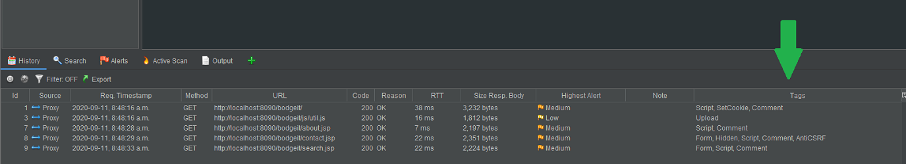

The tags are defined in and controlled by ZAP's options:

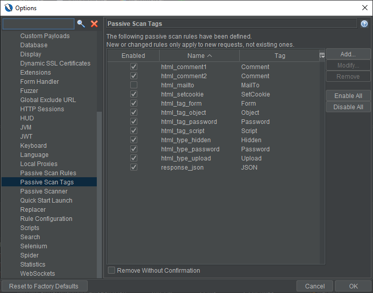

Each Tag is defined by a regex pattern and is applied via ZAP's [passive scanning functionality](/docs/desktop/start/features/pscan/), for example the Hidden tag looks for form fields that have HTML `type="hidden"`:

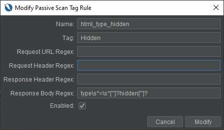

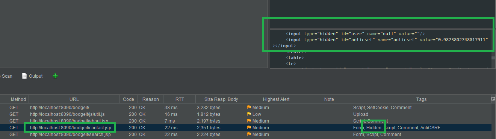

Tags can also be used to filter History entries. For example, if you wanted to see only those messages that had Hidden fields:

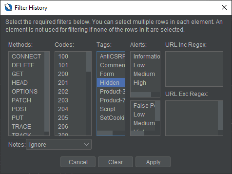

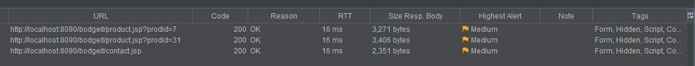

## Interpolation

A lesser known feature that was added in [version 2.8.0](/docs/desktop/releases/2.8.0/) is Tag Interpolation. This may sound like an advanced or daunting technology. But really it boils down to allowing the value returned  by a Regex capturing group to be used in the Tag text. For example a user could configure a Tag to identify the ID or name of a product:

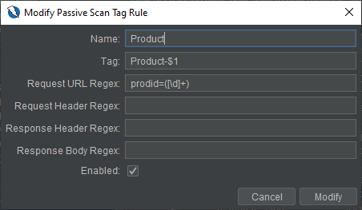

This Tag is setup such that the value of the first (and only) `$1` capturing group `([\d]+)`is returned as part of the tag value: `Product-$1`.

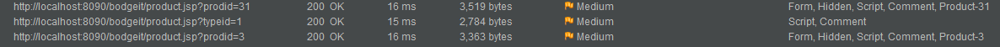

This could also be used for things like extracting usernames from responses (attributing logged in user), etc.

## Neonmarker

There is an add-on for ZAP which allows colouring of history items (rows) based on tags. The add-on is called Neonmarker and is available via [ZAP's Marketplace](/addons/).

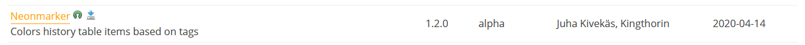

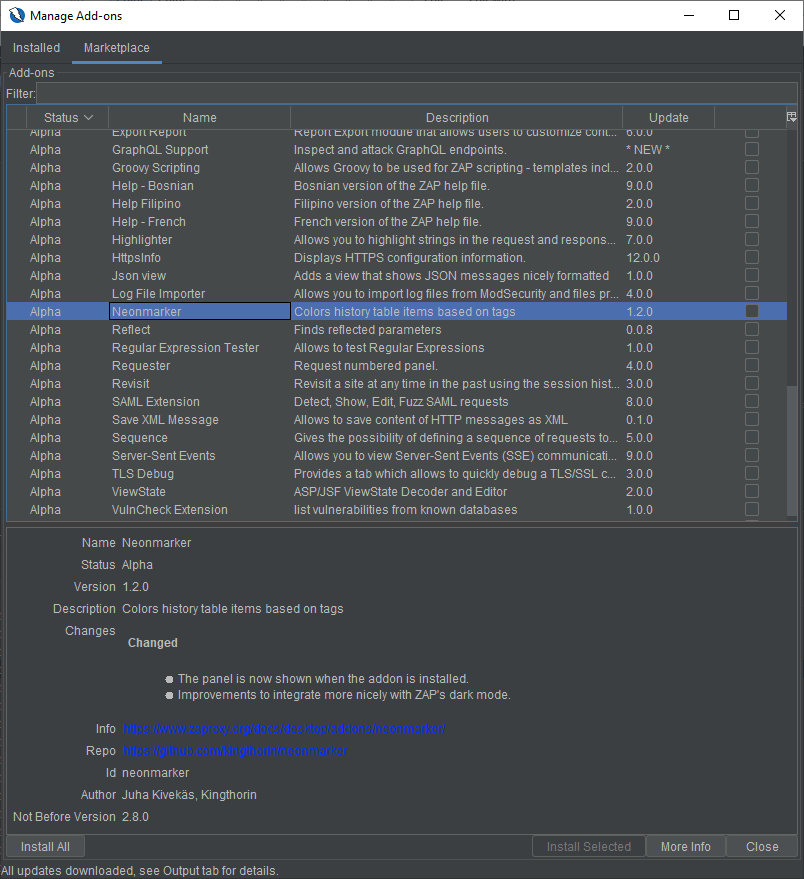

For example if you wanted all the messages with `Hidden` fields to be purple:
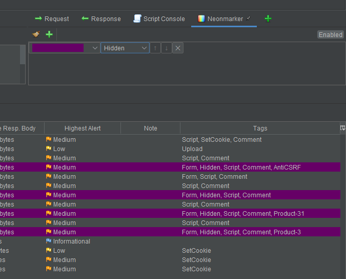

## Conclusion

By reading this post you've learned:

- Generally about ZAP's Passive Scan Tag functionality.
- How to configure tags.
- How to use interpolation with tags.
- How to get and use the Neonmarker add-on.
