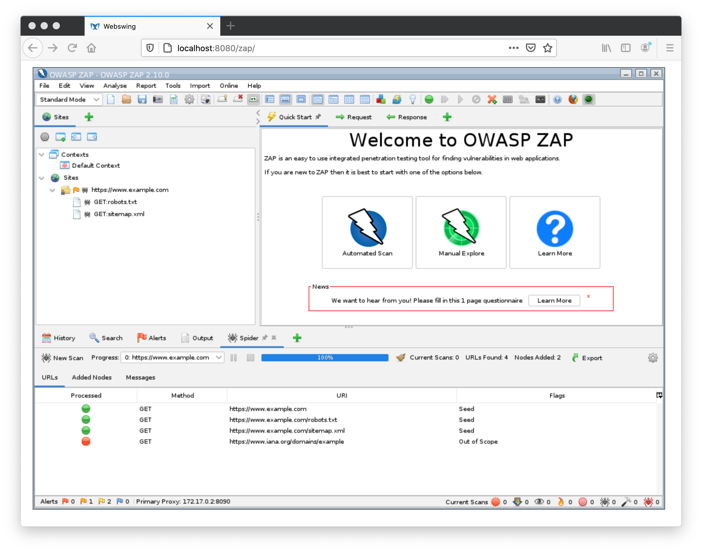
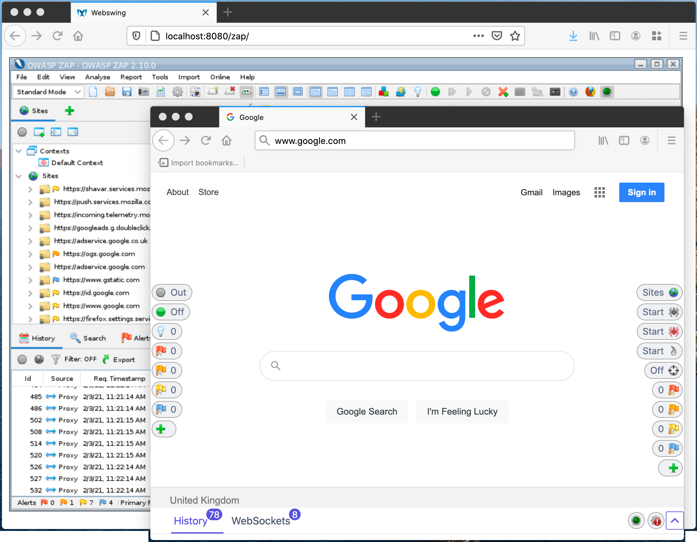

The [ZAP Docker images](/docs/docker/about/) are a great way to automate ZAP, but when testing a new application or diagnosing problems it is always easier to use the ZAP desktop so that you can see what is going on.

You can run the ZAP Desktop locally, but then you are running in a different environment.
You will also need to have Java installed, which some people are unwilling or unable to do.

## Webswing

Luckily you can still access the ZAP Desktop when running in Docker using a great product called [Webswing](https://www.webswing.org/). This amazing bit of technology allows you to run any Java Swing application in a browser.

Webswing is a commercial product but the company behind it are strong supporters of Open Source and so have very kindly allowed us to include Webswing in the ZAP Docker images.

To do that start ZAP running with Webswing use
 * `docker run -u zap -p 8080:8080 -p 8090:8090 -i owasp/zap2docker-stable zap-webswing.sh`

Then point your browser at `http://localhost:8080/zap` 

You will see the ZAP Splash screen and then you will have the full ZAP Desktop running in your browser!

You can start the Spider, run an Active Scan, do nearly everything that you can do when ZAP is running locally.

You can also interact with the ZAP Desktop in exactly the same way as you would if it is running natively. You can launch new ZAP dialogs, switch between them, move them, and resize them.

## Restrictions

Although most of the functionality works there are some features that will not work, in particular any features that launch other processes with GUIs like browsers. This breaks the [Browser Launch](/blog/2017-08-22-zap-browser-launch/) feature that many of you will use to start a browser that is set up to proxy through ZAP and trust its root CA certificate.

## Proxying your local browser through ZAP in Webswing 

In order to proxy a local browser with https based sites you need to start the docker container with a local drive mapped to `/zap/wrk` e.g. using:

*  `docker run -v $(pwd):/zap/wrk/:rw -u zap -p 8080:8080 -p 8090:8090 -i owasp/zap2docker-stable zap-webswing.sh`

Note that on Windows you will need to replace `$(pwd)` with the full current working directory.

When you do this ZAP will create 2 files on your mapped drive:

* `zap_root_ca.crt` - the public ZAP Root CA certificate
* `zap_root_ca.key` - the private ZAP Root CA certificate

You will need to use 2 browsers / profiles - one to proxy through ZAP and one to control the ZAP Desktop that you can now access via [Webswing](https://www.webswing.org/).

Launch the browser you want to proxy through ZAP (we recommend that you use a new browser profile e.g. in [Firefox](https://support.mozilla.org/en-US/kb/profile-manager-create-remove-switch-firefox-profiles) or [Chrome](https://support.google.com/chrome/answer/2364824?co=GENIE.Platform%3DDesktop&hl=en)) then point it at `http://localhost:8080/zap`

Configure it to [proxy via ZAP](/docs/desktop/start/proxies/)
and [import the public ZAP Root CA certificate](/docs/desktop/addons/network/options/servercertificates/#install) so that it is trusted to sign websites.

And there you have it, a local browser proxying through ZAP which can handle https sites and another browser which has full control of the ZAP Desktop, all without having to install Java!

Note that if you restart the docker container using the same mapped drive then ZAP will automatically import the private ZAP Root CA certificate that was exported earlier so you will not need to import it into your browser again.
