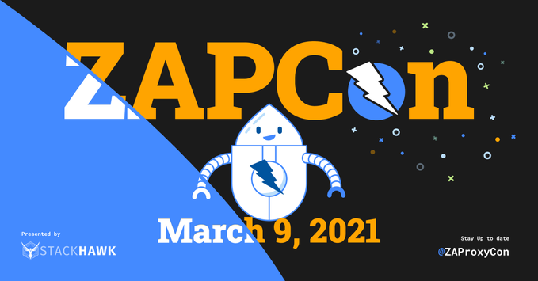

The very first ZAPCon is nearly here, but there's still time to [register](https://www.eventbrite.com/e/zapcon-2021-registration-138800517083) for it.

The schedule is:

* 08:00 am - 08:20 am PST : __Conference Opening__
* 08:20 am - 09:00 am PST : __Democratizing ZAP with Test Automation and Domain Specific Languages__, Abhay Bhargav, we45
* 09:00 am - 09:10 am PST : Break
* 09:10 am - 09:50 am PST : __ZAP Project Updates__, Simon Bennetts, ZAP
* 09:50 am - 10:00 am PST : Break
* 10:00 am - 10:40 am PST : __Mobile Application Security with ZAP__, Ankush Mohanty and Milan Sen, TCS
* 10:40 am - 10:50 am PST : Break
* 10:50 am - 11:30 pm PST : __ZAP Implementation in Pakistani Fintech__, Salman Khwaja and Muhammad Hammad Ul Hassan, TPS
* 11:30 pm - 11:40 pm PST : Break
* 11:40 pm - 12:20 pm PST : __How to enhance ZAP with feedback-based fuzzing__, Khaled Yakdan, Code Intelligence
* 12:20 pm - 12:30 pm PST : __Closing Ceremonies__

Full details are on https://zapcon.io/

I must admit that I was nervous when we started talking about the possibility of ZAPCon.
Would anyone want to talk at such an event, and more importantly would anyone want to listen?

I should not have worried! We had 20 talks submitted (many more than I expected) and so many high quality ones that we struggled to choose the very best. In the end we decided to accept more than we had originally planned. We are also hoping to release extra bonus talks after the event - stay tuned for more about that!
We have also had over 1500 people sign up for the event - again this has exceeded my most optimistic forecast, especially as that has all been put together in just a few weeks!

For my talk, as I have hinted on the ZAP user and developer groups, I will be launching a new ZAP Automation Framework. ZAP is already one of the easiest security tools to automate but I believe that this new framework will take it to another level. 
This will become the recommended way for most people to automate ZAP so join my talk to hear how it will work and to see it in action.

I also have a couple of other 'surprise' announcements that I hope you will like, but you’ll have to listen to the talk to hear them :D

I’m really looking forward to all of the other talks and the opportunity to discuss what matters most to you on the ZAPCon discord. 
[Register](https://www.eventbrite.com/e/zapcon-2021-registration-138800517083) for the conference in order to get invited to that.

