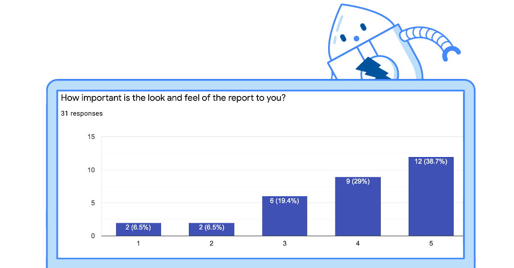
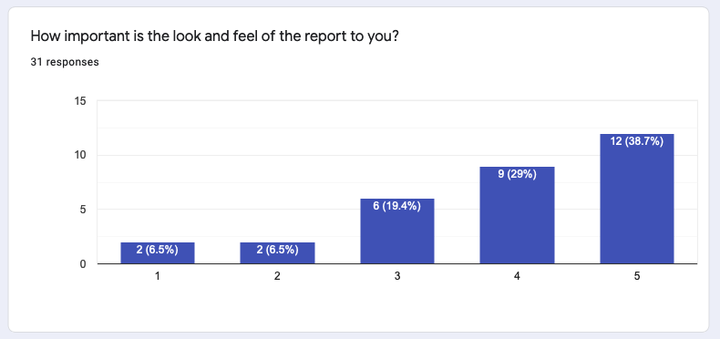
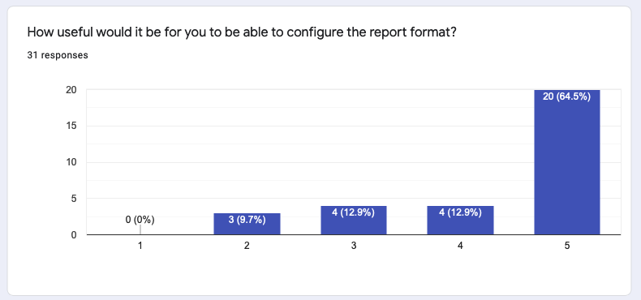
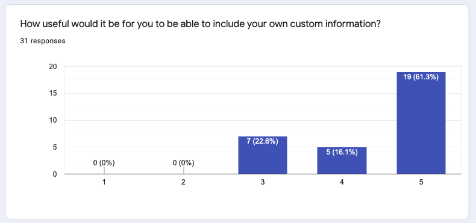

## The Competition is Currently OPEN

Apparently people have been a bit confused by some of the wording in this blog post, so just so that it is clear:

* The competition is **OPEN**
* It is open to everyone, regardless of where they live as long as we are legally able to participate

It will remain open until we have accepted **10** templates or July 1st 2021, whichever comes first. Hopefully the 10 templates!

Number of accepted templates to date: **0**

## The Competition

We have a new [Report Generation](https://www.zaproxy.org/docs/desktop/addons/report-generation/) add-on (detailed below) 
but while it is much more flexible, the current report templates it includes are still very basic. 
Lets be honest - creating stylish reports is probably not one of the ZAP core team's strengths &#128521;
Hence this competition.

We will award **$100 per HTML/PDF report template** that you submit and which we subsequently include with ZAP.

You do not need any coding skills to enter this competition - HTML, CSS and JavaScript are much more important.

The competition starts now but we will not **start** judging the reports until **April 12th 2021**.
This is to make sure you have plenty of time and to give us time to add more features (see below).

The competition will stay open until we have accepted **10 templates**, but we reserve the right to close it after it has been running for 3 months if we have not accepted 10 templates by then, and to accept a couple more than that if we think there are enough really good ones.

We are looking for templates that are:

* HTML / PDF - the add-on supports JSON/XML/MarkDown etc but those are much easier to create
* Open source and which we can include with ZAP
* Stylish
* Practical, i.e. provide the information people want (see below)
* Customisable (see below)
* Internationalised - you don't have to provide translations (unless you want to) but we will need English to be supported
* Screen reader compatible - this is new for us too, but there should be lots of information online about this
* Different from each other - we don't want 10 clones, we want to give people a real choice

## New Reporting Add-on
In order to be able to generate more modern and flexible reports we have released a new Reporting Add-on at [ZAPCon 2021](https://zapcon.io): that is now available on the ZAP Marketplace: [Report Generation](https://www.zaproxy.org/docs/desktop/addons/report-generation/).

This add-on is still at an early stage - for a list of enhancements planned see the related [issue tracker](https://github.com/zaproxy/zaproxy/issues/6483).

The key ones related to this competition (and which will be prioritised) are:

#### Allow arbitrary data to be included
The new add-on already provides access to much more data than is available in the current reports, 
but we want this to be __much__ more flexible, with *any* add-on being able to make arbitrary data available to the reports.

#### Support custom fields
We want reports to be able to define custom fields so that users can customise them in whichever way they want.

#### Support report sections
Reports will be able to define multiple separate sections and then allow users to choose which sections to include in their reports.

#### Load i18n files if present
The current reports already support internationalisation (i18n) but in order to support this for custom fields and report sections we will need to allow reports to define their own i18n files so that these custom elements can also be internationalised.

## How to create new reports

The add-on help has a section on [Creating Reports](/docs/desktop/addons/report-generation/create/).

If you need more advice and guidance then ask on the [ZAP User Group](https://groups.google.com/g/zaproxy-users).

[Thymeleaf](https://www.thymeleaf.org/) (the templating engine which we are using) is well documented but if you do have problems with it then ask on the ZAP User Group - we do now have some experience with it.

Also join the User Group for updates on the Report Generation add-on especially for features related to this competition.

To submit a report to this competition raise a pull request adding your report in a new directory underneath 
[reports/src/main/zapHomeFiles/reports](https://github.com/zaproxy/zap-extensions/tree/master/addOns/reports/src/main/zapHomeFiles/reports) - 
if you are not sure how to do that ask on the User group as well.

We are **really** looking forward to seeing what you produce - lets make one of ZAP's traditional weaknesses into one of its strengths!

## What do people want from reports?

We recently published a questionnaire asking this very question.

The relevant answers are shown below, but for me the highlights are that people want:

* Good look and feel
* Charts
* Ability to customise
* More data available

It is also worth checking through previous posts to the [ZAP User Group](https://groups.google.com/g/zaproxy-users).

One request that keeps coming up is the ability to include details of the scan rules that have passed.
This is not possible right now but thats one of the changes we will be making so we will be keen to see this supported in the new templates.

In the answers below the higher the number the more important it was for people.

#### How important is the look and feel of the report to you?

* Not important: 6.5%
* Less important: 6.5%
* Average importance: 19.4%
* More important: 29%
* Very important: 38.7%

#### How important is the ability to include charts in the report to you?

* Not important: 9.7%
* Less important: 12.9%
* Average importance: 22.6%
* More important: 22.6%
* Very important: 32.3%

#### How useful would it be for you to be able to configure the report format?

* Not important: 0%
* Less important: 9.7%
* Average importance: 12.9%
* More important: 12.9%
* Very important: 64.5%

#### How useful would it be for you to be able to include your own custom information?

* Not important: 0%
* Less important: 0%
* Average importance: 22.6%
* More important: 16.1%
* Very important: 61.3%

#### Any other reporting features you would like us to include?
This was a free text field and the answers are included without any changes:

* Be able to translate
* Branding. Not with the intention of branding for a hired engagement, but for internal reporting. 
* thx!
* The support for certain report formats like Hipaa, is27001, owasp Top10, pci, .... would be really cool :-)
Please be careful not to have multiple (machine readable) report formats, e.g. json & xml as this fragmantates the tool landscapes with some tools reading in the xml other the json. This just causes confusion. 
* When introducing new report types, please deprecate the old ones.
* You are awesome
* Links to OWASP Top10, ASVS, proactive controls, NIST CVE, CWE
* Reports should contain request/response details for the apis called
* Would be nice to also include things that are not alerts? As in URLs it tried with and were marked as PASS. Use case: I scan an API and want to see that all URLs it tried returned 401 Unauthorized. 
