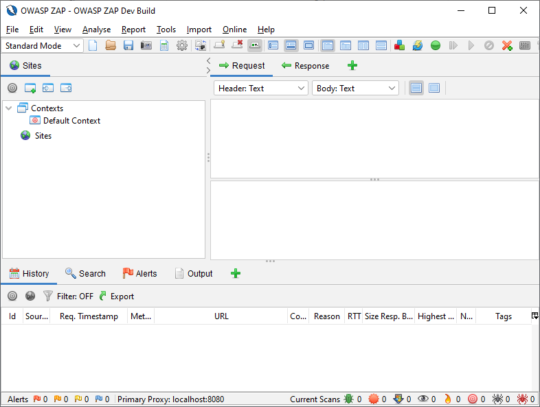
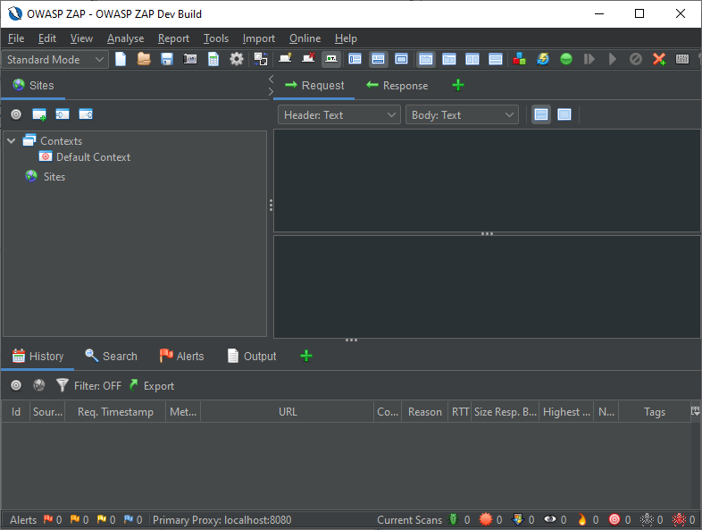
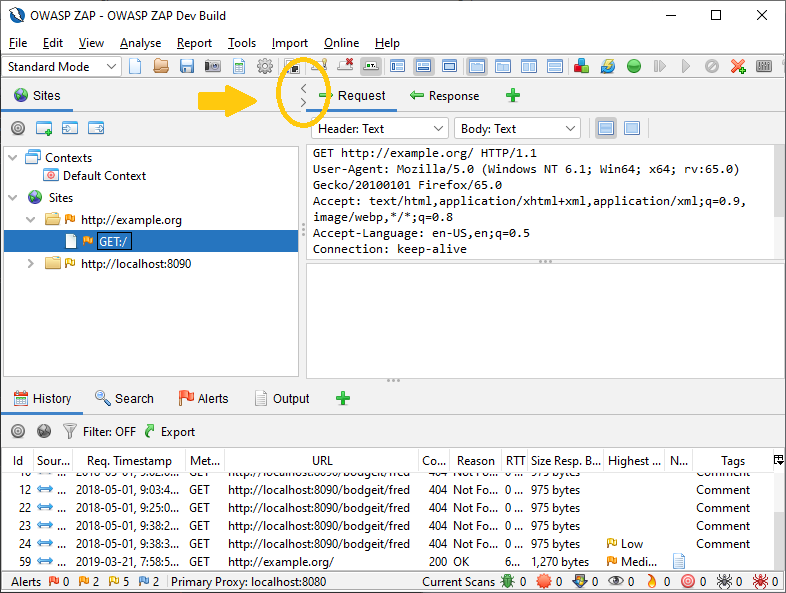
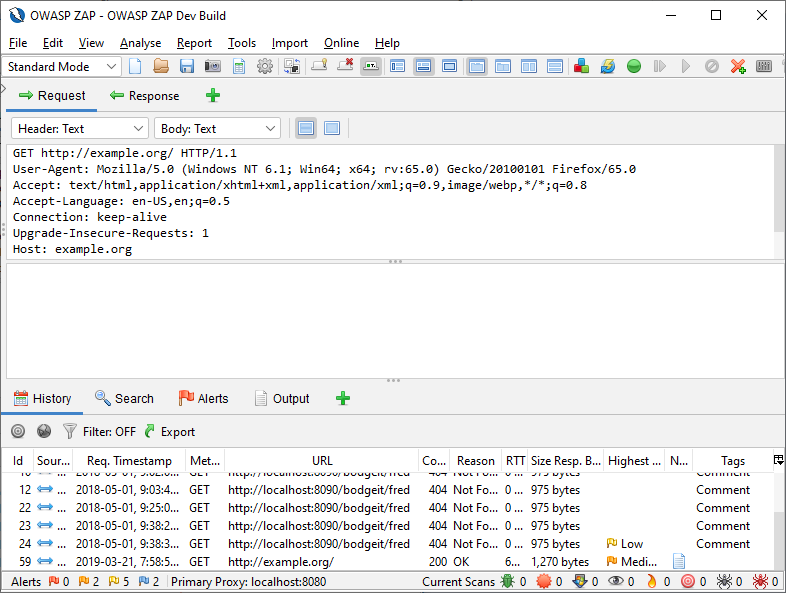
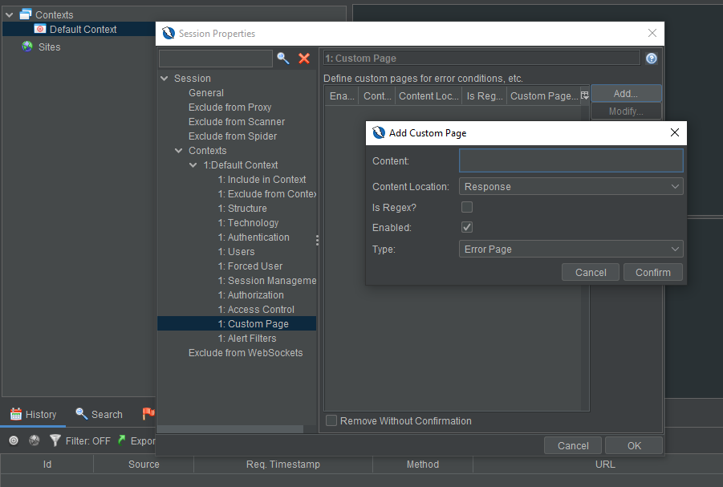
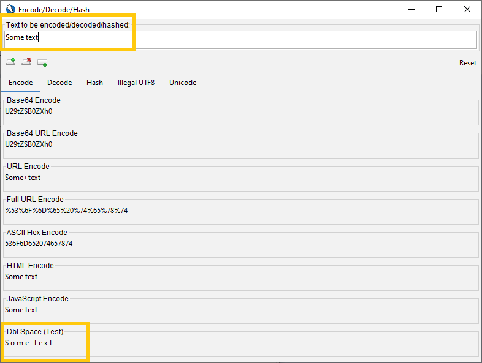

# ZAP 2.10.0

2.10.0 was released in [December 2020](/blog/2020-12-21-zap-2-10-0-the-10-year-anniversary-release/). This article digs into the details of some of the new and exciting features.

For full details see the [2.10.0 release notes](/docs/desktop/releases/2.10.0/).

## Dark Mode

ZAP now supports various different UI themes, including a selection of Dark modes and a modern default Light theme. The look and feel can be set dynamically by clicking on the  button in the main toolbar and then selecting the theme you want to use in the dropdown menu. The new default is `Flat Light`.




## Expandable/Collapseable Top Panes

In order to facilitate a greater number of usage models the top panels now support a left/right expand and collapse control. For example, this is a handy way to hide the Sites Tree (on the left) when you want more real estate to deal with reviewing Request/Response details.
The control appears just below the Main Toolbar and is aligned directly above the left/right split pane divider:



Clicking the &lt; arrow will expand the Request/Response pane (hiding the Sites Tree):



Similarly, clicking the &gt; arrow will expand the Sites Tree, Scripts Tree, etc. (hiding the Request/Response and other work panels).

## Custom Pages

One of ZAP's [oldest issues](https://github.com/zaproxy/zaproxy/issues/9) and a piece of development work that was 3 years in the making came to fruition in 2.10.0.

Have you ever encountered an application that returned a `200 - Ok` instead of a proper `404 - File Not Found` or `500 - Server Error` (or other non-standard handling)? Users can now define custom pages for their Context(s). These will be considered by scan rules whenever a URL is considered to be part of a defined and enabled Context.

This new functionality gives much more specificity and control in properly modeling and therefore assessing targets. There are a few ways this can impact scanning:
1. If the scan rule considers the initial condition of the request/response. (Some scan rules skip testing requests that are in an error state to start with.)
2. If the scan rule considers the state of the response as part of it's analysis. (Some scan rules will not raise alerts when the response is an error state.)

The configurations currently supported by this new functionality are:
1. Ok
2. Not Found
3. Error
4. Other

Of course these types are not necessarily limited to specific status code or simple definition. For example you could definitely define an `Error` type for a `405 - Method Not Allowed`, or `501 - Not Implemented`, etc. The `Other` type is provided to give further flexibility to users who want to script or handle unanticipated circumstances.

The functionality also allows for various options in definition:
- Location: URL or response (content).
- Match type: Regex or plain string¹. 

¹ Obviously a complex regex pattern may impact scan performance.



You can find a video introduction to the functionality [here](http://www.youtube.com/watch?v=rrVr-_-y6Xo&t=1m57s).

## Scriptable Encode/Decode/Hash

The Encode/Decode/Hash functionality provided by ZAP is now scriptable and is now provided via an add-on, so it can be updated between main releases.

It still supports a lot of default transformations:

| Encoder                | Decoders           | Hashers |
|------------------------|--------------------|---------|
| 2 byte Illegal UTF-8   | ASCII Hex Decode   | MD5     |
| 3 byte Illegal UTF-8   | Base 64 Decode     | SHA1    |
| 4 byte Illegal UTF-8   | Base 64 URL Decode | SHA256  |
| ASCII Hex Encode       | HTML Decode        |         |
| Base 64 Encode         | JavaScript Decode  |         |
| Base 64 URL Encode     | URL Decode         |         |
| HTML Encode            | Full URL Decode    |         |
| JavaScript Encode      |                    |         |
| URL Encode             |                    |         |
| Full URL Encode        |                    |         |
| Unescaped Unicode Text |                    |         |

Along with allowing users to create their own scripted transforms. For example say you wanted to be able to double space a string, you could add a JavaScript script such as:

```js
var EncodeDecodeResult = Java.type("org.zaproxy.addon.encoder.processors.EncodeDecodeResult");

/**
 * Process the input value and return the encoded/decoded/hashed etc. value
 *
 * Use EncodeDecodeResult.withError("Error Description") to provide an error description
 * inside the result view
 *
 * @param {String} value - The input value
 * @returns {EncodeDecodeResult} - The value that was encoded/decoded/hashed etc.
 */
function process(value){
    // Replace any character (except last) with the character and a space
    return new EncodeDecodeResult(value.replaceAll(".(?=.)", "$0 ").trim());
}
```



## Authentication Polling

The concept of [Authentication Verification Strategies](/docs/desktop/start/features/authstrategies/) has been introduced which allows ZAP to handle a wider range of authentication mechanisms including the option to poll a specified page for the authentication status of a user.

Checkout this video summary of [auth polling](https://www.youtube.com/watch?v=rrVr-_-y6Xo&t=377s).

## Authentication Header via ENV Vars

To help simplify automated testing usage, CI/CD, etc. A new set of environmental variables are available which allow you to easily add an authentication header to all of the requests that are proxied through ZAP or initiated by the ZAP tools, including the spiders and active scanner. 

- `ZAP_AUTH_HEADER_VALUE` &rarr; if this is defined then its value will be added as a header to all of the requests.
- `ZAP_AUTH_HEADER` &rarr; if this is defined then its value will be used as the header name - if it is not defined then the standard Authorization header will be used.
- `ZAP_AUTH_HEADER_SITE` &rarr; if this is defined then header will only be included in sites who's name includes its value.

You can learn a bit about auth header environment variables [here](https://www.youtube.com/watch?v=rrVr-_-y6Xo&t=1107s).

## Site Tree Control

Scripts and add-ons now have full access to how nodes are represented in the [Sites Tree](/docs/desktop/start/features/sitestree/). Both [Input Vector Scripts](https://github.com/zaproxy/community-scripts/tree/main/variant) and add-ons which include implementations of the [Variant class](https://static.javadoc.io/org.zaproxy/zap/2.10.0/org/parosproxy/paros/core/scanner/Variant.html) can change both the tree structure and names used for new nodes.

For more details see the [Site Tree Modifiers](/blog/2020-09-22-sites-tree-modifiers/) Blog post, and this [video](https://www.youtube.com/watch?v=rrVr-_-y6Xo&t=697s).

## Conclusion

This blog post delved into specific of some of the features that were new to ZAP in 2.10.0. ZAP is constantly being improved by a Global community of volunteers. Watch for more of these posts in the future.

For further details see the [2.10.0 release notes](/docs/desktop/releases/2.10.0/).
