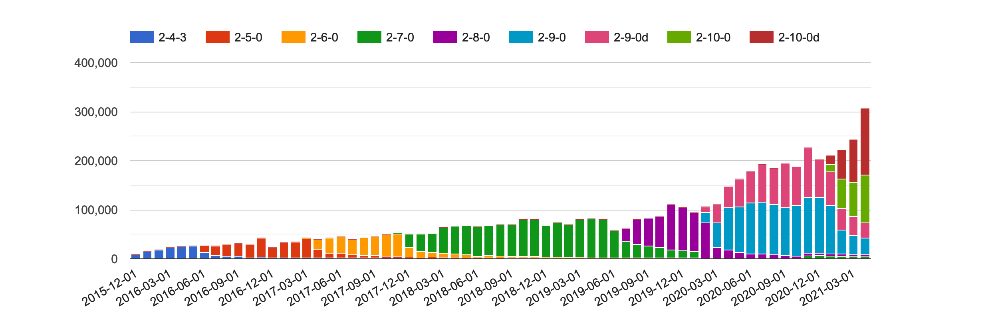

This blog post will show you how you can collect and publish statistics on your open source projects using free resources and open source scripts, based on the setup we have for ZAP.

We’re not doing anything particularly sophisticated and all of the scripts should be easy to understand. 

## Why Collect Statistics?

I released ZAP on [6th September 2010](/blog/2020-09-06-zap-is-ten-years-old/). 
At some point in December it was accepted as an OWASP project and by 1st January 2011 downloads had jumped from virtually none to 433. Is my memory that good? 
No, it was significant enough for me to record that number and I’ve been recording the ZAP download counts at the start of every month in a Google Spreadsheet ever since. 

For many years this was a completely manual process but to be honest I did not mind. 
I wrote a set of scripts to help me and it was always interesting to see how things were changing every month. 
Maintaining an open source project for many years can be a thankless task, but seeing the numbers steadily increase often gave me the encouragement I needed to keep going. 

But don’t worry, this blog post is not just how to maintain statistics in a spreadsheet. We have now automated the process using a set of relatively simple scripts that should be easy for you to copy and adapt to your needs.

Although we only collect limited stats we do get some really useful feedback. For example we have seen the percentage of people using the ZAP daemon increase steadily to the point where it is significantly higher than the desktop usage. This helps us plan what features we should focus on.

Statistics can also be great bragging rights - we now proudly state that ZAP is “the world’s most widely used web app scanner”. 
We were able to back that claim up with [our statistics](/blog/2020-04-02-is-zap-the-worlds-most-popular-web-scanner/) 
and made sure that our open source and commercial competitors were well aware of it. 
None of them have chosen to contest the claim so it must be true &#128513;

## What to Collect

Which statistics you collect will depend on your project and what's available to you, but these are some of the ones we collect for ZAP.

### Downloads

How often is your app downloaded? This doesn’t tell us how many people actually use it but it is still good to know how the number of downloads changes over time. 

This was initially all I recorded. When we had to move our downloads then a key requirement was that whatever platform we chose gave us download stats.
All of the ZAP downloads are hosted on GitHub so we can use their public APIs to access them. GitHub does not provide any history so recording these stats regularly is important.

This is of course more complicated if your app can be downloaded from different places. For example ZAP can be downloaded or accessed via a wide range of options including [Linux repos](https://software.opensuse.org/download.html?project=home%3Acabelo&package=zap), 
[Homebrew](https://formulae.brew.sh/cask/zap), [Snapcraft](https://snapcraft.io/zaproxy), [Flathub](https://flathub.org/apps/details/org.zaproxy.ZAP) 
and bundled in [Kali](https://tools.kali.org/web-applications/zaproxy). 
Very few of these options provide any stats so we do not really know how many people use ZAP in these ways.

### Docker Pulls

Another key metric for us, especially as the [ZAP Docker images](/docs/docker/about/) have proved so popular. 
Docker also provides public APIs which we can use. Again there is no history so it is important to record these regularly.

Some people have started asking us to make the ZAP Docker images available via Amazon ECR but so far I have not found out if it is possible to get usage stats for the pulls. 
If that is not possible then I’ll resist these calls - statistics are that important to us.

### Check for Update Requests

ZAP makes various “[calls home](/faq/what-calls-home-does-zap-make/)” - 
these are all via [Bitly](https://bitly.com/) URLs which means we get to find out how many calls were made. 
We create new Bitly URLs for each release so we can see which versions of ZAP people are using, and since 2.9.0 whether they are using ZAP in daemon or desktop mode.

Bitly does provide a limited history with a free account but again we record these stats via their API regularly so that we have the complete history.

These statistics are really useful for us as they give us an indication of the number of people who are actually using ZAP. 
We know that this is not the full picture - we are very public about what we collect and provide a [command line](/docs/desktop/cmdline/) option which will prevent any of these calls being made. 
We also know that many users use ZAP in environments where either all outgoing calls are blocked or just those to services like Bitly.

### User Interactions

Users can interact with us in a [large number of ways](/community/), including a set of GitHub issues, Google Groups, Slack channels, Discord, IRC, email, StackOverflow … the list goes on and on.

We try to push most discussions to the ZAP User Group and so we collect statistics for this group as well. 
Google Groups are actually a pain - there is no API for it and no easy way to collect statistics. 
Right now I manually run a simple [script](https://github.com/zapbot/zap-mgmt-scripts/blob/master/stats/group_count.gs) against my GMail inbox once a month - 
I don’t delete any emails from this group so it should be accurate. 
It is not pretty but it works!

## The Framework

For ZAP we follow a simple framework which is based on one I introduced when I was working in the Mozilla Web Security team. 
It worked well there so I simplified it even further and changed it to only use free services and resources (well, mostly).

At a high level all we do is:

1. Schedule
1. Collect
1. Store
1. Process
1. Display

### Schedule

You should collect your stats at regular intervals. When I was doing this manually I did it once a month but now it’s all automated we record them daily.
At Mozilla we used a Jenkins service for the scheduling as we were already using that for other jobs, but for ZAP we use GitHub Actions.
We have a separate set of “zapbot” accounts we use for many of the ZAP admin tasks and so the GitHub action we use is in the zapbot/zap-mgmt-scripts repo : 
[record-stats-v2.yml](https://github.com/zapbot/zap-mgmt-scripts/blob/master/.github/workflows/record-stats-v2.yml)

### Collect

The GitHub action calls a simple [stats.py](https://github.com/zapbot/zap-mgmt-scripts/blob/master/stats/stats.py) script passing in the ‘collect’ parameter. 
This in turn calls the collect method of subordinate scripts:

* [bitly.py](https://github.com/zapbot/zap-mgmt-scripts/blob/master/stats/bitly.py)
* [docker.py](https://github.com/zapbot/zap-mgmt-scripts/blob/master/stats/docker.py)
* [github.py](https://github.com/zapbot/zap-mgmt-scripts/blob/master/stats/github.py)
* [groups.py](https://github.com/zapbot/zap-mgmt-scripts/blob/master/stats/groups.py)

Each of these scripts is responsible for handling the statistics for a service. They call the relevant APIs to retrieve the data we want.

### Store

We store the raw and processed data in flat text files.
It doesn't really matter where you store them, for many years the Mozilla security stats were stored in a private GitHub repo. However we were collecting a lot of stats and over time the repo became very large so we switched to putting them in S3 buckets.
We do the same for ZAP stats - it’s not strictly speaking a free solution but as a flagship OWASP project we get access to various AWS services including S3 so that’s what we use.

The file structure is:

* s3://project-zap/stats/
  * bitly
    * daily
    * monthly
    * raw
  * docker
    * daily
    * monthly
    * raw
  * downloads
    * daily
    * monthly
    * raw
  * groups
    * monthly

When downloaded the statistics are stored in the relevant “raw” directory in a filename with the format YYYY-MM-DD-*statistic*.json
We store the full response from the relevant API, this means that we will be able to extract more data from these responses in the future if we decide we need to.
The “*statistic*” part will relate to the relevant statistic, for example for downloads this will be the version number.

### Process
The same [record-stats-v2.yml](https://github.com/zapbot/zap-mgmt-scripts/blob/master/.github/workflows/record-stats-v2.yml) GitHub action calls the same 
[stats.py](https://github.com/zapbot/zap-mgmt-scripts/blob/master/stats/stats.py) script but this time passing in the ‘daily’ parameter.
The sub-scripts then process any of the raw files that have not been processed, extracts only what we are interested in and outputs that into a new file in the relevant “daily” directory. These files contain all of the stats for that day and are all named YYYY-MM-DD.csv

The scripts also generate the relevant “monthly” files. Originally the plan was to do this on a separate schedule but it turned out to be easier to generate them this way, or at least that’s what I think.

When I created the infrastructure for the Mozilla web security stats we actually fed these into AWS Athena. Athena supports complex data structures so it is possible to skip this processing step if you use it or something with a similar option. However I found the configuration confusing and difficult to maintain. I’m a developer and understand code so even then I processed the stats with a script and created simple CSV files. These can be easily used by a wide range of technologies and services.

If you are able to use a service like Redash, Athena, Quicksight or Data Studio then you probably do not need to maintain separate ‘monthly’ files. We do as it makes the generation of our monthly charts much easier and because of the monthly stats that I used to collect manually - I’ve added some of these to S3 so can go back much further with the monthly stats than we can with the daily ones.

Finally the GitHub Action pushes any newly created files back into S3.

### Display
At Mozilla we used Redash, AWS Quicksight and Google Data Studio.

As the ZAP data is already in S3 I tried out Quicksight again. Unfortunately I found it didn’t meet my requirements, especially because I couldn’t share dashboards publicly. 

So in the end I chose a simpler option - creating charts directly on this static website: https://www.zaproxy.org.

We have another GitHub action [update-website-stats.yml](https://github.com/zapbot/zap-mgmt-scripts/blob/master/.github/workflows/update-website-stats.yml) 
which runs once a month. This calls the [stats.py](https://github.com/zapbot/zap-mgmt-scripts/blob/master/stats/stats.py) script passing in the ‘website’ parameter.
The sub-scripts process the monthly files and generate data files for our website.
This is implemented using Hugo and I implemented a simple Hugo shortcode [chart.html](https://github.com/zaproxy/zaproxy-website/blob/main/site/layouts/shortcodes/chart.html) which creates a chart using [Google Charts](https://developers.google.com/chart) and the data file supplied. 
The action then submits a pull request which we need to manually approve before it will be applied to the site. We do this for all of the other data that we update on this site.

And that is it! You can see all of the ZAP public stats on [/statistics/](/statistics/)

## The Future

Am I happy with the statistics that we collect for ZAP?

No - I want to know a lot more! I want to know which ZAP features people actually use.

My plan is to add telemetry to ZAP. However ZAP is a security tool and it therefore deals with very sensitive data. We have no need or desire to collect any information that may make our users nervous.
This means that we will have to be very careful with the data we collect, be very public about it and make it easy for people to opt out.
If and when we do implement this then you can be sure that we’ll write another blog post about it.
