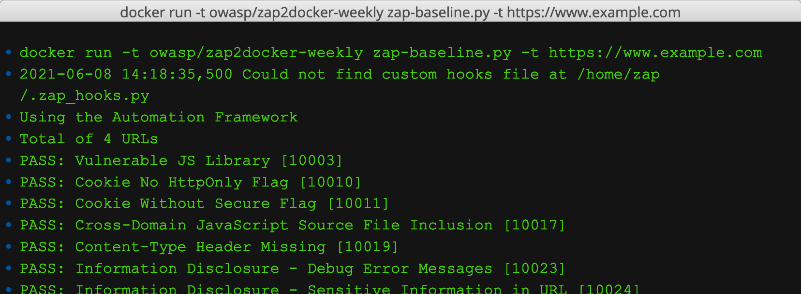

We are changing the [baseline scan](/docs/docker/baseline-scan/) (and the other packaged scans in time) to use the new [Automation Framework](/docs/automate/automation-framework/) (AF).

Hopefully the changes will not affect any of you who use it but we want to make sure that you understand what has changed and what to do if you think it is not working.

We would also like you to try it out as soon as possible and to [report any issues](https://github.com/zaproxy/zaproxy/issues) to us.

The current status is:

* [live](https://hub.docker.com/r/owasp/zap2docker-live/) docker image - AF used only if __explicitly enabled__
* [weekly](https://hub.docker.com/r/owasp/zap2docker-weekly/) docker image - AF used only if __explicitly enabled__
* [stable](https://hub.docker.com/r/owasp/zap2docker-stable/) docker image - AF will __not__ be used (this will only be changed at the next full release)

## Change Summary

Depending on which options you choose the baseline scan may now use the new [Automation Framework](/docs/automate/automation-framework/) (AF) instead of controlling ZAP via the API. This is part of an ongoing development to migrate all of the packaged scans to use the AF.

Initially the AF has to be explicitly enabled using the `--auto` baseline scan option. 
We would encourage everyone who uses the baseline scan to try this out and [report any issues](https://github.com/zaproxy/zaproxy/issues) to us.

We will be enabling the AF as soon as we are happy that there are no breaking changes, at which point the `--auto` flag will be ignored.
However you will be able to use the new `--autooff` flag to disable it.

Not all of the baseline options are currently supported by the AF which is why it will depend on the options you use - if you use any options not supported by the AF then the baseline will work as before, even if `--auto` is specified.

We are continually enhancing the AF so more baseline options will become supported in the coming weeks - this is an ongoing process and will therefore not warrant further blog posts :)

To see exactly which parameters are supported see the source code https://github.com/zaproxy/zaproxy/blob/main/docker/zap-baseline.py 

## Output Differences

If the AF is used for the baseline scan then the following line will be included in the output:

```
Using the Automation Framework
```

If you use the `-d` option to output diagnostic messages then these will differ significantly as the underlying mechanisms have changed.

If the AF reports any errors or warnings then these will be reported in a different way:

2021-06-10 11:08:44,764 Could not find custom hooks file at /home/zap/.zap_hooks.py 
2021-06-10 11:08:53,809 Failed to access summary file /zap/zap_out.json
Using the Automation Framework
Automation plan failures:
	Job spider failed to access URL https://www.example.bad check that it is valid : www.example.bad


If you map a drive to `/zap/wrk` and if the AF is used then it will copy the `zap.yaml` job configuration file into the drive you have mapped. This can be used to migrate away from the packaged scans to take full advantage of the new features we will be adding to the AF.

An example yaml file generated by the command:

```
docker run -v $(pwd):/zap/wrk/:rw -t owasp/zap2docker-weekly zap-baseline.py -t https://www.example.com -j --auto
``` 

```yaml
env:
  contexts:
  - name: baseline
    urls:
    - https://www.example.com
  parameters:
    failOnError: true
    progressToStdout: false
jobs:
- install:
  - pscanrulesBeta
  type: addOns
  uninstall: []
- parameters:
    enableTags: false
    maxAlertsPerRule: 10
  type: passiveScan-config
- parameters:
    maxDuration: 1
    url: https://www.example.com
  type: spider
- parameters:
    maxDuration: 1
    url: https://www.example.com
  type: spiderAjax
- parameters:
    maxDuration: 0
  type: passiveScan-wait
- parameters:
    format: Long
    summaryFile: /zap/zap_out.json
  type: outputSummary
```

Note that we will not be getting rid of the packaged scans, but the AF will provide more features and flexibility.

### Scanning example.com with the AF

2021-06-10 13:21:56,388 Could not find custom hooks file at /home/zap/.zap_hooks.py 
Using the Automation Framework
Total of 4 URLs
PASS: Vulnerable JS Library [10003]
PASS: Cookie No HttpOnly Flag [10010]
PASS: Cookie Without Secure Flag [10011]
PASS: Cross-Domain JavaScript Source File Inclusion [10017]
PASS: Content-Type Header Missing [10019]
PASS: Information Disclosure - Debug Error Messages [10023]
PASS: Information Disclosure - Sensitive Information in URL [10024]
PASS: Information Disclosure - Sensitive Information in HTTP Referrer Header [10025]
PASS: HTTP Parameter Override [10026]
PASS: Information Disclosure - Suspicious Comments [10027]
PASS: Open Redirect [10028]
PASS: Cookie Poisoning [10029]
PASS: User Controllable Charset [10030]
PASS: User Controllable HTML Element Attribute (Potential XSS) [10031]
PASS: Viewstate [10032]
PASS: Directory Browsing [10033]
PASS: Heartbleed OpenSSL Vulnerability (Indicative) [10034]
PASS: Server Leaks Information via "X-Powered-By" HTTP Response Header Field(s) [10037]
PASS: X-Backend-Server Header Information Leak [10039]
PASS: Secure Pages Include Mixed Content [10040]
PASS: HTTP to HTTPS Insecure Transition in Form Post [10041]
PASS: HTTPS to HTTP Insecure Transition in Form Post [10042]
PASS: User Controllable JavaScript Event (XSS) [10043]
PASS: Big Redirect Detected (Potential Sensitive Information Leak) [10044]
PASS: X-ChromeLogger-Data (XCOLD) Header Information Leak [10052]
PASS: Cookie without SameSite Attribute [10054]
PASS: CSP [10055]
PASS: X-Debug-Token Information Leak [10056]
PASS: Username Hash Found [10057]
PASS: X-AspNet-Version Response Header [10061]
PASS: PII Disclosure [10062]
PASS: Timestamp Disclosure [10096]
PASS: Hash Disclosure [10097]
PASS: Cross-Domain Misconfiguration [10098]
PASS: Weak Authentication Method [10105]
PASS: Reverse Tabnabbing [10108]
PASS: Modern Web Application [10109]
PASS: Absence of Anti-CSRF Tokens [10202]
PASS: Private IP Disclosure [2]
PASS: Session ID in URL Rewrite [3]
PASS: Script Passive Scan Rules [50001]
PASS: Stats Passive Scan Rule [50003]
PASS: Insecure JSF ViewState [90001]
PASS: Charset Mismatch [90011]
PASS: Application Error Disclosure [90022]
PASS: WSDL File Detection [90030]
PASS: Loosely Scoped Cookie [90033]
WARN-NEW: Incomplete or No Cache-control Header Set [10015] x 1
	https://www.example.com/ (200)
WARN-NEW: X-Frame-Options Header [10020] x 1
	https://www.example.com/ (200)
WARN-NEW: X-Content-Type-Options Header Missing [10021] x 1
	https://www.example.com/ (200)
WARN-NEW: Strict-Transport-Security Header [10035] x 3
	https://www.example.com/ (200)
	https://www.example.com/robots.txt (404)
	https://www.example.com/sitemap.xml (404)
WARN-NEW: HTTP Server Response Header [10036] x 4
	https://www.example.com/ (200)
	https://www.example.com/ (200)
	https://www.example.com/robots.txt (404)
	https://www.example.com/sitemap.xml (404)
WARN-NEW: Content Security Policy (CSP) Header Not Set [10038] x 3
	https://www.example.com/ (200)
	https://www.example.com/robots.txt (404)
	https://www.example.com/sitemap.xml (404)
WARN-NEW: Retrieved from Cache [10050] x 3
	https://www.example.com/ (200)
	https://www.example.com/robots.txt (404)
	https://www.example.com/sitemap.xml (404)
FAIL-NEW: 0	FAIL-INPROG: 0	WARN-NEW: 7	WARN-INPROG: 0	INFO: 0	IGNORE: 0	PASS: 47

### Scanning example.com without the AF

2021-06-10 13:22:14,620 Could not find custom hooks file at /home/zap/.zap_hooks.py 
Total of 4 URLs
PASS: Vulnerable JS Library [10003]
PASS: Cookie No HttpOnly Flag [10010]
PASS: Cookie Without Secure Flag [10011]
PASS: Cross-Domain JavaScript Source File Inclusion [10017]
PASS: Content-Type Header Missing [10019]
PASS: Information Disclosure - Debug Error Messages [10023]
PASS: Information Disclosure - Sensitive Information in URL [10024]
PASS: Information Disclosure - Sensitive Information in HTTP Referrer Header [10025]
PASS: HTTP Parameter Override [10026]
PASS: Information Disclosure - Suspicious Comments [10027]
PASS: Open Redirect [10028]
PASS: Cookie Poisoning [10029]
PASS: User Controllable Charset [10030]
PASS: User Controllable HTML Element Attribute (Potential XSS) [10031]
PASS: Viewstate [10032]
PASS: Directory Browsing [10033]
PASS: Heartbleed OpenSSL Vulnerability (Indicative) [10034]
PASS: Server Leaks Information via "X-Powered-By" HTTP Response Header Field(s) [10037]
PASS: X-Backend-Server Header Information Leak [10039]
PASS: Secure Pages Include Mixed Content [10040]
PASS: HTTP to HTTPS Insecure Transition in Form Post [10041]
PASS: HTTPS to HTTP Insecure Transition in Form Post [10042]
PASS: User Controllable JavaScript Event (XSS) [10043]
PASS: Big Redirect Detected (Potential Sensitive Information Leak) [10044]
PASS: Retrieved from Cache [10050]
PASS: X-ChromeLogger-Data (XCOLD) Header Information Leak [10052]
PASS: Cookie without SameSite Attribute [10054]
PASS: CSP [10055]
PASS: X-Debug-Token Information Leak [10056]
PASS: Username Hash Found [10057]
PASS: X-AspNet-Version Response Header [10061]
PASS: PII Disclosure [10062]
PASS: Timestamp Disclosure [10096]
PASS: Hash Disclosure [10097]
PASS: Cross-Domain Misconfiguration [10098]
PASS: Weak Authentication Method [10105]
PASS: Reverse Tabnabbing [10108]
PASS: Modern Web Application [10109]
PASS: Absence of Anti-CSRF Tokens [10202]
PASS: Private IP Disclosure [2]
PASS: Session ID in URL Rewrite [3]
PASS: Script Passive Scan Rules [50001]
PASS: Insecure JSF ViewState [90001]
PASS: Charset Mismatch [90011]
PASS: Application Error Disclosure [90022]
PASS: WSDL File Detection [90030]
PASS: Loosely Scoped Cookie [90033]
WARN-NEW: Incomplete or No Cache-control Header Set [10015] x 1 
	https://www.example.com/ (200 OK)
WARN-NEW: X-Frame-Options Header Not Set [10020] x 1 
	https://www.example.com/ (200 OK)
WARN-NEW: X-Content-Type-Options Header Missing [10021] x 1 
	https://www.example.com/ (200 OK)
WARN-NEW: Strict-Transport-Security Header Not Set [10035] x 3 
	https://www.example.com/ (200 OK)
	https://www.example.com/robots.txt (404 Not Found)
	https://www.example.com/sitemap.xml (404 Not Found)
WARN-NEW: Server Leaks Version Information via "Server" HTTP Response Header Field [10036] x 4 
	https://www.example.com/ (200 OK)
	https://www.example.com/robots.txt (404 Not Found)
	https://www.example.com/ (200 OK)
	https://www.example.com/sitemap.xml (404 Not Found)
WARN-NEW: Content Security Policy (CSP) Header Not Set [10038] x 3 
	https://www.example.com/ (200 OK)
	https://www.example.com/robots.txt (404 Not Found)
	https://www.example.com/sitemap.xml (404 Not Found)
FAIL-NEW: 0	FAIL-INPROG: 0	WARN-NEW: 6	WARN-INPROG: 0	INFO: 0	IGNORE: 0	PASS: 47

As you will see, in this case the AF reports one more issue than the non-AF case.

## Reverting to the Original Baseline

If you experience any problems with the AF then please let us know asap.
While we are resolving them then you can use the new `--autooff` option which will disable the AF.

Please note that this is a temporary option that will only be available while we are in the process of migrating the scripts. At some point this option will be removed so you must tell us if you experience any problems.
