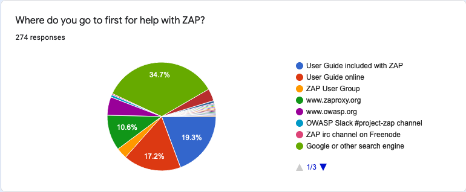
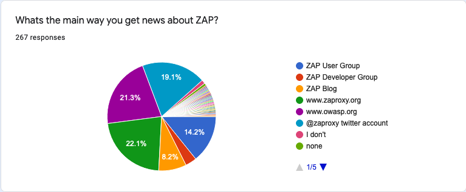
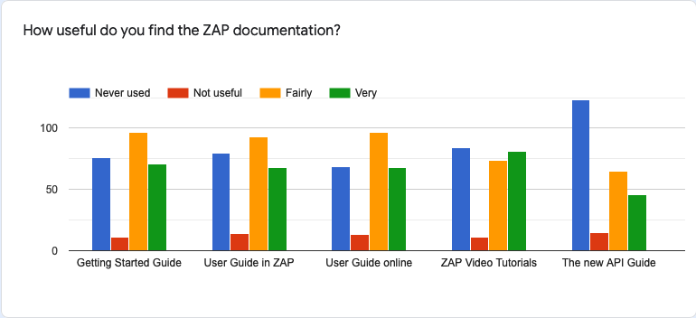

In December 2020 we published a Community Questionnaire focused on feedback and documentation.
We have just closed that questionnaire and wanted to share the results and explain how they are changing what we do.

## The Results

__Thank you__ to all of the 290 people who answered our questions - as you'll see we find the answers really helpful and they __do__ impact what we do.

### Where do you go to first for help with ZAP?

The largest single response was to go to Google or other search engine. 
It is a little bit problematic for us in that we have no direct control over what search engines return.

However it is also not too surprising - I must admit that I also use Google to find out specific things about ZAP (including things that I have documented!) and fortunately our content tends to come high up in the search results.

The combination of the User Guide (on and off line) and this site (which includes the user guide) account for nearly 50% which is good to see.

I must admit I’m a bit puzzled by the 5.5% of people who go to https://owasp.org first as we have no real content there, just a redirect to this site!

### What's the main way you get news about ZAP?

It's good to see that the sites we have some control over, the ZAP Groups, website, twitter and blog account for nearly 70% of the responses.

The 21.3% who use https://owasp.org are again a bit troubling as we do not tend to use that very much for ZAP news.

### How useful do you find the ZAP documentation?

The low number of "Not useful" and relatively high numbers of "Fairly" and "Very" useful replies are very gratifying to see.
Documentation used to be one of ZAP's weak spots and it's something we have been focusing on. 
We know there's (always) more to do but its good to see that we appear to be going in the right direction.

The fact that fewer people use the API documentation is not too concerning as we know that will only be of interest to a subset of ZAP users.

However it does appear that many people have not used any of the ZAP docs. Is that because ZAP is so intuitive that they don't need to??
To be honest I have no idea!

### What would you like us to document better?

This was a free format question so a bit harder to analyse.

However there were definitely some recurring themes:

Lots of people would like more __examples and case studies__.
That is not too surprising as it is not something we've really focused on.

The next most popular type of answer was that people were __happy__ with the documentation we already have. That is good to hear, but we will not be resting on our laurels!

__Scripting__ was the next most popular topic, despite the fact that we've recorded quite a few [videos](/videos-list/) specifically on scripting.

__APIs__ also came up in quite a few of the responses, including requests for more examples and better documentation around the format of the responses.

There were a few answers relating the __contexts and scope__ but after that the rest of the answers covered a wide range of different topics.

### What format would you find most useful (articles, videos, etc)?

Although this was free format the answers were much more focused making it easier to analyse.

The answers were pretty evenly split between __articles__ and __videos__, with some people preferring one and other people liking both.

### Would you like to be featured in a "ZAP Success Stories" section on [www.zaproxy.org](https://www.zaproxy.org)?

Quite a few of you said you might be interested - we have contacted some of you and will contact the rest very shortly.

### Do you have any other feedback about ZAP?

We had some great feedback here, for example:

---

`I like opensource projects because for their transparency and reliability and because they are accessible to more people and give the possibility of learning more deeply. It has been very important for my learning and training. I'm neurodivergent person (autistic) and I would like more easy ways of learning, like subtitles and traductions in videos (I'm half deaf too) and wroten articles.`

---

`Great tool! Thanks for all of your contributions to the community.`

---

`It's amazing to see what ZAP has accomplished, and what can be accomplished with ZAP.  Huge thanks to Simon and all of the other contributors who continue to work on it.`

---

`Thank you for building and maintaining the best DAST tool there is.`

---

`Thank you so much for this wonderful open source tool!!!`

---

`very impressive tool`

---

`Great! Keep going.`

---

`Thank you for providing this awesome tool`

---

`Great work, Simon and Team.`

---

`You guys have done a really fuc*ing good work`

---

`Great job guys! I'm new in the community, but fairly like ZAP so far...`

---

`Best App For Analysing Websites`

---

`Like with all open-source community projects: keep it up and thank you for everything! I guess I'll reach out to OWASP in the near future because I would like to get involved in such work too`

---

`it's great that this becomes somewhat industry standard when things get escalated to vendor such as firewall/security app, they know what you are talking about and acknowledge there is some ground to investigate instead of treating you like an yahoo.`

---

`ZAP is simply awesome!!!`

---

`Great tool, love that it works everywhere!!!`

---

`Thank you for this awesome gratis + open source software.`

---

`Great Job, this is one of my favorite tools, please make access control validation easier, manually selecting every single page for every single user is too much`

---

`OWASP ZAP is an amazing tool for web pentesting it have every thing i desired for web app pentration testing`

---

`I love this tool`

---

`Sorry, but the reporting sucks, and limits the usefulness of the tool.`

## What we are going to do differently

We publish questionnaires like this one because we do want feedback from you.
And there is no point in asking for feedback if we do not change what we do as a result!

### News

The current split of blog posts, tweets and messages to the ZAP groups seems to be working well.

Although maybe we should look at getting a bit __more content__ onto https://owasp.org !

### Documentation

Most of you are already going directly to our documentation, or searching for it via Google or other search providers.
To me that indicates we are on the right track - we need to produce __more documentation__ like this and ensure it is __high quality__ so that it appears high up in search results.

Articles and videos appear to be equally popular, and I can see why they are both useful.
We have been focusing on creating new [videos](/videos-list/) but it is clear we need to __focus on articles__ just as much, or possibly more in order to catch up!

We need to seriously look at producing more (or even some!) more __detailed examples__ and __case studies__.
This is not something we have a great deal of experience doing so if you would like to help us with this then please [get in contact](mailto:zaproxy-admin@googlegroups.com) with us.

And it looks like articles on __scripting__ and the __APIs__ are well overdue!

### Success Stories

We will be __following up__ with people who said they might be interested in contributing the the ZAP [Success Stories](/success/) but if you did not reply but would still like to be featured then just get in touch with us as per the links on that page.

The positive feedback was great to receive, and to the person who (rightly) complained about the reporting - hopefully the new [Report Generation](/docs/desktop/addons/report-generation/) add-on has addressed this long standing problem. If not then let us know what [enhancements](https://github.com/zaproxy/zaproxy/issues/new?template=feature-request.yml) you would like to see!
