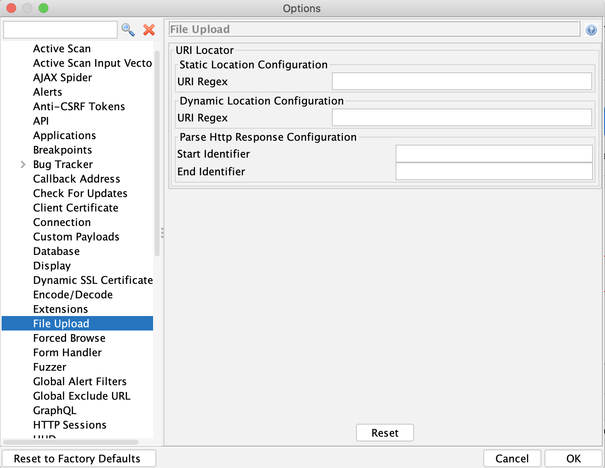

## Overview
File upload is becoming a more and more essential part of any application, where the user is able to upload their photo, their CV, or a video showcasing a project they are working on. The application should be able to fend off bogus and malicious files in a way to keep the application and the users safe. Generally file upload functionality is quite complex to automate and has huge attack surface hence there is a need to automate the process and also secure it. So the FileUpload add-on has scan rule which is used to find vulnerabilities in file upload functionality and this blog explains on how to use it.

## Configuration
File upload functionality generally has 2 endpoints, one from where file is uploaded and one from where file is retrieved. It is necessary to know both these endpoints. While Active Scanning an application, file upload endpoint is already known but retrieval endpoint is not known to the scan rule hence there are configuration details specific to the retrieval endpoint.

Under ZAP's Options dialog you will find the File Upload screen as shown below:

 
### Explanation

For finding the URL to retrieve/view the uploaded file, here are some options:

1. In some applications, the URL to retrieve the uploaded file is **static** and doesn't change or only the file name is changed. For handling this type of configuration, options panel has **Static Location Configuration** where static URL is added into URI Regex field. URI Regex field also supports the dynamic file name by **${fileName}** parameter, for e.g. `http://<baseurl>/${fileName}`.
2. In some applications the URL to retrieve the uploaded file is present in the **file upload request's response**. For handling this type of configuration, options panel has **Parse HTTP Response Configuration** which has 2 parameters **Start Identifier** and **End Identifier**. These identifiers are used to locate the URL within the response.
3. In some applications the URL to retrieve the uploaded file is present in the **response of a different URL** which is called a **preflight request**. E.g. Profile picture URL is part of profile page and hence we need to parse the response of the profile page to find the URL of the profile picture. For handling this type of configuration, the options panel has **Dynamic Location Configuration** which has a **URI Regex** and **Parse HTTP Response Configuration** which has **Start Identifier**, and **End Identifier**. So the FileUpload add-on will invoke the URI mentioned in URI Regex and then parse the response using Start Identifier and End Identifier. URI Regex field also supports the dynamic file name by **${fileName}**.

As FileUpload add-on's scan rule will execute as part of OWASP ZAP Active Scan, so after filling these configuration details, run the active scan in order to find the vulnerabilities in file upload functionality.

## Vulnerability Coverage
The FileUpload add-on's scan rule attempts to upload various types of files with payloads and then tries to retrieve them to identify vulnerabilities present in the file upload functionality. 

FileUpload add-on uploads following types of files:
- HTML and its variants
- JSP and its variants
- JPEG and GIF images
- EICAR file
- SVG images

Vulnerabilities covered are:
- Cross site scripting
- Remote Code Execution by uploading JSP and its variants
- No virus scan. 

The FileUpload add-on is currently only available for dev versions of ZAP such as weekly releases or built from source, as it depends on an up-to-date version of ZAP's core.
The add-on will be made available in the [ZAP Marketplace](https://www.zaproxy.org/addons/) for newer ZAP versions.
For more information please visit [FileUpload addon](https://github.com/SasanLabs/owasp-zap-fileupload-addon)

For detailed information on FileUpload add-on configuration see the following video: 

## Special Thanks
This addon is highly inspired from [Upload-Scanner](https://github.com/portswigger/upload-scanner) and uses many concepts from Upload-Scanner extension.