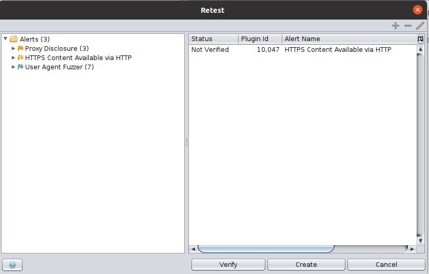
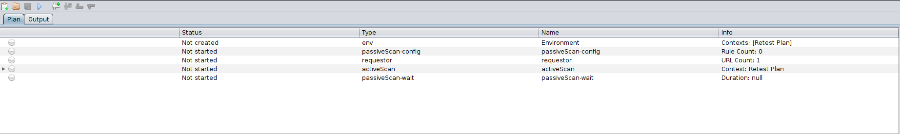

ZAP is a great tool to detect vulnerabilities of different kinds in web applications and generate alerts accordingly. However, it currently lacks a user-friendly mechanism to revalidate or retest the identified weaknesses.

Whenever any reported vulnerability is claimed to have been fixed by the developer, a tester using ZAP has to set up all the original scan settings used to detect the vulnerability once again, which is a tiresome and time-consuming process.

The add-on aims to simplify this process, by generating a "Retest Plan" corresponding to the alerts selected for retesting, which could then be run in ZAP via the use of the Automation Framework.

## Generating a Plan 

The user can select any number of alerts that they wish to retest in the Alerts tab. Then they can right-click, and choose the "Retest..." option, which would open up the Retest Dialog. The dialog can also be opened via using the `Tools` &rarr; `Retest...` option.
Here, they can add further alerts to be included in the plan by selecting them in the alerts tree on the left and clicking on the '+' button. They can also remove alerts by selecting them in the panel on the right and clicking on the '-' button.
All selected alerts can also be edited using the 'Edit' button, which allows the users to (optionally) specify regexes for various fields against which to match any alerts which are generated.

## Verifying and Running a Plan 

The dialog has a 'Verify' button, which checks whether the alerts which have been selected to be included in the plan, are actually present at that moment. This ensures that the user is faced with no surprises when they use the plan somewhat later down the line.
Each selected alert has a status column in the table, which displays the current status of the alert, which is one out of 'Not Verified', 'Present' and 'Absent'.

The user can click on the 'Create' button, which creates the plan and loads it in the automation panel. From here, the user can reorder/modify the jobs as required and also run the plan. More information on how the Automation Framework GUI works is given [here](https://www.zaproxy.org/docs/desktop/addons/automation-framework/gui/)
Since a retest plan can be run from the command line too, it is also easy to integrate it within a CI/CD pipeline.

## Retest Result 

The user can see the result of running the retest plan in the Output tab of the automation panel. The 'Pass'/'Failed' status for an alert test depends on whether that alert was being checked for its absence or for its presence. This value can be configured by changing the 'Action' field
of an alert via the Edit alert functionality described above.

## The Retest API
The add-on also has an API, which currently supports only one 'retest' action. The user can supply a list of comma separated alert IDs for retesting, and would receive a response containing the 'Present'/'Absent' status of an alert along with the values of all the fields describing that alert.

## Future Plans
The add-on is still currently in its early stages, so feel free to report any issues you face at the [ZAP User Group](https://groups.google.com/group/zaproxy-users) or raise a GitHub [issue](https://github.com/zaproxy/zaproxy/issues) for bugs.
One major enhancement that the add-on definitely needs is the ability to retest authenticated alerts. I definitely plan to add this soon, as retesting alerts without having to deal with authentication, was one of the main reasons which lead people to request for this functionality.
Currently, all the information required to retest any authenticated alert is not persisted to a ZAP session. Once authentication is in place, I also plan to implement this, as it would allow users to create a plan from a previously saved session.

There are other UI enhancements which I plan to implement in the future, such as adding tests grouped by their alert ID, adding a flag icon on the right-hand pane for tests with the risk set (thus allowing users to ID the most important tests) etc.

I implemented this add-on as a part of my Google Summer of Code 2021 project, and this would not have been possible without the constant guidance and help I received from my mentors Simon, Ricardo and Rick.
Their feedback was instrumental in helping me finish what initially seemed like a gigantic task. I also learned a lot from them during the course of the project, and I am grateful to them for the same.

## List of Retest PRs

This is a list of all pull requests (excluding those related to releases) that were created for the retest add-on.

|Pull Request|Description|
|---|---|
|[#2998](https://github.com/zaproxy/zap-extensions/pull/2998)|Add a new requestor job to the automation framework|
|[#3020](https://github.com/zaproxy/zap-extensions/pull/3020)|Added alerts tests to the automation framework|
|[#3050](https://github.com/zaproxy/zap-extensions/pull/3050)|The first version of the add-on|

