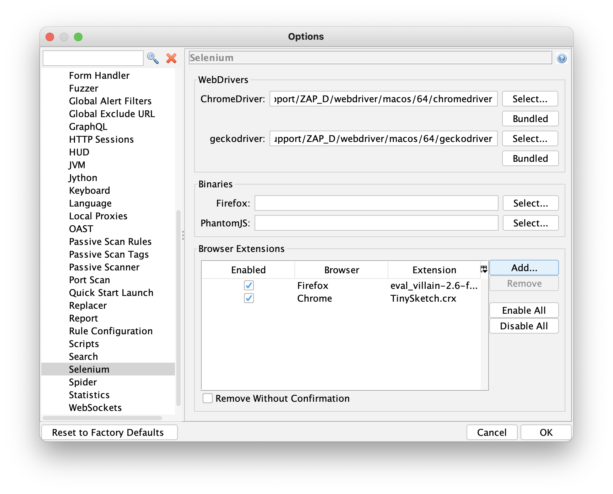

Configuring your browser to proxy through ZAP has been an unnecessary chore since 2017 when we introduced
[Browser Launch](/blog/2017-08-22-zap-browser-launch/).

For those of you who are not aware of this feature it allows you to launch modern browsers (i.e. Firefox and Chrome) from ZAP -
these are preconfigured to proxy via ZAP and ignore certificate exceptions. So no extra setting up is needed at all.

OK, thats not strictly true - these browsers are launched with new profiles which meant that if you wanted to use any browser extensions
then you would need to install them every time you launch a new browser. Or go back to using your existing browsers and having to set them up to proxy through ZAP again.

But that is no longer the case - you can now tell ZAP which browser extensions you want to use via the Selenium Options screen:

Clicking on the "Add" button will bring up a dialog which will allow you to select the extension file you want to add.
The file must be accessible locally and have a ".xpi" extension for Firefox or a ".crx" extension for Chrome.

Browser add-ons can be enabled and disabled via this panel, only enabled extensions will be installed when you launch browsers from ZAP.

### Firefox Extensions

Firefox extensions can be found on https://addons.mozilla.org/ - just search for the extension you want, right click on the blue
"Add to Firefox" button and then "Save Link As..." specifying a suitable local file.

### Chrome Extensions

Chrome extensions can be found on https://chrome.google.com/webstore/category/extensions

Unfortunately its a bit harder to save Chrome extensions - one option is to use the 
[CRX Extractor/Downloader](https://chrome.google.com/webstore/detail/crx-extractordownloader/ajkhmmldknmfjnmeedkbkkojgobmljda)
Chrome extension, but you will be able to find other options via your favourite search engine.

### ZAP Add-Ons

ZAP add-ons will be able to include browser extensions - all they need to do is to install them into the `selenium/extensions` folder
underneath the ZAP [default directory](/faq/what-is-the-default-directory-that-zap-uses/).

Note that if you install any ZAP add-ons which do this (their descriptions will make this clear) then just deleting the 
browser extensions via the Selenium Options screen will not help - it will work but they will appear again when ZAP is restarted.
If you decide to delete these browser extensions then you will need to remove the corresponding ZAP add-on.
