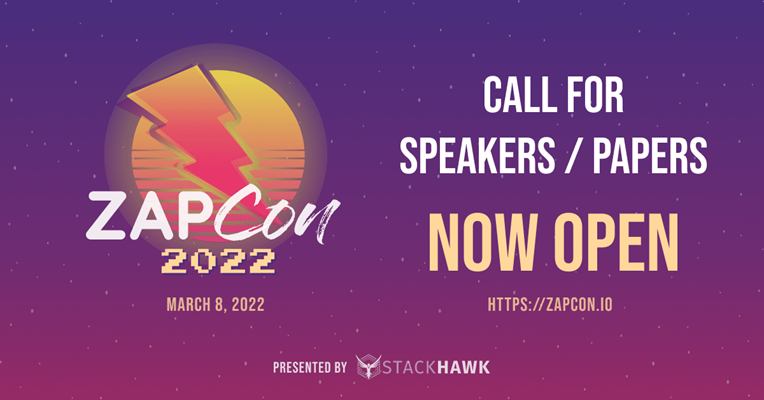

## Call for Papers

I am thrilled to announce that [ZAPCon](https://zapcon.io/) is returning for its second year :smiley:
 
The second annual ZAP user conference will take place on March 8, 2022 and the [Call for Papers](https://sessionize.com/zapcon2-cfs) is open!

This year the event’s theme is "Levelling Up" and we are looking for speaking proposals that talk about how to do more with ZAP. 

Whether you are a seasoned user that has rolled out ZAP at scale within your company, or are relatively new to the tool, we want to hear what you have to say. Initial topic ideas include scaling ZAP in the enterprise, advanced ZAP skills, API security testing, contributing to ZAP, or ZAP automation. 

If you have a topic that is not included in this list, great! Send us an outline and we’ll review it!

The CFP closes on January 7, 2022 at 10:59pm PT. 

## Attendee Registration

Speaking not your forte? No problem. 

[Registration is now open](https://hopin.com/events/zapcon/registration), and it is completely free! Grab your spot and register for ZAPCon 2022.
Learn more about ZAP, meet other ZAP enthusiasts, and help grow the exciting world of dynamic application security testing (DAST)! 

And who knows, you may even get some free swag...

See you on March 8!
