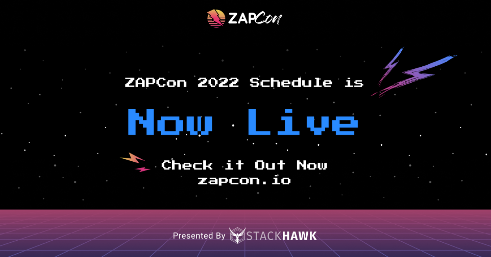

I am excited to share that we’ve just released the speaker lineup and schedule for the [ZAPCon](https://zapcon.io/) 2022! 
ZAPCon takes place on March 8-9, with one day of talks and one day of incredible workshops. 

On March 8, ZAPCon will bring you a full day of talks from security and ZAP industry leaders including my friend Jim Manico, the CEO and Application Security Educator at Manicode Security. The schedule is packed with topics from "Out-of-band Application Security Testing with ZAP" to "Drive-By Pentesting with ZAP Scripts" from 9am until 5pm ET.

On March 9, stay tuned for exclusive workshops that you can only find at ZAPCon. Hear about the latest in API Security Testing from industry experts, get a crash course in "Automated Security Testing with GitHub Actions" from a Senior DevOps Engineer at StackHawk, and watch my own presentation on "How to Contribute to ZAP".

In a different timezone? No problem – we won’t let you miss out on all of these special presentations. All of the ZAPCon talks and workshops will be recorded, so you can watch them after the fact at your own pace as long as you’re [registered for ZAPCon](https://hopin.com/events/zapcon?utm_source=ZAProxy%20Blog&utm_campaign=Promotion).

To tee-up ZAPCon, the OWASP Foundation will be hosting a variety of [training workshops](https://www.eventbrite.com/e/owasp-march-webinars-tickets-225237991897?utm_campaign=none&utm_medium=event-page&utm_source=owasp-web) on March 7. 
Stop by to warm up your AppSec skills before the main event begins. 

ZAPCon is a free event, sponsored by [StackHawk](https://www.stackhawk.com/). [Register](https://hopin.com/events/zapcon?utm_source=ZAProxy%20Blog&utm_campaign=Promotion) for free now. 
