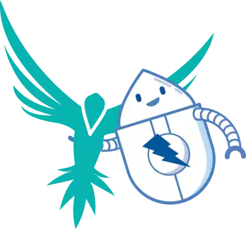

In case you missed the news, StackHawk has [launched](https://www.stackhawk.com/blog/the-zap-fund/) a $100,000 
[ZAP Fund](https://www.stackhawk.com/zap-fund/) dedicated to improving ZAP and the ZAP Community!

Obviously the ZAP Core Team is very grateful for this initiative and have been working with [StackHawk](https://www.stackhawk.com) to make the most of this great opportunity.

As you will see from the main [ZAP Fund](https://www.stackhawk.com/zap-fund/) page there are a set of ZAP issues which now have bounties on them, including some “rolling” issues which we will keep adding until the relevant features have all been implemented.

## Getting Started

In order to work on any of these issues you will need to set up a ZAP development environment.
Fortunately we have lots of docs to help you do this - see the [ZAP Developer Guide](/docs/developer/).

Then you just need to choose an issue to work on - these are listed on the [ZAP Fund](https://www.stackhawk.com/zap-fund/) page and are tagged with the [stackhawk-bounty](https://github.com/zaproxy/zaproxy/issues?q=is%3Aissue+is%3Aopen+label%3Astackhawk-bounty) label in our main repo.

Just comment on an unassigned issue to reserve it. In order to give everyone a fair chance only one [stackhawk-bounty](https://github.com/zaproxy/zaproxy/issues?q=is%3Aissue+is%3Aopen+label%3Astackhawk-bounty) issue will be assigned to any one person at a time.

## Scan Rules and Spiders

Many of the initial set of issues are related to the scan rules and the spiders. This is partly because these are relatively self contained, and so should be easier to get to grips with.

They are also easier to test and are covered by some test applications which we are now testing with ZAP every day - the results are on the [ZAP Scans](/docs/scans/) page.

## Videos

In order to help you get started with these 2 areas I have recorded the following videos.

The first one covers all of the ways you can contribute to ZAP, how to set up a ZAP development environment and I walk you through how I improved one of the scan rules:



The second one covers how to improve the standard spider:



## More Bounties

We will be setting bounties on more issues as the existing ones are solved.

Some of those will be relatively easy but some will get gradually more complex, and be given a higher bounty.
This is to encourage you to keep learning more about the ZAP code base and to become increasingly more proficient with it.

## Advice and Guidance

If you have any questions about specific issues then ask those questions on that issue.

If you would like more general help with ZAP development then either ask on the [ZAP Developer Group](https://groups.google.com/group/zaproxy-develop) or on the [#zaproxy IRC channel](https://web.libera.chat/#zaproxy).

Would you like to see more documentation or videos? If so then just get in touch and let us know what you would like to see.
