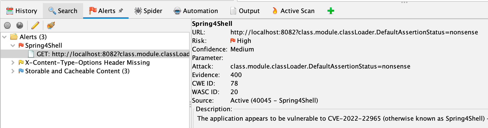

As you are probably all too aware, there is yet another Remote Code Execution (RCE) vulnerability in a 
[popular framework](https://spring.io/blog/2022/03/31/spring-framework-rce-early-announcement#vulnerability).

So we've created a new Alpha Active Scan rule, not surprisingly called Spring4Shell.

Unlike [Log4Shell](/blog/2021-12-14-log4shell-detection-with-zap/) this rule is easier to use, just install the latest 
[alpha active scan rules](/docs/desktop/addons/active-scan-rules-alpha/) add-on and make sure the Spring4Shell rule is enabled when
you active scan your apps.

The rule uses a payload of `class.module.classLoader.DefaultAssertionStatus=nonsense` 
(inspired by [this twitter thread](https://twitter.com/RandoriAttack/status/1509298490106593283))
on all nodes and raises an alert if this payload results in a 400 response.
It will not raise an alert if a similar but safe payload also results in a 400 response.

Like to know more? The relevant code is all in [Spring4ShellScanRule.java](https://github.com/zaproxy/zap-extensions/blob/main/addOns/ascanrulesAlpha/src/main/java/org/zaproxy/zap/extension/ascanrulesAlpha/Spring4ShellScanRule.java).

We've tested it against a selection of apps which are deliberately vulnerable to Spring4Shell and it appears to work well.

However, as always we would like your feedback - try it out against your apps and let us know how well it works.
 