In this post we will see how to use [Zest](/docs/desktop/addons/zest/) scripts which are a really powerful and big part of ZAP, and then we will use the Fuzzer for brute-forcing the password of an account. 

Note that if you know Burp but are new to ZAP you may wish to checkout the [Burp to ZAP Feature Map](/docs/burp-to-zap-feature-map/) page now available.

### Lab Instructions

This time we will try solve this [lab](https://portswigger.net/web-security/authentication/password-based/lab-username-enumeration-via-account-lock), here’s the description: 

This lab is vulnerable to username enumeration. It uses account locking, but this contains a logic flaw. To solve the lab, enumerate a valid username, brute-force this user's password, then access their account page.

* [Candidate usernames](https://portswigger.net/web-security/authentication/auth-lab-usernames)
* [Candidate passwords](https://portswigger.net/web-security/authentication/auth-lab-passwords)
 
### Finding the Username

For enumerating usernames, and finding the one we need, we will use Zest scripts. We will surround the POST request with a File loop and repeat this POST 5 times. If we hit the right username the account will be locked and we can see it in the response body. 

1. We need to open ZAP and launch the Browser with the lab URL and make an attempt to login, we will see in our __POST:login()(password, username)__ in the __Sites__ tree

    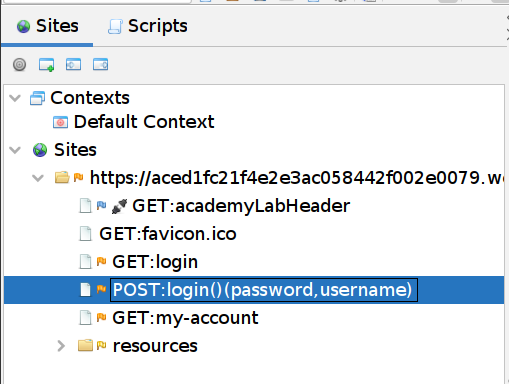

1. We then need to resend the __GET:login2__ request to force the system to generate a verification code for Carlos. 
    __Sites -> GET:login2 -> right click -> Open/Resend with Request Editor…__
    
1. __Right click__ on the __POST__, select __Add to Zest Script -> New Zest Script…__ and choose a name for your script

    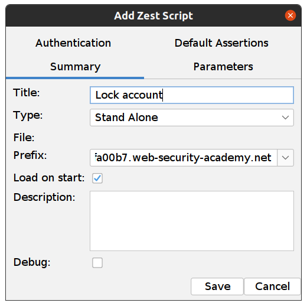

    This is how the new script should look: 
    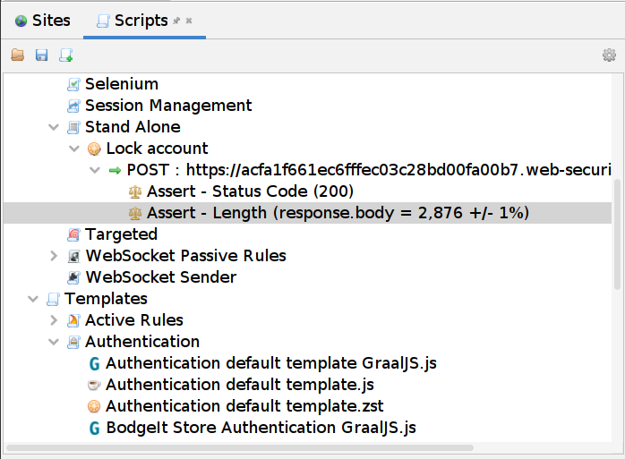
    
1. Expand the __POST__, __Double Click__ on __Assert - Length…__ and set the length to __3011__, which is the Response body size for an incorrect password or username. 

    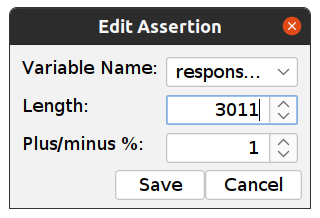

1.  Now we will set the File loop around the POST. __Right Click__ on the __POST__, select __Surround with … -> Loop File__. 
    You will need to set a Variable Name (in my case it is “fuzz”) and File Locations with the file in which you saved the [usernames](https://portswigger.net/web-security/authentication/auth-lab-usernames).

    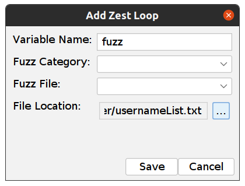

1. Now we need to set this variable name (“fuzz”) in our post, so the script can replace the username in the POST request with our username from the file.  To set this variable, __double click__ on our __POST__ and add "__{{variable_name}}__" after __username=__

    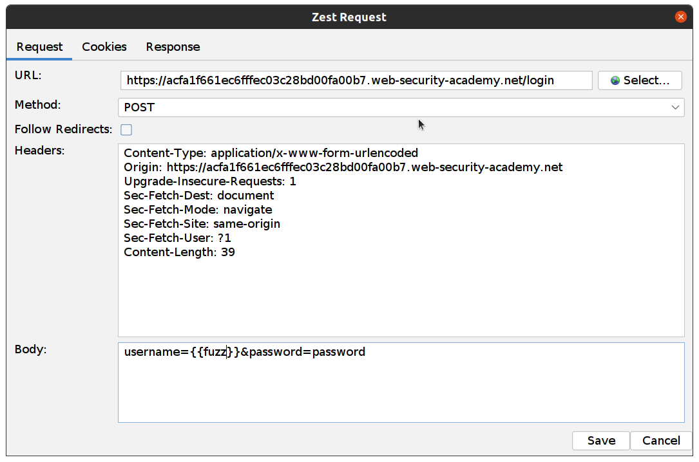

    Now, If we run our script it will make one request per username from our file. We’ll need to make the same request 5 times. 

1. To do this, we can just copy and paste the __POST__ 4 times (we could also do this in another inner loop)

    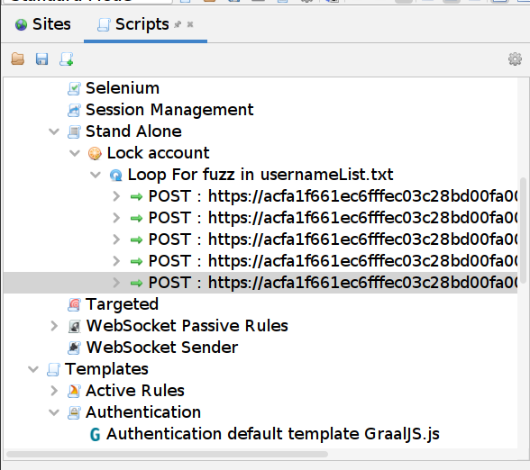

1. Now we can Run our script and we are looking for differences in Size Resp. Body:

    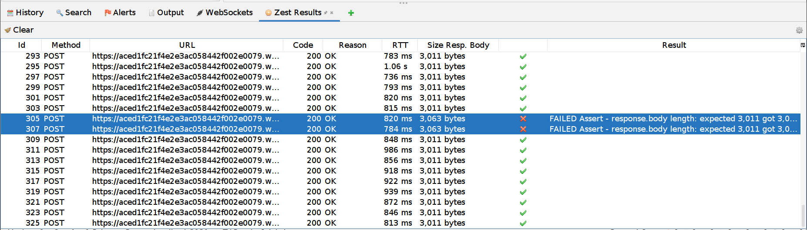

1. If we open this request (or also select another request and compare the response bodies) we can see that the response is “You have made too many incorrect attempts. Please try again in 1 minute(s).” 

    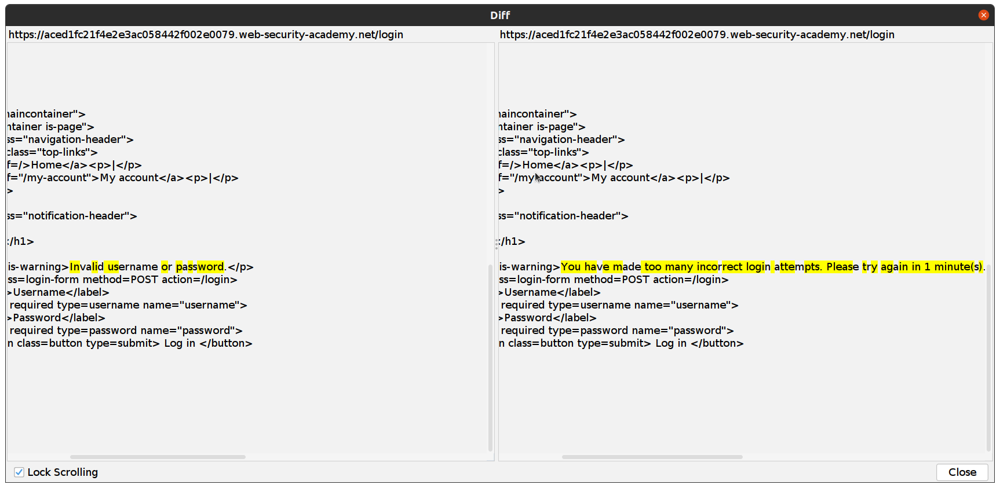

    This indicates to us that this username exists! We can open the response and see our username:
    
    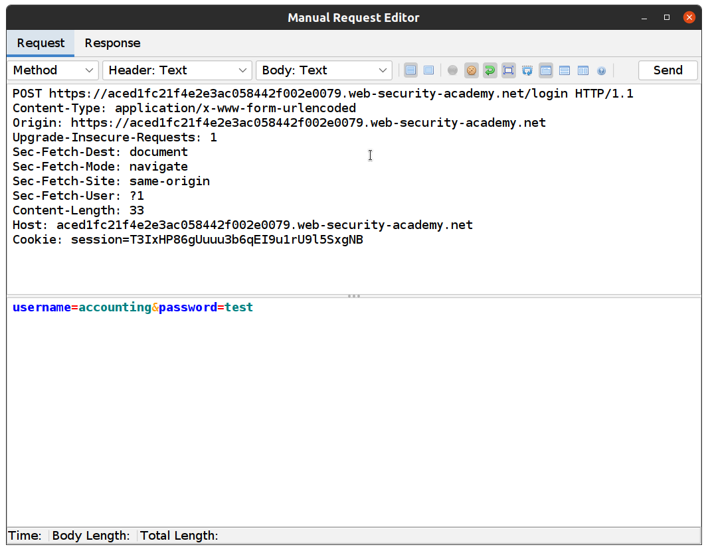
    
    In this example, it’s “accounting” but when you try, it will likely be a different one. 

### Brute-forcing the Password

So now we have a username and all we need to do is brute-force the password of this account with the [Fuzzer](/docs/desktop/addons/fuzzer/). 

1. Go back to __Sites__ tree and __Right Click__ on our __POST:login()(password, username)__ select __Attack -> Fuzz…__ and set the username to the one we just found and highlight value for the password:

    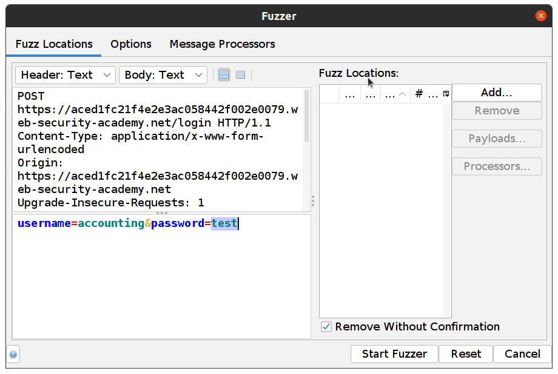

1. Add our passwords to Fuzzer, __Add… -> Add__ Select Type: __Strings__ and paste all passwords and click __Add__ 

    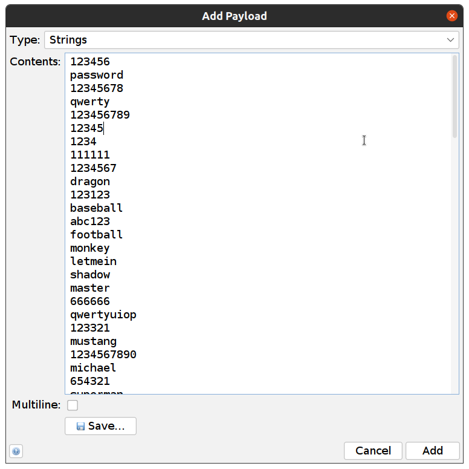

1. Click __Start Fuzzer__

    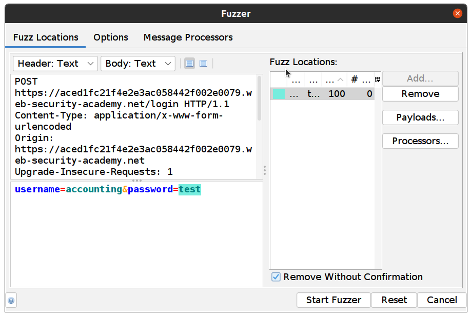

In the example, it is a super strong password :wink: “1234567” and if we open the response of this request we can see the lab was successfully solved and we are logged in as “accounting”!

ZAP rocks! :metal: