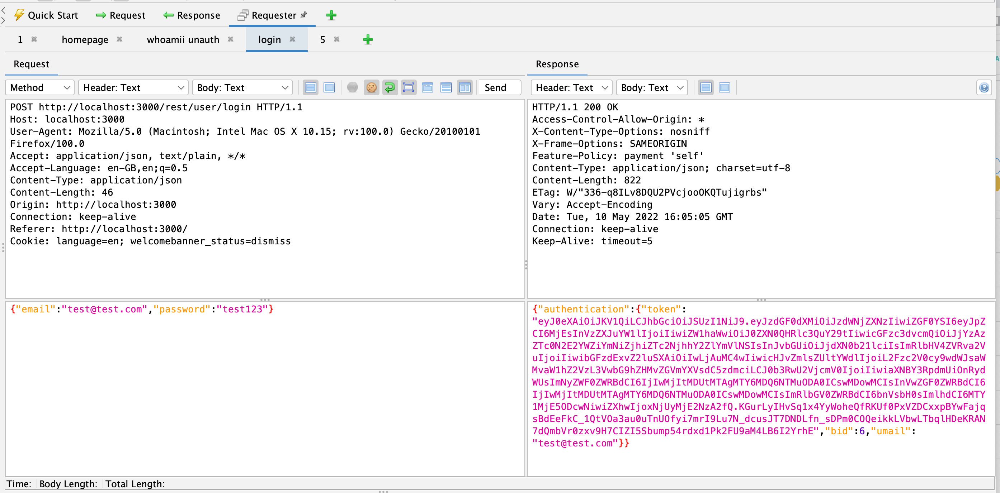
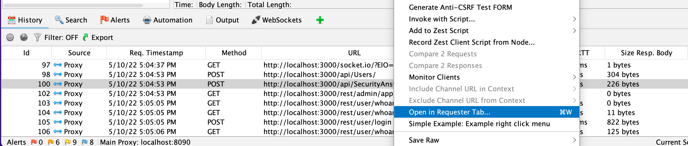
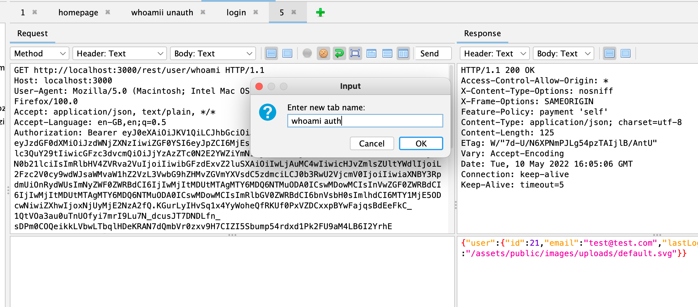

ZAP has a lot of features aimed at developers but the Requester add-on is one that is really aimed at pentesters.

It is not installed by default so you will need install it from the [Marketplace](/addons/) from within ZAP.

Once you have it installed you will see a new Requester tab next to the standard Request and Response tabs:

The new tab is like the built in [Manual Request Editor](/docs/desktop/ui/dialogs/man_req/) dialog but it also supports any number of Request/Response tabs.

While you can create requests from scratch you will find it much easier to right click on existing requests in any of the other ZAP tabs and select "Open in Requester Tab..." - the request will then open in a new Requester tab.
You can also use the Control / Command + "W" key to do the same thing via the keyboard.

By default the tabs are given incrementing integer names, but you can double click on any of the tabs to be given the option to rename them to something more meaningful to you.

Have a play with this add-on and if you can think of anything it could do better then [get in touch](https://groups.google.com/group/zaproxy-users)!