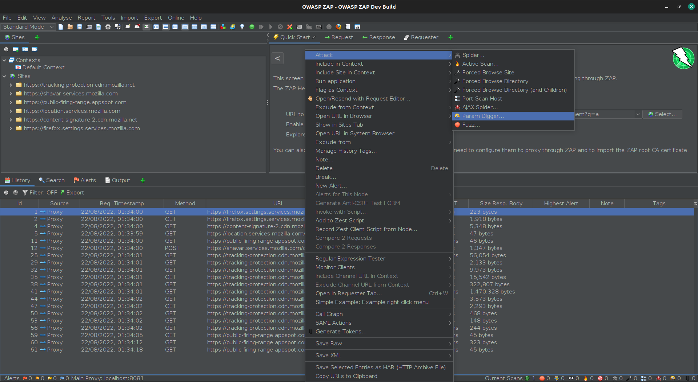
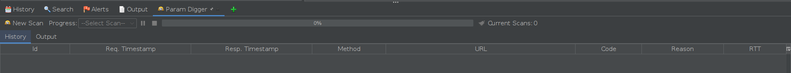
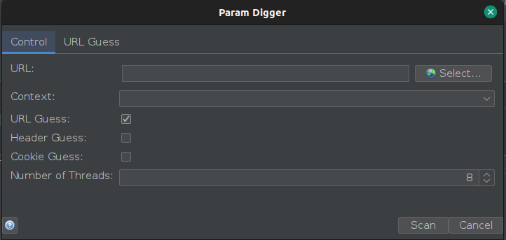
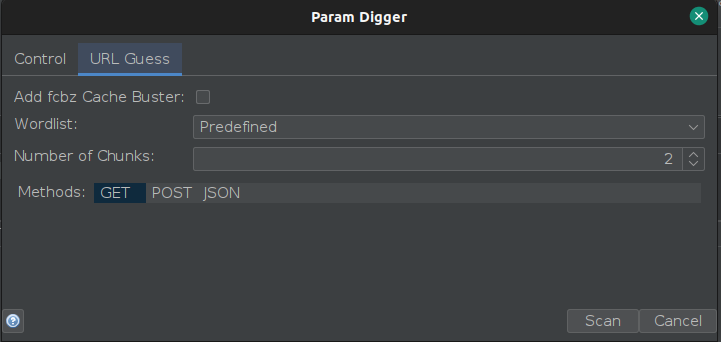

Parameter discovery is the process of finding unlinked, unreferenced, or hidden parameters that can be used by the user to control or influence the behaviour of the application. Resulting in successful attack scenarios like [SQL injection](/docs/alerts/40018/), [XSS](/docs/alerts/40012/), SSRF, Web Cache Poisoning based attacks and much more. Often times such uncovered parameters are properly configured and can be a suitable entry point for further manipulation. These are real hidden treasures which can be very crucial in the recon process to develop a successful exploit.  

[Param Digger](/docs/desktop/addons/parameter-digger/) is a new add-on for ZAP that allows you to discover and analyse parameters in web applications, that might not be visible to the user. The main idea behind Param Digger is to increase the attack surface of the website by identifying these parameters. It's inspired by the [Param Miner](https://portswigger.net/bappstore/17d2949a985c4b7ca092728dba871943) extension for Burp Suite. This a part of my GSoC 2022 project [link](https://summerofcode.withgoogle.com/programs/2022/projects/XDtc6Ero).

The add-on is still in its early stage, so the range of functionality is limited. I'll be adding more functionality over the next few days and in the long term I hope to add it to the Automation Framework in ZAP.

## How to use the Param Digger add-on
To begin with, you will need install it from the [Marketplace](/addons/) from within ZAP as it's not installed by default. Once you have it installed, you can access the Param Digger from three locations: the add-on menu which appears after clicking the plus green icon, the right click menu under the Attack option, and from the tools menu. 

This is how the Param Digger panel in the information window looks like:

Whether you choose to start a new scan by clicking the "New Scan" button on the Param Digger tab or start a new scan from the attack menu or the tools menu, you will be greeted with the Param Digger dialog. This dialog allows you to select the parameters you want to discover, the methods you want to use, the word lists you want to use, and other options.  

Currently the Param Digger only supports the "URL Guess", which uses a list of URL parameters. So it is the one which is selected by default. The screenshot of the default "URL Guess" tab is given below. You can use the predefined word list provided by the add-on or you can create your own and import it after selecting the "Custom" option from the Wordlist pull down. Selecting "Custom" would also enable the File Location field for you where you can supply the appropriate file path after browsing. You can also use both the word lists provided by the add-on and your own by selecting the "Both" option. 

After selection of the word list, you have to select the methods. By default it's GET. You can select as many methods as you want using Ctrl + Click (For Mac or other related platforms use Cmd + Click). 

## Future Work

While the foundation of the add-on has been laid out, the Param Digger is still in its early stage. There is a lot more work left to do. I will be adding more functionality such as: A starter string for the JSON method in the URL Guesser, adding a new method for XML, and other guessing methods in the main dialog. I will also be adding "Parameter Mining" using "FAT GET" requests and other techniques as suggested in [Practical Web Cache Posinoning](https://portswigger.net/research/practical-web-cache-poisoning) and [Web Cache Entanglement](https://portswigger.net/research/web-cache-entanglement) which can be enabled or disabled based on users' choice, having the name "web cache poisoning" or other such related term.

I would also like to work on the add-on's integration with the ZAP Automation Framework. This would help users to find parameters on every URL in the website by using the Spider and launch active or passive scans against the results.

Have a play with this add-on and if you can think of anything it could do better then get in touch or open issues on GitHub!  
[User Group](https://groups.google.com/group/zaproxy-users)
[IRC](https://web.libera.chat/#zaproxy)

### Note
An earlier version of this add-on was published on the ZAP Marketplace as "Param Miner". If you installed this add-on you will need to remove it manually - the name was changed to prevent it being confused with the Burp Suite add-on.