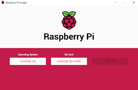
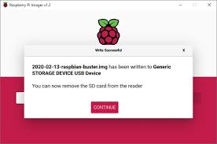
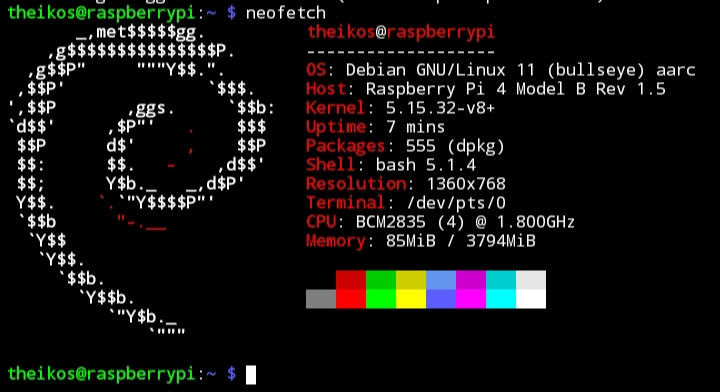
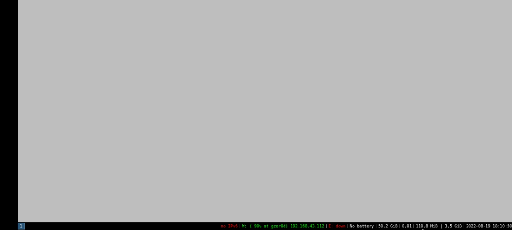
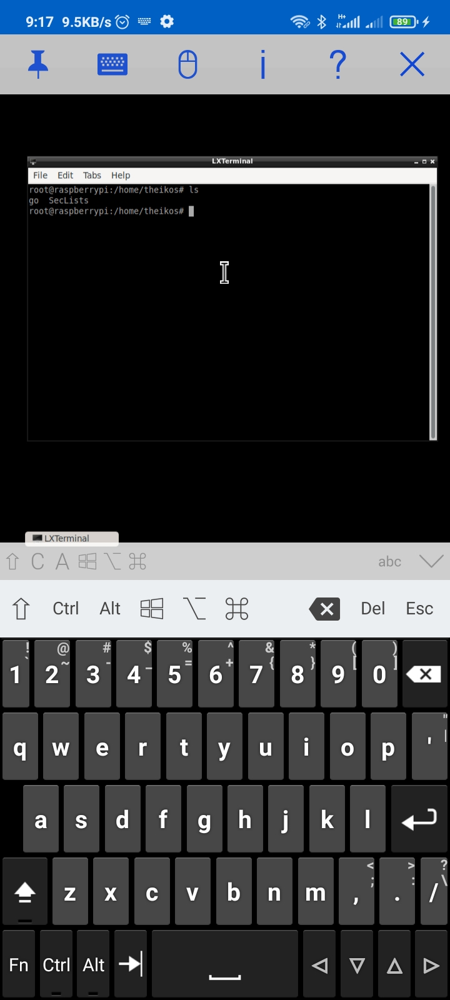
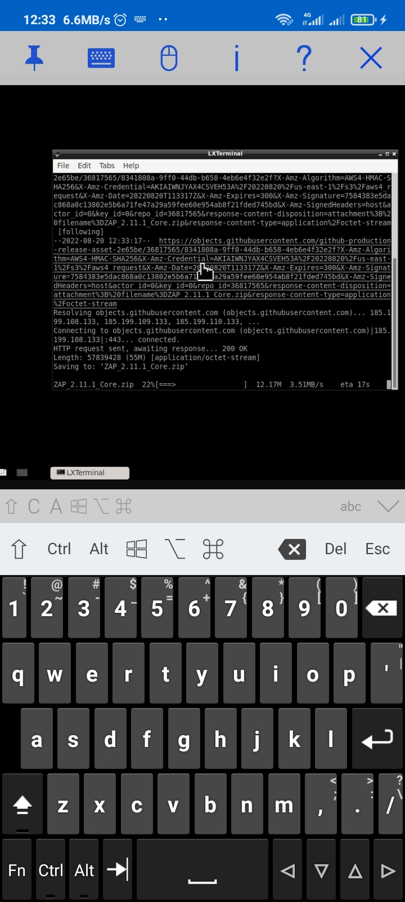
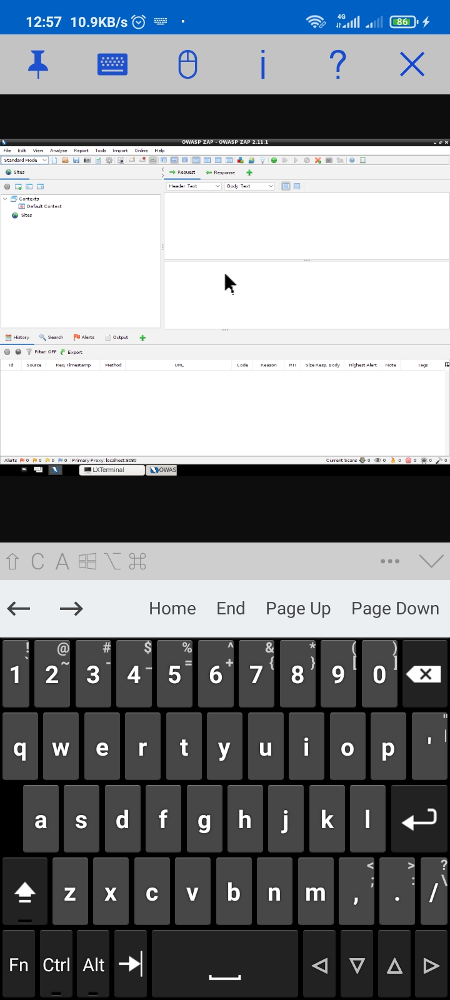
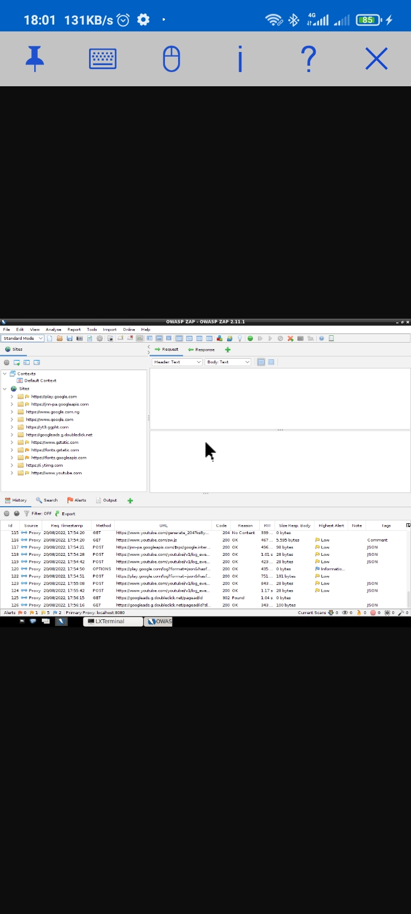

# Running ZAP on on a raspberry pi

## The whole idea !
I know maybe a lot of people that are going to read this are probably going to ask, ***why go through this stress? , why not just use your computer?***

The single reason was that i had issues with steady power supply and needed something to hack with all the time even if i'm away from home so it would be possible to spend more time on targets.

Now that you know the reason behind the whole idea , we can dive right in.

## Getting started 
 Disclaimer: There's currently no method to run [ZAP](https://github.com/zaproxy/zaproxy) on an android device alone.

This set up is actually possible by installing a linux based OS ([Raspbian OS Lite](https://downloads.raspberrypi.org/raspbian_lite_latest) in this case) and then creating a LAN with your android phone and your raspberry pi in it to enable you to connect and control the raspberry pi via ssh or vnc using your mobile device.

### Requirements:
To be able to use ZAP on your android phone you'll need a :
* Raspberry pi (for this setup i used the raspberrypi 4 model B 4G RAM) 
* A working android phone (no root needed)  
* Micro HDMI 
*  Card reader (to enable you use your Micro SD card with your PC)
* Micro SD card (64 GB+ recommended)
* personal computer.

## Step 1 : Installing linux based OS on the raspberry pi
This tutorial will show you how to install Raspberry PI OS Lite edition, the official Raspberry PI Foundation free Operating System without a graphical user interface.
you need to download the image, the 2 distributions can be get with the following links:

* [Raspberry PI OS Lite 64-bit](https://downloads.raspberrypi.org/raspios_lite_arm64/images/raspios_lite_arm64-2022-04-07/2022-04-04-raspios-bullseye-arm64-lite.img.xz)
* [Raspberry PI OS Lite 32-bit](https://downloads.raspberrypi.org/raspios_lite_armhf/images/raspios_lite_armhf-2022-04-07/2022-04-04-raspios-bullseye-armhf-lite.img.xz)

Once you get the distribution, the installation procedure will be the same in both cases.

Please note that in both cases you have to run the installation software with administrative permissions.

There are various methods and different installation software that can be used for the installation but in this guide we'll make use of [Raspberry PI Imager](https://www.raspberrypi.com/software/)

After installing the Raspberry PI imager according to your respective operating system. Launch the software with administrative permissions so you can be able to write into the SD card.



Then click the ***'CHOOSE OS'*** button , select ***'CUSTOM'*** from the drop down menu that will be displayed , then you can locate the Raspberry pi image you downloaded earlier.

Now plug in your card reader with the micro SD card inserted into any of the various USB ports on your computer and click on the ***'CHOOSE STORAGE'*** button and locate your SD card in the options displayed (usually your sd card is the only option displayed if no other storage devices are plugged into your computer).

The ***'WRITE'*** button at this point would change colour depicting that you're ready to write into your SD card , but before we write into the storage device click the 'SETTINGS' icon below the gear button to access options to pre-configure WiFi , SSH (recommended)  and so on and set according to your preferences.

Once this is done, we can now click the ***'WRITE'*** to write into our SD card .
It doesn't take much time, once the raspberry pi imager is done with the writing process it displays the following prompt.



Now all we have to do is unplug the SD card from the card reader and insert into the raspberry pi and connect it to a power source and wait for the booting process to finish up.

## Step 2 : Connecting your raspberry pi to your android phone

Next we turn on our router or mobile hotspot with the wifi setup preinstalled in Step1 to enable raspberry pi connect automatically to it and create a network in which both devices can share connectivity

Using any ssh client , connect to the ip address(192.168.43.112 in my case) of raspberry pi on the network using the preconfigured ssh credentials in Step 1 to enable access to a terminal window
   


Run the following commands to install a VNC server on the raspberry pi

* Update the raspberry pi repository list

```bash
 sudo apt update   
```

* Install tightvncserver by typing
```bash
  sudo apt install tightvncserver
```

* Run tightvncserver
```bash
    sudo tightvncserver
```

Now create a password for the VNC server .There's no need to create a view only password 

The Raspberry Pi has now started a VNC server session at ***your raspberry pi ip:1*** remember this address as it is needed later.

Install any VNC client software from the Google Play store and launch the application add new host using ***your raspberry pi ip:1*** as Host address, use the user that created the vnc server on your raspberry pi and the password you created.

## Step 3 : Installing a windows manager and a desktop manager on the raspberry pi
When i was going through this set up initially i tried to make it as light weight and minimalistic as possible, i installed only X , dmenu and a windows manager , i3  but the VNC clients weren't recognising the shortcut keys to run the terminal and dmenu  even after editing i3's config so i had to install a desktop manager , lxde.
  


Run the following commands to install X, dmenu ,i3 and lxde on the raspberry pi

```bash
sudo apt update && sudo apt upgrade && sudo apt install xserver-xorg-core xserver-xorg-video-fbdev xserver-xorg-input-evdev xinit xfonts-base lxde  --no-install-recommends -y
```

Let XServer know the preferred desktop environment  to start:

```bash
echo 'exec startlxde' > ~/.xinitrc
```

Now we can start up a terminal from the VNC client by clicking the last option on the lower left of the screen and selecting system tools



## Step 4: Installing ZAP on the raspberry pi
Before we start ZAP installation, we need to install java8 or higher in our raspberry pi (i used java11 for this installation)

```bash
sudo apt-get install openjdk-8-jdk
```

Go to [ZAP official download page](/download/) and download the ***`core cross platform package`*** zip file.



After the download is completed unzip the downloaded package and you'll have a folder like ***`ZAP_version_number`*** , run the zap.sh script in the folder and ZAP will start.



The reason for using the core version of ZAP is because it doesn't  contain unneccesary components like the in-built browser that doesn't  work on the set up.

All you have to do now is install any browser of your choice, install ZAP's CA certificate and [set up the proxy](/docs/desktop/start/proxies/) on the browser and you're good to go.



Cheers!!!
