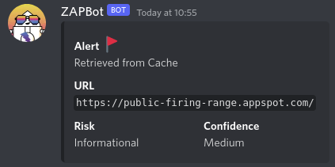
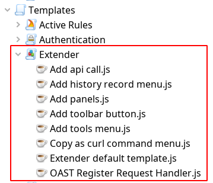

I recently learnt about ZAP Extender scripts and I wish I knew about them sooner!

Extender scripts allow dynamically adding new functionality to ZAP while it is running.
This can include graphical elements and new API endpoints.

The `install` function in an Extender script is called when the script is enabled, and the `uninstall` function is called when it is disabled.

We will now look at a few Extender scripts to demonstrate their capabilities.
These are just examples, and how you use these scripts depends on how creative you can be!
Please note that the examples in this blog post will only work on recent ZAP versions (newer than 2.11, including weekly releases).

# Use ZAP as a web server
While ZAP is intended to be used as a forward proxy, it can also act as an HTTP web server!
This could be useful when you're already inside ZAP and need a mock target to test your new scan rule.
Here's an Extender script that starts an echo server on port 9000 with the path "/echo":

```js
var address = "0.0.0.0"
var port = 9000

var HttpResponseHeader = Java.type("org.parosproxy.paros.network.HttpResponseHeader")
var extensionNetwork = control.getExtensionLoader().getExtension("ExtensionNetwork")
var server

function messageHandler(ctx, msg) {
    ctx.overridden()
    if ("/echo".equals(msg.getRequestHeader().getURI().getPath())) {
        msg.setResponseHeader(new HttpResponseHeader("HTTP/1.0 200 OK"))
        msg.setResponseBody(msg.getRequestBody().toString())
        return
    }
    msg.setResponseHeader(new HttpResponseHeader("HTTP/1.0 404 Not Found"))
    msg.setResponseBody("The page you are trying to visit does not exist :P.")
}

function install(helper) {
    server = extensionNetwork.createHttpServer(messageHandler)
    server.start(address, port)
}

function uninstall(helper) {
    server.stop()
}
```

Copy the above code to a new Extender script and enable it.
Then try opening `http://localhost:9000/` in your browser or send it a request using the [Requester](/blog/2022-05-10-the-requester-addon/)!


# Subscribe to ZAP Events
ZAP publishes internal events which may be consumed by both Java code and scripts.
Events are published when new alerts are raised, site nodes are added, a scan has stopped, etc.
You can find a full list of the internal events published by ZAP [on this page](/docs/internal-events/).

The following script sends a notification to a Discord webhook whenever ZAP raises an alert, with some of its details.

```js
var discordWebHookUrl = "<Replace with Discord Webhook URL>"

var HttpSender = Java.type("org.parosproxy.paros.network.HttpSender")
var HttpMessage = Java.type("org.parosproxy.paros.network.HttpMessage")
var HttpHeader = Java.type("org.parosproxy.paros.network.HttpHeader")
var HttpRequestHeader = Java.type("org.parosproxy.paros.network.HttpRequestHeader")
var URI = Java.type("org.apache.commons.httpclient.URI")

function consumer(event) {
    if (event.getEventType() != "alert.added") return
    print(event.getParameters().get("name"))
    var params = event.getParameters()
    alert = {
        "fields": [
            { "name": "Alert :triangular_flag_on_post:", "value": params.get("name") },
            { "name": "URL", "value": "`" + params.get("uri") + "`" },
            { "name": "Risk", "value": params.get("riskString"), "inline": true },
            { "name": "Confidence", "value": params.get("confidenceString"), "inline": true }
        ]
    }
    var body = { "content": "", "embeds": [alert] }
    body = JSON.stringify(body)

    var requestMethod = HttpRequestHeader.POST
    var msg = new HttpMessage()
    msg.setRequestHeader(new HttpRequestHeader(requestMethod, new URI(discordWebHookUrl, true), HttpHeader.HTTP11))
    msg.getRequestHeader().setHeader(HttpHeader.CONTENT_TYPE, HttpHeader.JSON_CONTENT_TYPE)
    msg.getRequestHeader().setHeader(HttpHeader.CONTENT_LENGTH, String(body.length))
    msg.setRequestBody(body)
    var sender = new HttpSender(HttpSender.MANUAL_REQUEST_INITIATOR)
    sender.sendAndReceive(msg)
    print(msg.getResponseBody().toString())
}

function install(helper) {
    org.zaproxy.zap.ZAP.getEventBus().registerConsumer(consumer, "org.zaproxy.zap.extension.alert.AlertEventPublisher")
}

function uninstall(helper) {
    org.zaproxy.zap.ZAP.getEventBus().unregisterConsumer(consumer)
}
```




# Other examples
We have only scratched the surface of what is possible to do with Extender scripts.
There are many more examples available as [templates included in ZAP](https://github.com/zaproxy/zap-extensions/tree/main/addOns/scripts/src/main/zapHomeFiles/scripts/templates/extender) as well as with the [Community Scripts](https://github.com/zaproxy/community-scripts/tree/main/extender) add-on.



## Add new endpoints to ZAP's API
If you want to interact with ZAP via its API but cannot find an existing endpoint to do what you want, you could write an extender script to add that endpoint.
It could also be useful in situations when you want to return data in a format ZAP doesn't already support.

## Add new GUI elements
It is also possible to add GUI elements with extender scripts.
You can add new Panels, toolbars, `Tools` menu options, and more.
For example, the [Copy as curl command menu.js](https://github.com/zaproxy/zap-extensions/blob/2e11aaa68bf569c756cb0b97cb32db07b5d5ee52/addOns/scripts/src/main/zapHomeFiles/scripts/templates/extender/Copy%20as%20curl%20command%20menu.js) script adds a new context menu item that allows you to copy any request made by ZAP as a curl command.

## Register OAST Request Handlers
If you use the [OAST add-on](/blog/2021-08-23-oast-with-owasp-zap/) for your tests, you can register custom out-of-band request handlers using extender scripts.

# Your Ideas!
If you create any fun new Extender scripts then please share them via the [community-scripts repository](https://github.com/zaproxy/community-scripts)!
