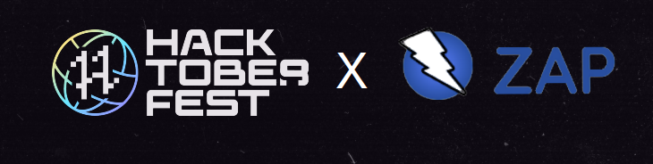

We are happy to announce that ZAP is participating in [Hacktoberfest](https://hacktoberfest.com/) 2022.

## Contributors
This is what contributors need to know to participate in and complete Hacktoberfest 2022:
- Go through the [Hacktoberfest 2022 contributor](https://hacktoberfest.com/participation/#contributors) section to know more about what you should do and the rewards you will receive. We would be genuinely happy if you choose the "plant a tree" option as your reward.
- Contributions/pull requests can be made to the following repositories under the [OWASP ZAP](https://github.com/zaproxy) organization:
    - ZAP Core: [link](https://github.com/zaproxy/zaproxy)
    - ZAP Extensions: [link](https://github.com/zaproxy/zap-extensions)
    - ZAP HUD: [link](https://github.com/zaproxy/zap-hud)
    - ZAP Core Help: [link](https://github.com/zaproxy/zap-core-help)
    - ZAP Community Scripts: [link](https://github.com/zaproxy/community-scripts)
- Read the [ZAP Contributing Guide](/docs/contribute/).
- We recommend you to go through the [ZAP Developer Guide](/docs/developer/). It has all the answers to your questions about the development environment setup and the checks that your PR should pass before it is merged. 
- If you are a beginner, please check out the curated [Hacktoberfest issues](https://github.com/zaproxy/zaproxy/issues?q=is%3Aopen+is%3Aissue+label%3AHacktoberFest) on the main ZAP repo.
- If you would like to challenge yourself, you can check out the [good second issues](https://github.com/zaproxy/zaproxy/issues?q=is%3Aopen+is%3Aissue+label%3A%22good+second+issue%22) and [enhancement](https://github.com/zaproxy/zaproxy/issues?q=is%3Aopen+is%3Aissue+label%3Aenhancement) issues.

Some good resources to get started for beginners:
 - Open Source Guides: [How to contribute to Open Source](https://opensource.guide/how-to-contribute/)
 - GitHub: [GitHub training kit](https://training.github.com/)
 - DigitalOcean: [Introduction to Open Source](https://www.digitalocean.com/community/tutorial_series/an-introduction-to-open-source)
 - GitHub: [Write good PRs](https://github.blog/2015-01-21-how-to-write-the-perfect-pull-request/)