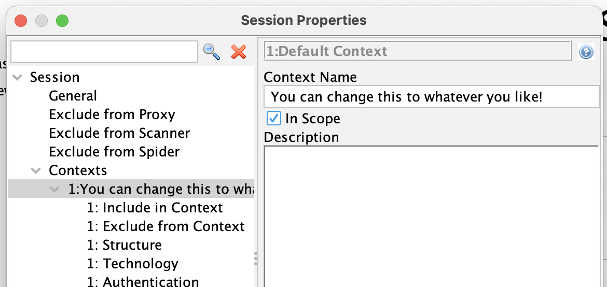
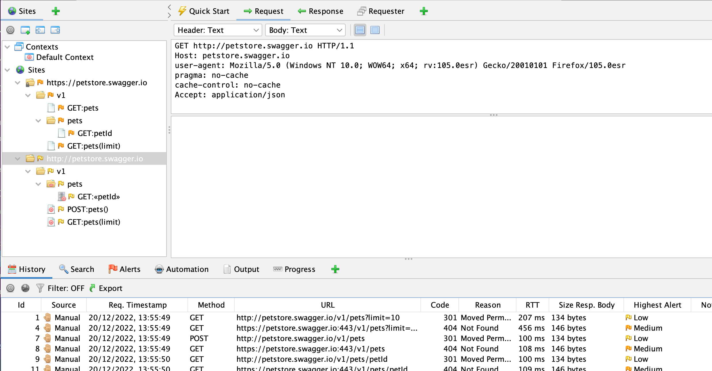
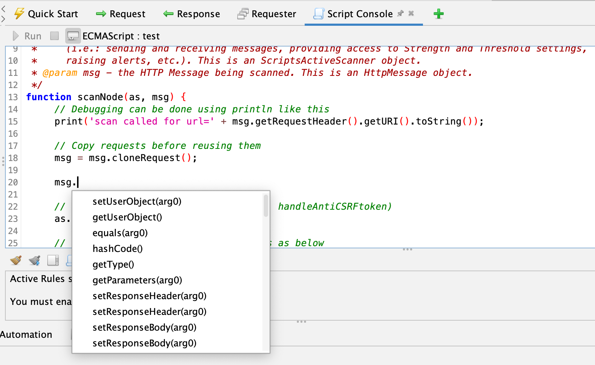
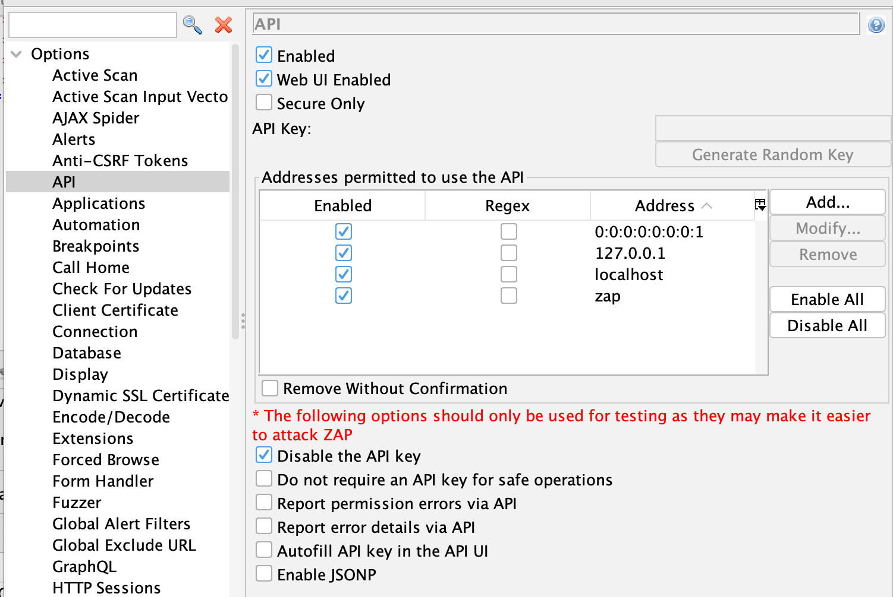

Sometimes Christmas comes early, and in this case for me it was the publication of the [Twelve Days of ZAPmas](https://www.secureideas.com/blog/twelve-days-of-zapmas-day-1-setting-up-zap) blog posts by [Mic Whitehorn-Gillam](https://twitter.com/mic_wg).

If you have not read them yet then please do - they are a great introduction to ZAP and provide what I think is a very fair and balanced comparison to Burp Suite.

The blog posts raise some very valid points but are also missing a couple of important things, but happily [Secure Ideas](https://www.secureideas.com/) have allowed me to write a [guest blog post](https://www.secureideas.com/blog/zapmas-feedback) which we're cross posting here as well to address them 😀

### Context Naming
On [Day 5](https://www.secureideas.com/blog/twelve-days-of-zapmas-day-5-scope-and-contexts) Mic mentioned that he couldn’t find a way to rename a context once created via the right click “Include in context” option.

This is of course possible - just navigate to the top node in the Session Properties dialog for that context.

### OpenAPI Import
On [Day 7](https://www.secureideas.com/blog/twelve-days-of-zapmas-day-7-api-testing-with-postman-and-zap) Mic said that on importing an OpenAPI spec ZAP “didn’t present any real UI for viewing and reissuing those requests.” 

All of the ZAP requests made when importing an OpenAPI spec are actually shown in both the Sites and History tab, so you can select them from either of those and then view them or open them in the Request Editor or a Requester tab.

### Out of Band Testing
On [Day 11](https://www.secureideas.com/blog/twelve-days-of-zapmas-day-11-zap-impressions-from-a-burp-user) Mic said that “Burp has a few advantages here, a big one being Collaborator”.

The good news is that ZAP does have Out of Band testing support via the [OAST add-on](/docs/desktop/addons/oast-support/) - this supports [BOAST](https://github.com/marcoagner/boast) and [Interactsh](https://github.com/projectdiscovery/interactsh). Both of these services are open source, you can use the default services they have set up or host them yourself.
All of the scan rules which support Out of Band testing have the [OUT_OF_BAND](/alerttags/out_of_band/) tag.
Also make sure you have a look at the [Out-of-band Application Security Testing with OWASP ZAP](/blog/2021-08-23-oast-with-owasp-zap/) blog post. 

### Scripting
Mic was very complimentary about ZAP scripting support but did say that it was not well enough documented.

That is a very fair criticism.

However we do have [limited code completion support](/docs/desktop/addons/script-console/console/#auto-complete):

This only works on parameters, but it will let you keep drilling down until you type something other than the list of options presented to you.

It is also worth noting we have loads of examples in the [community-scripts](https://github.com/zaproxy/community-scripts) repo.

The README files in that repo also link to the JavaDocs for the parameters: eg https://github.com/zaproxy/community-scripts/tree/main/active#parameters

### Remote API Access
On [Day 11](https://www.secureideas.com/blog/twelve-days-of-zapmas-day-11-zap-impressions-from-a-burp-user) Mic also mentioned that ZAP was not practical for testing mobile apps because the ZAP API is restricted to localhost.

While that is true by default it is also easy to change, as per the [FAQ: How can I connect to ZAP remotely](/faq/how-can-i-connect-to-zap-remotely/)?

You can also change ZAP to listen on 0.0.0.0 in the Network / Local Servers/Proxies Options panel, which has the same effect:

It is also worth noting that the API Options screen allows you to specify which of the addresses that ZAP listens on support the API and also allows you to turn off other ZAP security features like the API key.

It should go without saying that you should only turn off security features in a safe environment, but I’ll say it anyway!

### Conclusion
All in all this was a great set of blog posts.

The only other thing I’d like to point out is that unlike our commercial competitors ZAP is open source, and this means anyone can get involved.

If you’d like to help us make ZAP even better then please see our [Contributing Guide](/docs/contribute/) or just get in touch with [me](/docs/team/psiinon/) 😀