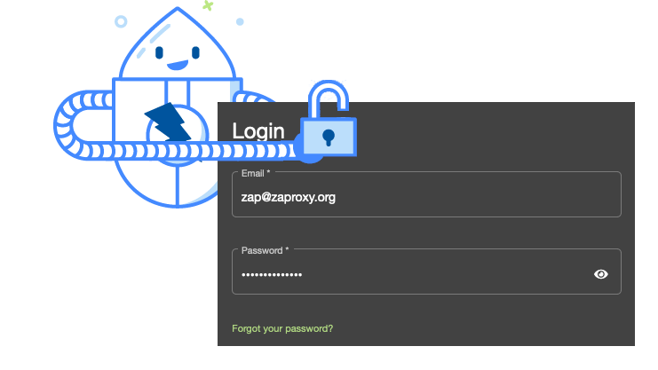

If you want to use ZAP to scan an app while authenticated then you can either 
[handle the authentication yourself](/docs/authentication/handling-auth-yourself/) (generally not recommended) or you need to configure ZAP to handle it for you.

ZAP has extremely flexible support for [authentication](/docs/authentication/), but some use cases are much easier than others.

In this blog post we are going to look at one of the hardest cases!

### The Hard Use Case

The use case we are dealing with here is where you have an app which has a complex authentication flow.
We cannot authenticate with a single POST request.

To make things harder we are also dealing with a modern web app that maintains the authentication state client side.

### Why is it so Hard?

ZAP can launch browsers using [Selenium](https://www.selenium.dev/) which you can control via scripting, so they should be able to handle any sort of complex authentication flow.

The problems arise because we need to authenticate to the app in 2 different ways:

1. Directly, for example when using the standard spider and for most of the active scan rules
1. Via a browser, for example when using the [AJAX Spider](/docs/desktop/addons/ajax-spider/) or the [DOM XSS scan rule](/docs/desktop/addons/dom-xss-active-scan-rule/)

#### Direct Requests

The first problem relates to direct requests.

ZAP will only authenticate to the target app once it has made a request and checks to see that it is not authenticated. ZAP will block this first request (and any that arrive in the meantime) while it tries to login. If we use one of the built-in authentication methods then ZAP will 'know' that the request is for authentication and make the request while we are blocking the original one. 

However, in this case we have to launch a browser. By default ZAP will not be able to tell that these requests are for authenticating and will also block them. 

#### Browser Requests

The second problem occurs when we launch browsers from ZAP. 

If we just launch the browsers and open a URL on the target app then the browser will not be logged in due to the authentication state it maintains.

Depending on how the application works it _may_ be possible to inject the authentication state, but in many cases it will not work.

If we cannot inject the authentication state correctly then the browsers will stay unauthenticated. This means that the AJAX Spider will explore the app while unauthenticated and will miss all of the content that is only accessible while authenticated.

### The Test App

For this example we are going to use [OWASP Juice Shop](https://owasp.org/www-project-juice-shop/).

This is a modern web app which maintains client side authentication state.

We can in fact configure ZAP to authenticate to Juice Shop _without_ using Selenium, but we will ignore that option here :wink:.

To automate ZAP we are going to use the [Automation Framework](/docs/automate/automation-framework/) (AF) - this is a powerful and flexible framework ideally suited to this task.

### The Solution

The solution is quite complex, and requires several scripts to make it work.

The full set of scripts and instructions on how to run them are available in the 
[Community Scripts](https://github.com/zaproxy/community-scripts/) repo in the 
[af-plans/juiceshop-selenium-auth](https://github.com/zaproxy/community-scripts/tree/main/other/af-plans/juiceshop-selenium-auth) directory.

As you will see we plan to make this process easier, which is one reason for not giving the set-up instructions here - we will be updating the example as we add features which simplify the process.

However, I will explain what the various parts are doing and why they are needed.

We actually handle the 2 cases differently:

1. Direct requests are managed by ZAP authentication handling.
1. Browsers are logged in when they are launched, and are then treated as 'unauthenticated'.

#### The Test Plan

[juiceshop-test.yaml](https://github.com/zaproxy/community-scripts/tree/main/other/af-plans/juiceshop-selenium-auth/juiceshop-test.yaml) is an AF plan which just checks that authentication is set up correctly for a single direct request.

It sets up the Juice Shop context (including the authentication) and registers all of the scripts.

It makes one request to the Juice Shop front page specifying the user to use, which means ZAP will attempt to authenticate as that user.

It checks the standard ZAP authentication statistics to make sure that there was at least one successful authentication request and no authentication failures.

If you change the plan or scripts to break the authentication (e.g. by removing the user or using different credentials) then you should see that the plan fails at least one of these tests.

#### The Full Plan

[juiceshop-auth.yaml](https://github.com/zaproxy/community-scripts/tree/main/other/af-plans/juiceshop-selenium-auth/juiceshop-auth.yaml) is an AF plan which checks that authentication is set up correctly for both the standard and AJAX Spiders.

It sets up the context and scripts as per the test plan.

In addition to that it runs the standard spider authenticated and the AJAX Spider unauthenticated - ZAP is not used to authenticate the AJAX Spider because the browsers are logged in when they are launched.

In both cases a set of statistics are checked to make sure that authentication is really working - both standard 
[ZAP stats](/docs/internal-statistics/) are used as are statistics maintained by the scripts below.

#### The Authentication Script

The [JuiceShopAuthentication.js](https://github.com/zaproxy/community-scripts/tree/main/other/af-plans/juiceshop-selenium-auth/JuiceShopAuthentication.js) script is run when ZAP detects that a direct request is not currently authenticated.

The first time it runs it creates a new proxy for the authentication requests - this is how ZAP can tell that these requests are for authentication.

The proxy is stored in a [global script variable](/docs/desktop/addons/script-console/#global-variables) so that we do not keep trying to recreate it.

The script then launches a browser using the [Selenium add-on](/docs/desktop/addons/selenium/) specifying that it should use the new proxy.

It actually makes 2 requests so that we avoid the warning modals that Juice Shop uses - these are very hard to get rid of in any other way.

If you need to use Selenium to authenticate to your apps then it is the commands that control the browser in this script that you will need to change to match your app.

The `messageHandler` method will get invoked for every request and response which go through the proxy.
In this case it just looks for the authentication response and tries to extract the session token from it.
This is another place you will need to change for your apps.

#### The HttpSender Script

The [JuiceShopHttpSender.js](https://github.com/zaproxy/community-scripts/tree/main/other/af-plans/juiceshop-selenium-auth/JuiceShopHttpSender.js) script is run for all of the requests and responses proxied through ZAP.

It is needed so that we add the authentication token and cookie to the verification requests that ZAP uses to check if we are logged in.

We also use it to update statistics which will help us tell if requests from the AJAX Spider are really authenticated.

#### The Selenium Script

The [JuiceShopSelenium.js](https://github.com/zaproxy/community-scripts/tree/main/other/af-plans/juiceshop-selenium-auth/JuiceShopSelenium.js) script is run whenever ZAP launches a browser. This will happen when the AJAX Spider and DOM XSS rule run, but also when we launch a browser via the authentication script.

The script also logs in to Juice Shop in the same way as the authentication script. This sets up the client side authentication state correctly - without this the AJAX Spider would not be able to explore authenticated content.

If your apps set client side authentication state then you will need to authenticate in a similar way.

#### The Session Management Script

The [JuiceShopSession.js](https://github.com/zaproxy/community-scripts/tree/main/other/af-plans/juiceshop-selenium-auth/JuiceShopSession.js) script is run when direct requests are made by ZAP. 

It updates the requests with the authentication token and cookie.

It will not run when the AJAX Spider runs as we are running that 'unauthenticated' as it logs in to Juice Shop when the browsers are launched.

#### The Reset Script

The [JuiceShopReset.js](https://github.com/zaproxy/community-scripts/tree/main/other/af-plans/juiceshop-selenium-auth/JuiceShopReset.js) script is not actually used when automating ZAP. However, it is very useful when you are testing and debugging a set up like this using the ZAP desktop.

The script stops the proxy started by the authentication script, clears the session tokens stored in global script variables, and resets the authentication states for all of the users.

### Sanity Checks

You have managed to configure ZAP to authenticate to your app and test it effectively.

How do you know that this set up will keep working?

As you will have seen the above plans use a combination of standard ZAP stats and customs ones which are maintained by the scripts.

However, the AF supports more [Job Tests](/docs/desktop/addons/automation-framework/tests/) so you can do things like stopping long running jobs early based on statistic thresholds and checking that ZAP finds specific URLs (and optionally specific content in them). You could use the latter to ensure ZAP finds URLs that it should only be able to find if authentication is working.

If you can think of any other sort of tests that the AF could usefully support then [let us know!](https://groups.google.com/group/zaproxy-users).
