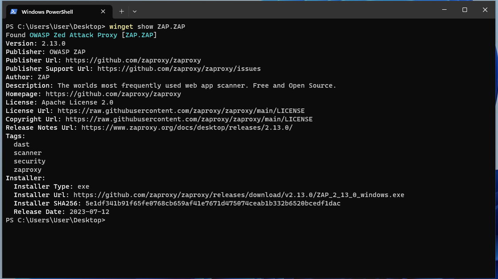

You can now install ZAP on Windows using winget - the [Windows Package Manager](https://learn.microsoft.com/en-us/windows/package-manager/).

With winget installed you can see that ZAP is available by typing: `winget show ZAP.ZAP`

And you can install ZAP by typing: `winget install --id=ZAP.ZAP -e`

That's it!

You may notice that it still says "OWASP" as this is ZAP 2.13 and the package name has to match the name used by the executable.

We have added Windows Package Manager to the list of ["Officially Supported Repos"](/download/#official)
on the Downloads page.

If you use Windows then please try this out and let us know how you get on :grin:.