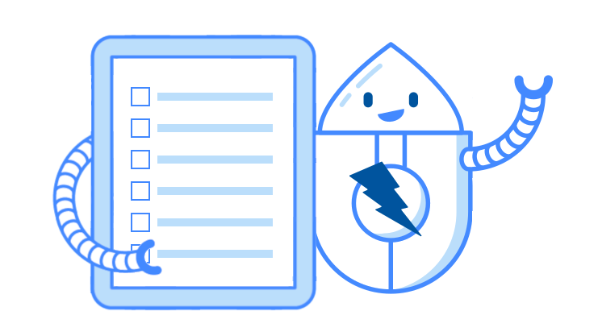

## New Questionnaire

Since [moving to SSP](/blog/2023-08-01-zap-is-joining-the-software-security-project/) we have doubled the number of people working full time on ZAP (from 1 to 2).
While we have volunteers who spend a lot of their own time working on ZAP we are still clearly a very small development team.
That is why we want to make sure we are focusing as much time as possible on the things that are most important to you, the ZAP users.

So we have a new [questionnaire](https://docs.google.com/forms/d/e/1FAIpQLSeslne7nAjiK-oCckMXU39ESa47QjK08p4bT63O2T6EDzR05g/viewform?usp=sf_link)!

The questionnaire asks you just 3 main questions - and the options are the same for all of them.

We want to know the top 3 aspects of ZAP that you would most like us to focus on.

If you would like to give us other feedback on ZAP then please do that via the [ZAP User Group](https://groups.google.com/group/zaproxy-users).

## Aspects

These are the aspects included in the questionnaire, with some added explanations:

- Authentication
  - This covers ZAP authenticating to target apps
- Automation
  - This includes the Automation Framework, Packaged Scans, and API
- Documentation
  - This includes how to use ZAP, technical docs, videos etc
- Ease of Use
  - Specifically relating to the ZAP Desktop app
- Integrations with 3rd party tools
- Manual Testing Capabilities
  - Typically ones which are not covered by automation
- Modern Web App Handling
  - This includes both exploring and attacking modern web apps more effectively
- Scan Rules
  - Both active and passive scan rules - the way ZAP automatically detects potential vulnerabilities
- Scalability
  - This includes handling very large apps and potentially handling lots of apps
- Other
  - Your chance to mention any significant aspects that you think we have missed

## Results

Please fill in this [questionnaire](https://docs.google.com/forms/d/e/1FAIpQLSeslne7nAjiK-oCckMXU39ESa47QjK08p4bT63O2T6EDzR05g/viewform?usp=sf_link) ASAP!
We do not plan on leaving it open too long as we want to drill down into the most popular aspects as soon as we can.
So if you want to have your say in what we do then fill it in today!
