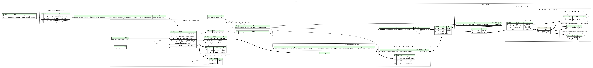

macOS has been using [`.DS_Store`][wikipedia-ds-store] hidden files for many
years to store metadata about files and folders on a file system. These metadata
are mainly created and used by the [Finder][wikipedia-finder] to store
attributes like your preferred view option for a particular folder, or the icon
positions of the files it contains.

`.DS_Store` files, when accidentally published and accessible on the Internet,
can leak information about the structure of a file hierarchy, leading to
potential information disclosure vulnerabilities. It is often the case when
stored in the Git repository of a website.

Discovering and reading the contents of `.DS_Store` files present on a website
can prove to be a valuable asset when conducting web security audits and
penetration tests. This has led me to the idea of integrating this
reconnaissance task as part of the ZAP Spider tool, enabling the process to be
fully automated and saving time during security engagements. But first things
first, one needs to parse the internal structure of such files.

## Parsing .DS_Store files

The specifications detailing the internal structure of `.DS_Store` files have
never been made public, but [thanks to community-driven
efforts][0day-parsing-ds-store], most parts have been reverse engineered,
enabling people to create custom parsers. Nevertheless, writing a parser for
`.DS_Store` files is not a trivial task given the complexity of the format. This
is why not much implementations can be found online, and most of them are in
Python, Go and Perl only.

Instead of writing a file parser from scratch, the [Kaitai Struct
project][kaitai-struct] allows to write a generic description of a binary file
format, and then to programmatically generate the code of a parser in a specific
programming language. In other words, Kaitai Struct allows you to describe a
file format only once and then produce parsers in many programming languages
such as Python, Java, PHP, Ruby, etc.

Let's have a look at a small example taken from the official website of the
Kaitai Struct project:

```yaml
meta:
  id: gif
  file-extension: gif
  endian: le
seq:
  - id: header
    type: header
  - id: logical_screen
    type: logical_screen
types:
  header:
    seq:
      - id: magic
        contents: 'GIF'
      - id: version
        size: 3
  logical_screen:
    seq:
      - id: image_width
        type: u2
      - id: image_height
        type: u2
      - id: flags
        type: u1
      - id: bg_color_index
        type: u1
      - id: pixel_aspect_ratio
        type: u1
```

This example is a partial description of the GIF file format. The description
itself is a YAML file comprising the following main sections:

- `meta`: Metadata of the file description such as its title, file extension if
  any, license, default endianness to use when parsing, etc.
- `seq`: Sequence of attributes with their type, size when needed (e.g.
  strings), documentation, etc.
- `types`: It is possible to create your own types and to instantiate them like
  done for `header` and `logical_screen`. As you can see, each type has its own
  sequence of attributes.

When compiled with version 0.10 of the Kaitai Struct compiler with Python as
target, the following code is produced:

```python
# This is a generated file! Please edit source .ksy file and use kaitai-struct-compiler to rebuild

import kaitaistruct
from kaitaistruct import KaitaiStruct, KaitaiStream, BytesIO


if getattr(kaitaistruct, 'API_VERSION', (0, 9)) < (0, 9):
    raise Exception("Incompatible Kaitai Struct Python API: 0.9 or later is required, but you have %s" % (kaitaistruct.__version__))

class Gif(KaitaiStruct):
    def __init__(self, _io, _parent=None, _root=None):
        self._io = _io
        self._parent = _parent
        self._root = _root if _root else self
        self._read()

    def _read(self):
        self.header = Gif.Header(self._io, self, self._root)
        self.logical_screen = Gif.LogicalScreen(self._io, self, self._root)

    class Header(KaitaiStruct):
        def __init__(self, _io, _parent=None, _root=None):
            self._io = _io
            self._parent = _parent
            self._root = _root if _root else self
            self._read()

        def _read(self):
            self.magic = self._io.read_bytes(3)
            if not self.magic == b"\x47\x49\x46":
                raise kaitaistruct.ValidationNotEqualError(b"\x47\x49\x46", self.magic, self._io, u"/types/header/seq/0")
            self.version = self._io.read_bytes(3)


    class LogicalScreen(KaitaiStruct):
        def __init__(self, _io, _parent=None, _root=None):
            self._io = _io
            self._parent = _parent
            self._root = _root if _root else self
            self._read()

        def _read(self):
            self.image_width = self._io.read_u2le()
            self.image_height = self._io.read_u2le()
            self.flags = self._io.read_u1()
            self.bg_color_index = self._io.read_u1()
            self.pixel_aspect_ratio = self._io.read_u1()
```

Note that the code produced relies on an external dependency from the Kaitai
Struct project, so the result is not standalone.

In comparison, the internal structure of a `.DS_Store` file is immensely more
complex as the following diagram can attest (also programmatically generated
thanks to the Kaitai Struct project):



Basically, a `.DS_Store` file structures its data as
[B-trees][wikipedia-b-tree], with each B-tree referred to as a "directory" in
this file format's terminology. Each directory consists of blocks (where a block
represents a node in a B-tree), and each block consists of records. Each record
contains a filename and a type that defines the purpose of its value.

It took me some time to write a functional Kaitai Struct format specification
for the `.DS_Store` files, but the result is now publicly accessible in the
[Kaitai Struct's Format Gallery][kaitai-struct-format-gallery].

## Probing .DS_Store files with ZAP

ZAP has a tool called the Spider which enables to discover new resources on a
website. Basically, it works by scanning a first web page for references to
other resources and then proceeds recursively until exhausting all remaining
links. Additionally, the Spider tries to access some resources which are not
referenced by any web pages, like `robots.txt` or Git metadata files. To do so,
it sends requests targeting those hidden files in the folders it has already
discovered on the remote web server.

Once the Spider has detected a file named `.DS_Store` on a remote server and
made sure it starts with the right alignment bytes, it starts the parsing
process ([see on
GitHub](https://github.com/zaproxy/zap-extensions/blob/5e078b1770c888a1bd6071e2a314d86c3128ddb0/addOns/spider/src/main/java/org/zaproxy/addon/spider/parser/DsStoreParser.java#L111-L115)):

```java
@Override
public boolean canParseResource(ParseContext ctx, boolean wasAlreadyParsed) {
    return ctx.getPath().endsWith(".DS_Store")
            && startsWith(ctx.getHttpMessage().getResponseBody().getBytes(), MAGIC_BYTES);
}
```

A new instance of the `DsStore` class generated by the Kaitai Struct compiler is
then created, allowing to easily navigate the inner workings of the `.DS_Store`
file ([see on
GitHub](https://github.com/zaproxy/zap-extensions/blob/5e078b1770c888a1bd6071e2a314d86c3128ddb0/addOns/spider/src/main/java/org/zaproxy/addon/spider/parser/DsStoreParser.java#L56-L63)):

```java
DsStore dsStore = null;
try {
    dsStore =
            new DsStore((new ByteBufferKaitaiStream(message.getResponseBody().getBytes())));
} catch (Exception ex) {
    getLogger().debug(ex.getMessage());
    return false;
}
```

For each directory (B-tree) in the `.DS_Store` file, the master block is read to
obtain the location of the root block. The B-tree is then traversed recursively
from its root block ([see on
GitHub](https://github.com/zaproxy/zap-extensions/blob/5e078b1770c888a1bd6071e2a314d86c3128ddb0/addOns/spider/src/main/java/org/zaproxy/addon/spider/parser/DsStoreParser.java#L64-L78)):

```java
for (MasterBlockRef masterBlockRef : dsStore.buddyAllocatorBody().directories()) {
    // Each B-tree directory has one master block comprising metadata.
    MasterBlock masterBlock = masterBlockRef.masterBlock();
    getLogger().debug("Rcords: {}", masterBlock.numRecords());

    Block rootBlock = masterBlock.rootBlock();

    // Traverse recursively the B-tree from its root block.
    try {
        traverse(rootBlock, ctx);
    } catch (Exception e) {
        getLogger().warn("There was an issue parsing the .DS_Store. {}", e.getMessage());
        getLogger().debug(e, e);
    }
}
```

A block can be either an internal node of the B-tree or a leaf node. Internal
nodes contain references to other nodes unlike leaf ones. The `traverse` method
explores each node of the tree by calling itself recursively when a reference to
another block is found. Finally, for each block, the filename contained in its
record is extracted and used to build new URLs for the Spider to probe ([see on
GitHub](https://github.com/zaproxy/zap-extensions/blob/5e078b1770c888a1bd6071e2a314d86c3128ddb0/addOns/spider/src/main/java/org/zaproxy/addon/spider/parser/DsStoreParser.java#L84-L109)):

```java
private void traverse(Block block, ParseContext ctx) throws Exception {
    getLogger().debug("Traversing");
    Block nextBlock = block.rightmostBlock();

    if (nextBlock != null) {
        traverse(nextBlock, ctx);
    }

    Set<String> alreadyChecked = new HashSet<>();
    for (BlockData blockData : block.data()) {
        nextBlock = blockData.block();

        if (nextBlock != null) {
            getLogger().debug("Recursed");
            traverse(nextBlock, ctx);
        }
        String entry = blockData.record().filename().value();
        if (alreadyChecked.contains(entry)) {
            getLogger().debug("{} already done", entry);
            continue;
        }
        alreadyChecked.add(entry);
        getLogger().debug("Processing: {}", entry);
        processUrl(ctx, entry);
    }
}
```

## Conclusion

Probing and parsing `.DS_Store` files directly in ZAP is one step further into
completing its set of tools for assessing the security of web applications. I am
so delighted for this feature to finally be implemented. It took years from the
moment I started poking around with the Kaitai Struct project, my contribution
to the format gallery regarding the `.DS_Store` description, the idea of using
it to enhance the ZAP Spider and our collaboration with
[kingthorin][gh-kingthorin] on the implementation.

 [0day-parsing-ds-store]: https://0day.work/parsing-the-ds_store-file-format/ "Parsing the .DS_Store file format | Sebastian Neef - 0day.work"
 [gh-kingthorin]: https://github.com/kingthorin "kingthorin - GitHub profile"
 [kaitai-struct]: https://kaitai.io/ "Kaitai Struct"
 [kaitai-struct-format-gallery]: https://formats.kaitai.io/ds_store/index.html "Kaitai Struct - Format Gallery"
 [wikipedia-b-tree]: https://en.wikipedia.org/wiki/B-tree "B-tree"
 [wikipedia-ds-store]: https://en.wikipedia.org/wiki/.DS_Store ".DS_Store"
 [wikipedia-finder]: https://en.m.wikipedia.org/wiki/Finder_(software) "Finder (software)"
