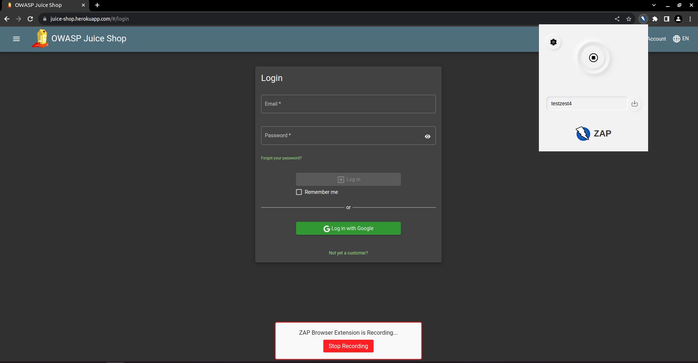

# Browser Recorder - Exploring My Google Summer of Code 2023 Journey

## My Introduction

I'm Aryan Gupta, a passionate software developer with a knack for problem-solving. I've worked with various programming languages, including Java, JavaScript, TypeScript, C++, and Python. As a seasoned full-stack developer well-versed in the MERN stack, I've always been eager to learn new things. My curiosity also extends to cybersecurity, where I'm fascinated by the challenge of uncovering online vulnerabilities.

Contact Me Here: [GitHub](https://www,github.com/aryangupta701) | [LinkedIn](https://www.linkedin.com/in/aryan-gupta-78273a1b6/) | [Twitter](https://twitter.com/aryangupta_701)

## Embarking on a New Adventure with Google Summer of Code 2023

This summer, I embarked on an amazing adventure: Google Summer of Code 2023. For a developer like me, this program is the epitome of innovation and learning. What could be more exciting than collaborating with brilliant minds from around the world on projects that push the boundaries of technology? As I delved into the program, I found myself drawn to an exceptional project: the ZAP Browser Recorder.

## The Challenge

Imagine this scenario: you're a web developer or a cybersecurity enthusiast, determined to ensure a website's security by using the renowned Zed Attack Proxy (ZAP). But, before you even start testing for vulnerabilities, you need to navigate through various pre-task activities like logging in or setting up a user session. These activities not only consume valuable time but can also lead to frustration, hindering the overall testing process. This is where the ZAP Browser Recorder project comes in. By automating the script generation process, this project aims to streamline the website testing process, making it more efficient and user-friendly.

## Streamlining Website Testing: Introducing the ZAP Browser Recorder Project

In the ever-evolving landscape of web development and cybersecurity, the importance of comprehensive testing cannot be overstated. However, testing websites often involves repetitive pre-task activities like logging in, which can be time-consuming and cumbersome. Recognizing this challenge, the ZAP Browser Recorder project sets out to revolutionize the way websites are tested by addressing the inconvenience users face during these initial steps.

## The Solution

Enter the ZAP Browser Recorder project - a visionary solution to this often-overlooked challenge. The project's primary goal is to streamline the website testing process, making it more efficient and user-friendly. At its core, the ZAP Browser Recorder aims to provide a seamless bridge between user interactions and ZAP's capabilities.

The proposed solution is simple yet powerful: a browser extension that records user interactions while navigating a website. These interactions are then intelligently transformed into a Zest script, a human-readable format used in ZAP. This script is generated in JSON format, ensuring compatibility and ease of use with ZAP's existing infrastructure. This innovative approach eliminates the need for manual scripting, allowing users to focus solely on testing for vulnerabilities. 

## The ZAP Browser Recorder Project: A Closer Look

The ZAP Browser Recorder project is comprised of two main components: the browser extension and the client add on. The browser extension is responsible for recording user interactions, while the client add on facilitates communication between the browser extension and ZAP. Together, these components form a cohesive solution that streamlines the website testing process. 

As of now the browser extension supports recording mainly the following types of user interactions: 

1. Clicking
2. Typing
3. Frame Switches 

Here is how the browser extension looks like:

## Client Add On

The client add belongs to the ZAP extensions which helps to integrate with the browser extension. The client add on is responsible for the following tasks:

* Responsible for the communication between the browser extension and the ZAP. 
* Used by the Zest Addon to record the user interactions and generate the Zest script.

## Integration with Zest AddOn 

The Zest Addon is extended to provide a new record type called `Client (browser) side script`. This record type is used to record the user interactions and generate the Zest script. The Zest Addon leverages the power of the client add on and the browser extension to record the user interactions and generate the Zest script. 

Here is how the Zest Record Dialoge looks like:

## Features and Benefits

The ZAP Browser Extension project offers a number of features and benefits, including:

* User Interaction Recording: The browser extension will capture user interactions as they navigate through a website, effectively creating a trail of actions.
* Automated Zest Script Generation: The captured interactions will be transformed into a Zest script in JSON format, ready for use with ZAP's testing capabilities.
* Local Script Storage: Users will have the option to save generated scripts locally, fostering reusability and enhancing collaboration.
* Seamless Integration with ZAP: The final deliverable of this project will be a fully functional browser extension that seamlessly integrates with ZAP, ensuring a smooth transition from interaction recording to vulnerability testing.

## Impact and Future Prospects

The ZAP Browser Recorder project has the potential to drastically change the landscape of website testing. By automating the script generation process and removing the barriers of repetitive pre-task activities, developers and cybersecurity professionals can focus their efforts on what truly matters: identifying and mitigating vulnerabilities. 

As this project comes to fruition, the efficiency gains in website testing are evident. The hours saved from manual scripting can now be invested in thorough security assessments, bolstering the overall cybersecurity posture of web applications. Moreover, the open-source nature of this project ensures that its benefits extend far beyond its initial implementation, fostering collaboration and continuous improvement within the development and security communities. 

## Conclusion

In conclusion, the ZAP Browser Recorder project is not just about improving efficiency - it's about empowering developers and cybersecurity enthusiasts to make the digital realm safer, one interaction at a time. As this project progresses, it stands as a testament to innovation, collaboration. 
