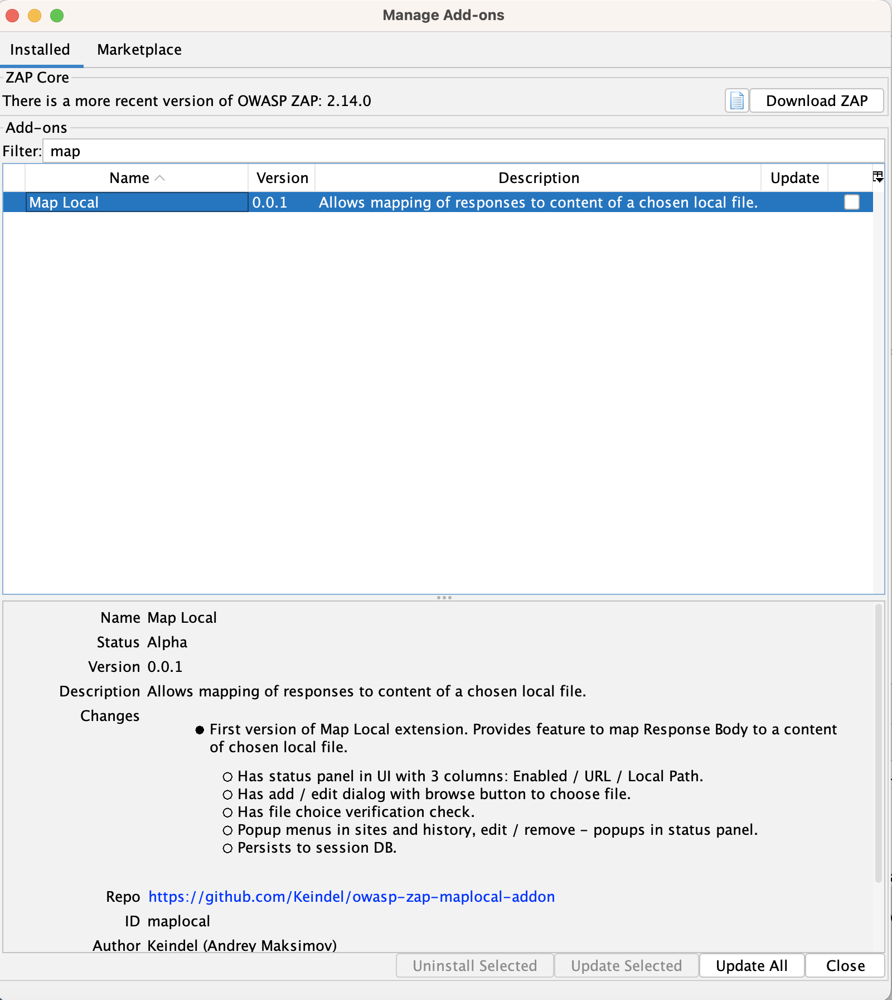
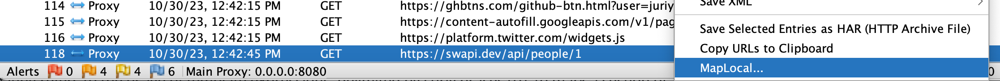
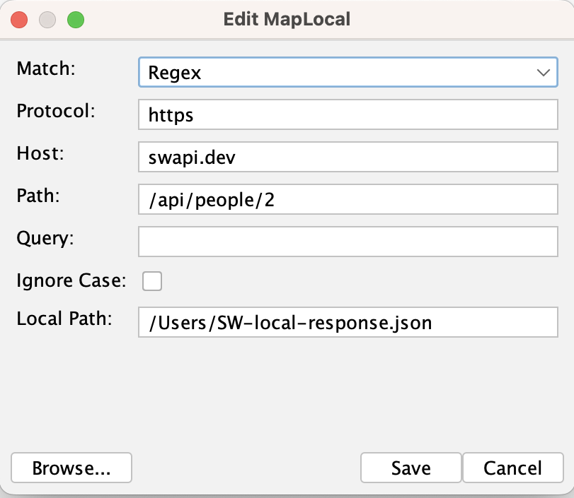
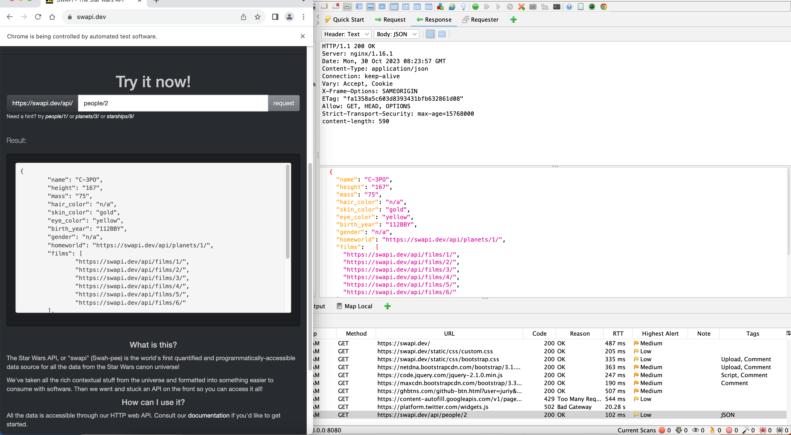
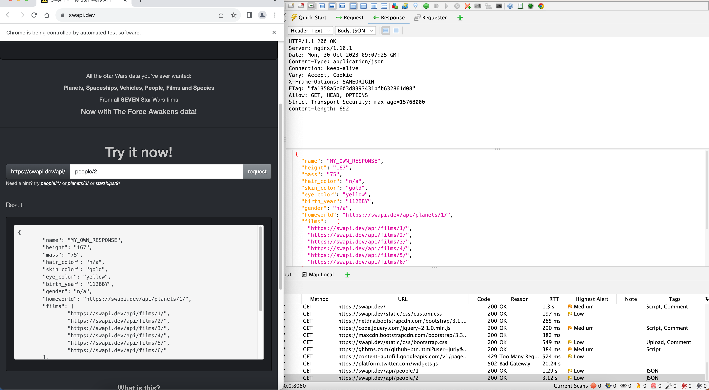

This add-on allows you to specify mappings of local resources to replace responses when using ZAP.
Feature is an analog of:
- Map Local in Charles https://www.charlesproxy.com/documentation/tools/map-local/
- Map Local in Proxyman https://docs.proxyman.io/advanced-features/map-local

This add-on creation was motivated for the case of using ZAP as a proxy for the web- and mobile-apps debug and test purposes.
It is quite common and useful feature for testing of applications and helps to get needed responses to verify correct behavior of your app without prior uploading or changing data on your server.

The tool speeds up the development process by eliminating the need for frequent uploads and making it safe to test in a controlled local environment. 
This is especially beneficial when developers need to check multiple edge cases without updating the data on the server explicitly. 
Additionally, Map Local is essential for Quality Assurance (QA) professionals and developers who want to test an application's behavior with various responses, making it a must-have for comprehensive testing and debugging.

## Installing the add-on

You can install it via the [ZAP Marketplace](/addons/).

## Using the Map Local

1. Right Mouse Button click on Site or in History Tab to call context menu. 
2. Choose "MapLocal..."
3. In the dialog window you can modify fields, if needed:  Protocol, Host, Path and Query
   

4. You must supply a path to a file. Click on "Browse" button to choose local file for mapping or just provide the path to the field "Local Path"
5. Save
6. That's it! Now you can see newly created mapping in Map Local extension status panel 🎉
   from here on all requests to the matching URL's will return responses with the content of chosen local file.
   
   Original response example:
   
   Modified response example:
   
Important notice: pay attention to possible caching in your app (e.g. such as in Chrome-browser). If you made same requests earlier it can prevent expected behavior, even though MapLocal in ZAP mapped the response body.