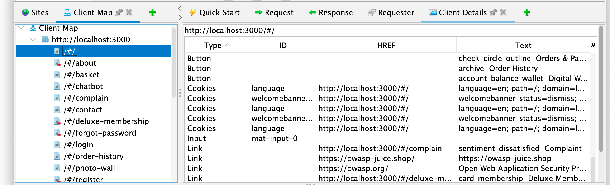
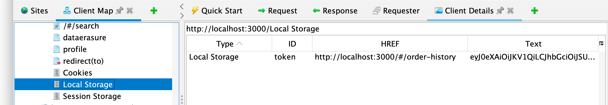
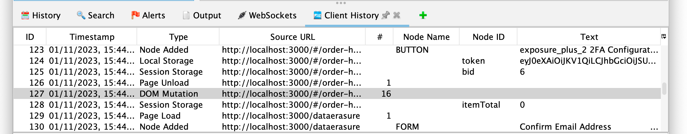

Modern web apps are very prevalent these days, and by "modern" we mean web apps which make heavy use of JavaScript in the browser (a.k.a. the client).

These apps are challenging for all security tools, including ZAP.
Historically ZAP has been a [MitM](/docs/desktop/start/features/intercept/) proxy which means it can see all of the communications between the browser and the target app, but it has not been able to see what is going on in the browser.

ZAP can explore modern apps pretty effectively using the [AJAX Spider](/docs/desktop/addons/ajax-spider/) and can find [DOM XSS](/docs/desktop/addons/dom-xss-active-scan-rule/) vulnerabilities by launching browsers. But we know that we could still do better, and based on our recent [What Should We Focus On](/blog/2023-08-29-what-should-we-focus-on/) questionnaire we know it is your top priority too.

So we have a brand new [Client Side Integration](/docs/desktop/addons/client-side-integration/) add-on (also called the Client add-on for short) which helps ZAP understand what is going on inside the browser.

### ZAP Chat Video



Staring [OWASP Juice Shop](https://owasp.org/www-project-juice-shop/)

### Client Visibility

The [Client](/docs/desktop/addons/client-side-integration/) add-on is not currently included in ZAP by default so you will need to add it via the [ZAP Marketplace](/addons/).
 	
The add-on adds 3 new tabs to ZAP which give you a lot more information about what is happening in the browser.

All of this information is available via Browser dev tools, but only for the pages being displayed.
ZAP shows you all of the essential details for the whole app, and this information is also available when automating ZAP.

#### Client Map

The [Client Map](/docs/desktop/addons/client-side-integration/#client-map) is a representation of the apps that the browser accesses, so superficially it looks similar to the [Sites Tree](/docs/desktop/start/features/sitestree/).

However if you look closely you will see that it actually includes the [URL fragments](https://en.wikipedia.org/wiki/URI_fragment) which are not sent from the browser to the target app, so ZAP doesn't normally see these.
These fragments give you a much more detailed understanding of the client side structure of the app.

The Client Map includes URLs that have not yet been visited - these have a small red ‘minus’ sign to indicate URLs that have been found in the DOM but which have not been directly accessed by ZAP.

The Client Map also includes storage nodes so you can see the contents of cookies, local storage, and session storage in the browser.

It supports a set of context menu options - these can be accessed via a "right click" or the relevant key combination for your OS.

#### Client Details

The [Client Details](/docs/desktop/addons/client-side-integration/#client-details) tab (also shown above) shows details about the node selected in the Client Map.

It allows you to understand much more about the functionality that this URL represents in the target app.

The types of data displayed include:

* Button: Buttons detected in the DOM
* Cookies: Cookies set in the browser
* FORM: Forms detected in the DOM
* Input: Input elements detected in the DOM
* Link: Links detected in the DOM
* Local Storage: Data set in [Local Storage](https://developer.mozilla.org/en-US/docs/Web/API/Window/localStorage) in the browser
* Session Storage: Data set in [Session Storage](https://developer.mozilla.org/en-US/docs/Web/API/Window/sessionStorage) in the browser

#### Client History

The [Client History](/docs/desktop/addons/client-side-integration/#client-history) tab shows all of the client side events sent from the browser extension to ZAP.

In addition to the data displayed in the Client Details tab it also includes:

* DOM Mutation: Browser [MutationObserver](https://developer.mozilla.org/en-US/docs/Web/API/MutationObserver) event
* Node Added: A DOM node added to the specified URL
* Page Load: Browser [load](https://developer.mozilla.org/en-US/docs/Web/API/Window/load_event) event
* Page Unload: Browser [unload](https://developer.mozilla.org/en-US/docs/Web/API/Window/unload_event) event
 
### AJAX Spider Enhancement

While the AJAX Spider is an effective way to explore modern web apps we know that there are some JavaScript based controls that it struggles with.
This add-on [enhances](/docs/desktop/addons/client-side-integration/ajax-scan/) the AJAX Spider and if it finds in scope URLs in the DOM that have not been accessed by the AJAX Spider then it will directly request those URLs.
This means that ZAP may explore your modern apps more effectively.

If you have a modern app and you know the AJAX Spider does not completely explore it then try it with this new add-on.

We score how well the Client add-on does in the regular [ZAP vs Crawl Maze](/docs/scans/crawlmaze/) scan.
Note that the Client column only shows URLs found by the Client add-on but NOT the AJAX Spider.

### The Browser Extension

The Client add-on gets all of the data from the browser via a ZAP Browser Extension which it installs in Firefox and Chrome.
The Browser Extension is (of course) open source: https://github.com/zaproxy/browser-extension

### Future Plans

We plan to enhance the Client add-on to support things like:

* Client side passive scanning
* Client side active scanning
* Storing client data in the ZAP session

### Feedback

We would love to hear your feedback about this add-on, for example:

* Does it cause problems on any of your web apps?
* Does it display all of the information clearly
* What else would you like it to do?

Let us know via the ZAP User Group: conversation link to be added once this blog has been published..
