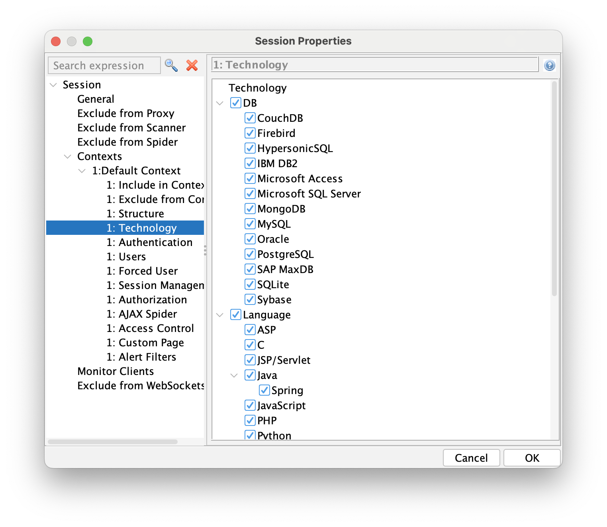
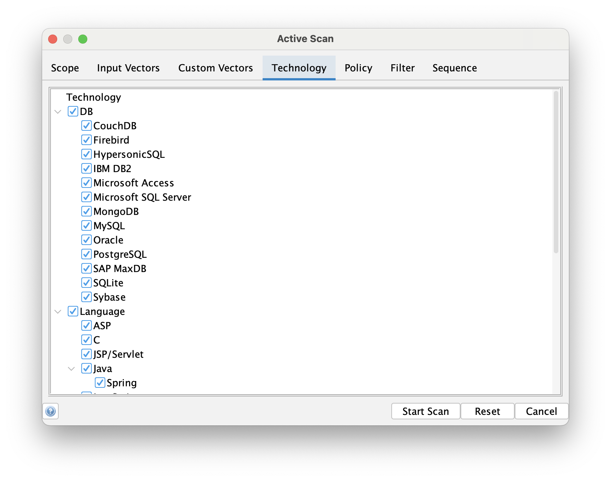

By default ZAP performs "black box" testing - it makes no assumptions about the target application.

However if you actually know what technologies the target uses then you can tell ZAP, and this can have a significant benefit.

### Speed

Many of the ZAP scan rules target specific technologies, such as specific SQL servers, protocols like LDAP, and operating systems like Linux.

If those technologies are not present in your target then trying to attack them is just a waste of time. A MySQL specific injection attack is not going to work if MySQL is not used!

To see what impact that could have we ran all of the ZAP alpha, beta, and release status active scan rules against a test app, first with no technology configured and second with all technology turned off.

The second scan took around 30% of the time taken when all technologies were enabled, a very significant improvement.

### How to Define Technology

In most cases you will want to define a [Context](/docs/desktop/start/features/contexts/) in order to configure the technology associated with it.

#### Desktop UI

Once you have defined your Context then you can configure the technology in the corresponding screen:




You can also define the technology when running the Active Scanner via the [Advanced Options](/docs/desktop/ui/dialogs/advascan/#technology):



This is an ideal option if you want to perform some specific tests, perhaps with a higher than normal [strength](/docs/desktop/ui/dialogs/scanpolicy/#strength).

#### Packaged Scans / GitHub Actions

The [Packaged Scans](/docs/docker/), and their associated [GitHub Actions](https://github.com/marketplace?query=zap&verification=verified_creator), all support a `-n context_file` option.

It is recommended that you generate this context file via the ZAP Desktop. If you do that then you can define the corresponding technologies that the context uses.

#### Automation Framework

Contexts, and the technology associated with them, are defined in the [environment](/docs/desktop/addons/automation-framework/environment/). You just need to list the technologies which you know do not apply:

```yaml
      technology:
        exclude:
        - Db
        - C
        - PHP	
```

The latest list of technologies targeted by ZAP scan rules are listed on the [Technologies](/techtags/) page. This page also links from the technologies to the rules which target them.


You only need to supply the last names, although supplying the full names (such as `Language.C` will still work.
Technologies can be added dynamically by scan rules so this list can change in-between ZAP full releases.

#### API

The ZAP API supports technology configuration via the endpoints:

* [/context/view/technologyList/](/docs/api/#contextviewtechnologylist) : Lists the names of all built in technologies
* [/context/view/includedTechnologyList/](/docs/api/#contextviewincludedtechnologylist) : Lists the names of all technologies included in a context
* [/context/view/excludedTechnologyList/](/docs/api/#contextviewexcludedtechnologylist) : Lists the names of all technologies excluded from a context
* [/context/action/includeContextTechnologies/](/docs/api/#contextactionincludecontexttechnologies) : Includes technologies with the given names, separated by a comma, to a context
* [/context/action/excludeContextTechnologies/](/docs/api/#contextactionexcludecontexttechnologies) : Excludes technologies with the given names, separated by a comma, from a context
* [/context/action/includeAllContextTechnologies/](/docs/api/#contextactionincludeallcontexttechnologies) : Includes all built in technologies in to a context
* [/context/action/excludeAllContextTechnologies/](/docs/api/#contextactionexcludeallcontexttechnologies) : Excludes all built in technologies from a context

### Why Not Define the Technology?

There are various reasons why you might not want to define the technology:

* You are not sure which technology is being used by the app.
* You are not sure when technology is being used by apps the target app integrates with.
* You think the technology might change over time and you do not want to maintain that list in your security test environment.

### Dynamic Technology Detection

If you use other tools such as [SAST](https://owasp.org/www-community/Source_Code_Analysis_Tools) and [SCA](https://owasp.org/www-community/Component_Analysis) then you way be able to determine the technology in use by an application dynamically.

We are not aware of any such tools which generate output suitable for feeding directly into ZAP at this time.
If you learn of any, or implement your own mappings, then please [let us know](https://groups.google.com/group/zaproxy-users)!