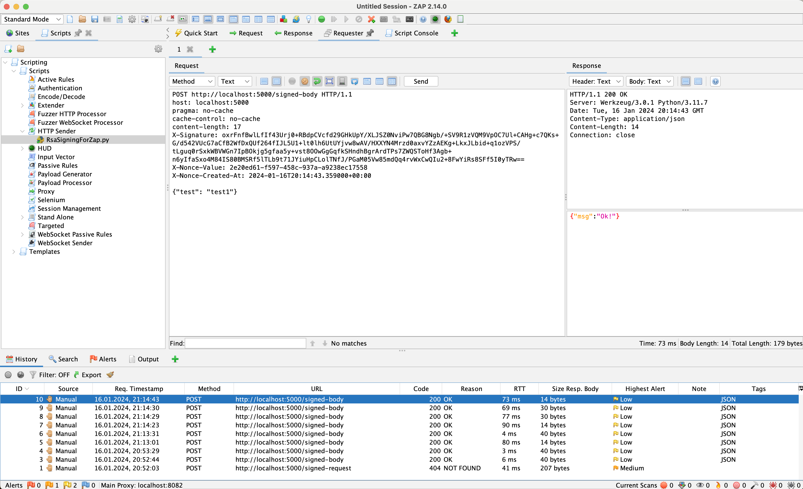
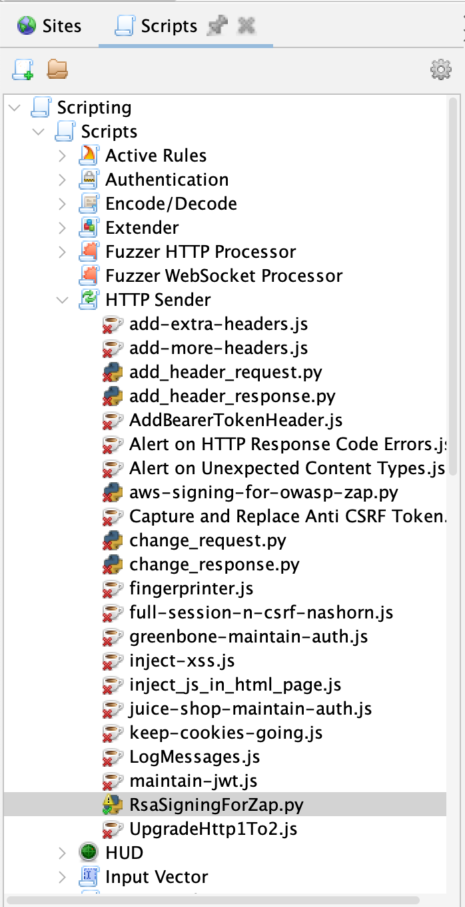
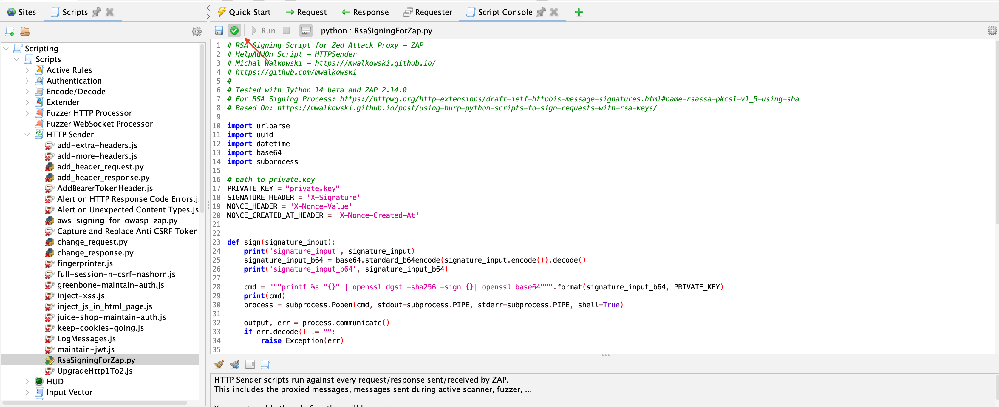
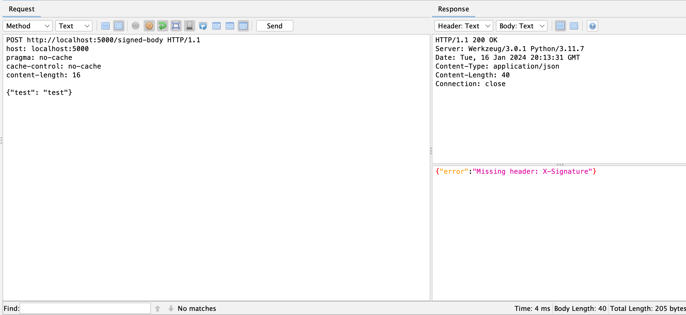
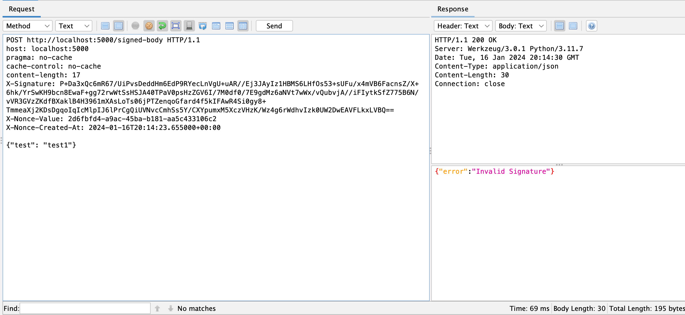
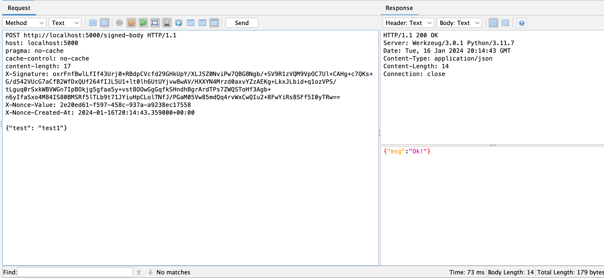

In the community-scripts repository, a new script is now available that enables signing of outgoing requests using RSA keys. The script was written at the suggestion of [Simon Bennetts](https://www.zaproxy.org/docs/team/psiinon/) based on the article ["Using Burp Python Scripts to sign requests with RSA keys."](https://mwalkowski.github.io/post/using-burp-python-scripts-to-sign-requests-with-rsa-keys/) This script proves useful when testing applications that require signing requests with RSA keys. The need for writing this script arose during the implementation of a project where the API was used for communication, among other things, with a mobile application. The mobile app transmits sensitive data, such as personal information and credit card data, to the backend. For obvious reasons, this data must be protected from modification. The mechanism employed in the examined application aims to hinder attackers from manipulating requests and further exploitation. At the same time, the applied mechanisms made it challenging to conduct penetration tests. In the analyzed software, the author implemented two security mechanisms. Firstly, in the requests, two additional headers can be observed, 'X-Nonce-Value' and 'X-Nonce-Created-At,' designed to protect against replay attacks. Secondly, there's a third 'X-Signature' header, securing the integrity of the transmitted message using an RSA signature.

The script works as follows:
1. It adds a nonce value to the request using uuid4 (X-Nonce-Value).
1. It adds the current date to the request (X-Nonce-Created-At).
1. It generates a digital signature for the request using the private key, method, path, message body, nonce value, and current date.
1. It adds the digital signature to the request.

## Installation Instructions
To use the script, you need to install the community-scripts repository. The easiest way to install in  ZAP is by installing the "Community Scripts" add-on from the ZAP Marketplace.

## Usage Instructions
To use the script for signing a request, select the Scripts tab, then expand HTTP Sender, and choose RsaSigningForZap.py.


For the script to function correctly, you need to set the **PRIVATE_KEY** parameter. This parameter should contain the absolute path to the RSA private key that you want to use for signing your requests. Afterward, upon running, the script will automatically add missing headers and the signature.


## Additional Info
The default header names can be easily changed based on your needs by editing the following lines of code at the beginning of the file:
```python
SIGNATURE_HEADER = 'X-Signature'
NONCE_HEADER = 'X-Nonce-Value'
NONCE_CREATED_AT_HEADER = 'X-Nonce-Created-At'
```
## Example of Use
The screenshot below illustrates an attempt to send a request that did not include additional headers. As you can see, the server indicated their absence and did not process the message.


In the screenshot below, another attempt to send a request is presented. This time, the required headers were added; however, a change in the message body resulted in a mismatch with the signature, causing the server to reject the message as well.


The screenshot below shows the use of the written code. The headers nonce and signature are correct, as evidenced by the proper response received from the server.


You can find more technical details about the script at this [link](https://mwalkowski.github.io/post/zed-attack-proxy-zap-scripting-and-request-signing-with-rsa-keys).  Thanks for reading! 😁