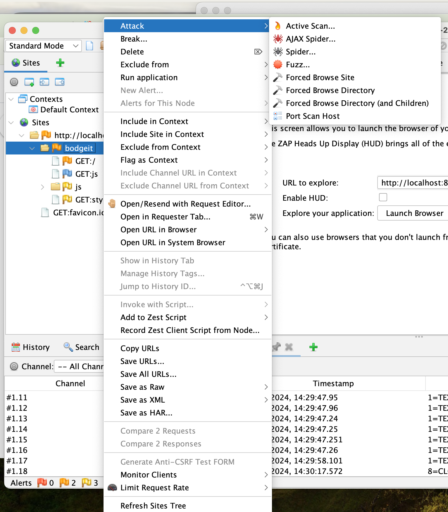
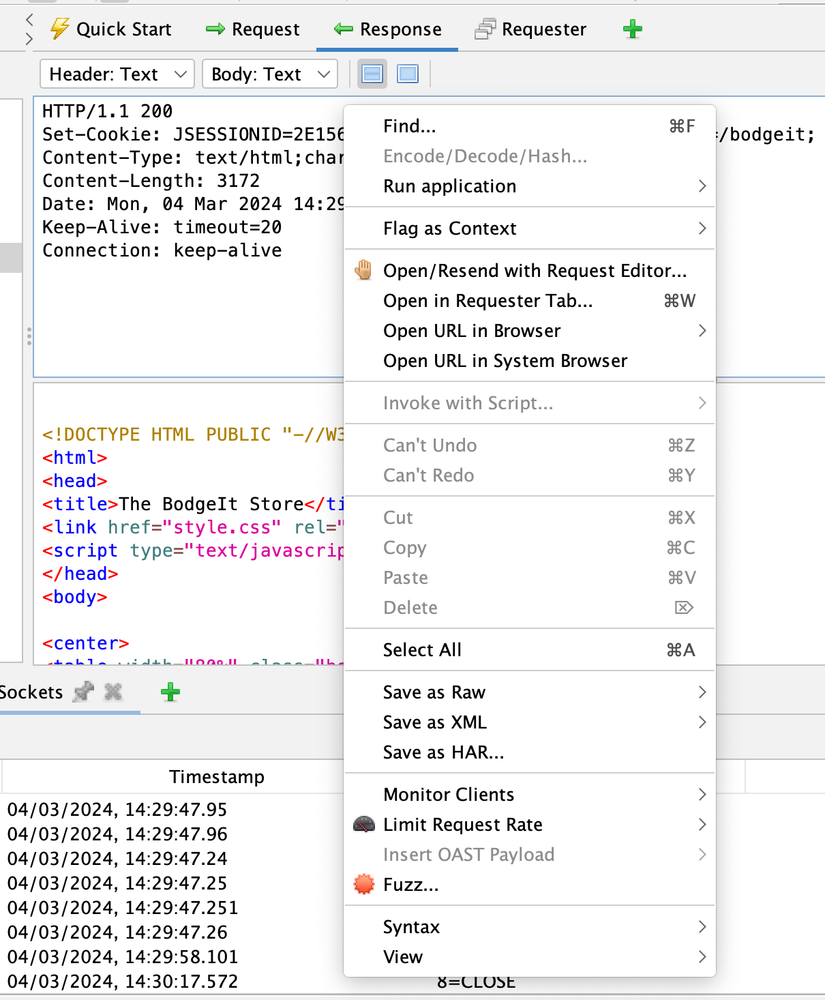

## Highlights

### ZAP Desktop Context Menus

All of the ZAP desktop context menus have been restructured to make them easier to use.

As this has required core changes the new menus cannot be updated in 2.14.0.
However they are available in the latest [weekly release](/download/#weekly) and will of course be in the next full ZAP release.

The new Sites context menu:

And the new Request context menu:
 

### OWASP Docker Org Depreciation

From today we will no longer be updating the ZAP releases in the OWASP Docker Hub organisation.

Please change to use `ghcr.io/zaproxy/zaproxy` or `softwaresecurityproject` as per the [Downloads page](https://www.zaproxy.org/download/#docker).

### ZAP Funding

A lot of time and effort has once again been spent on securing ZAP's future - expect a major announcement fairly soon!

### Google Summer of Code

Unfortunately we were not chosen to be a Google Summer of Code mentoring organisation 😞.

However the good news it that a student still wants to work on one of the proposed GSoC projects, 
[gRPC support](https://github.com/zaproxy/zaproxy/issues/7695), so we will be mentoring them outside of GSoC :grin:.

If you would like to be mentored to work on ZAP then just get in touch via the [Developer Group](https://groups.google.com/group/zaproxy-develop).

## Ongoing Work

### Improved Automation Capabilities

More progress has been made on a new GitHub Action which will support the [Automation Framework](/docs/automate/automation-framework/).

### Alert Details and Examples

All of the [alerts](/docs/alerts/) are being reviewed and where necessary updated to ensure they have 
up to date details and examples.

## Website Updates

The following new pages were added to the website in January.

* Blog: [ZAP Professional Services?](/blog/2024-02-19-zap-professional-services/)
* Blog: [ZAP Updates - January 2024](/blog/2024-02-02-zap-updates-january-2024/)

## New Contributors

A very warm welcome to the people who started to contribute to ZAP this month!

* [Biplav Oraon](https://github.com/biplavoraon)
* [Jeremy Bonghwan Choi](https://github.com/jeremychoi)
* [Roberto Polli](https://github.com/ioggstream)

## GitHub Pulse
Here are some statistics for the two main ZAP repositories:

[zaproxy](https://github.com/zaproxy/zaproxy/pulse/monthly)  
Excluding merges, 3 authors have pushed 7 commits to main and 7 commits to all branches. On main, 63 files have changed and there have been 619 additions and 378 deletions. 

[zap-extensions](https://github.com/zaproxy/zap-extensions/pulse/monthly)  
Excluding merges, 11 authors have pushed 65 commits to main and 65 commits to all branches. On main, 332 files have changed and there have been 3,149 additions and 1,038 deletions. 

A total of [76 human PRs were merged](https://github.com/search?q=org%3Azaproxy+type%3Apr+-author%3Azapbot+-author%3Aapp%2Fdependabot+sort%3Aupdated-asc+closed%3A2024-02+is%3Amerged&type=pullrequests) on the ZAP repos.

## Released add-ons - Full Changelog
In February 2024, we released updated versions of 16 add-ons:

##### Active scanner rules
**v63**  
Changed
- Maintenance changes.

Added
- The SQL Injection scan rule now includes a MySQL/MariaDB generic error message.

##### Active scanner rules (beta)
**v51**  
Changed
- The following scan rules now include example alert functionality for documentation generation purposes (Issue 6119):
    - Backup File Disclosure
    - Httpoxy - Proxy Header Misuse
    - Anti-CSRF Tokens Check
    - HTTP Parameter Pollution
    - Cross-Domain Misconfiguration 
- Alerts from the HTTP Parameter Pollution scan rule are now raised with Low confidence.
- Updated reference for scan rules (Issue 8262):
    - Session Fixation
    - Cross-Domain Misconfiguration 
- Add website alert links to the help page (Issue 8189).

##### Authentication Helper
**v0.12.0**  
Changed
- Handle traditional apps better in authentication detection dialog.
- Make cookies set in auth request available to header based session management.

Fixed
- Correct HTTP field names shown in diagnostic data.

##### GraphQL Support
**v0.23.0**  
Added
- Video link in help for Automation Framework job.
- Website alert links to the help page (Issue 8189).

Changed
- Maintenance changes.

Fixed
- Fix graphql parameter injection in URL query.

##### Linux WebDrivers
**v73**  
Changed
- Update ChromeDriver to 122.0.6261.94.

**v72**  
Changed
- Update ChromeDriver to 122.0.6261.69.

**v71**  
Changed
- Update ChromeDriver to 122.0.6261.57.

##### MacOS WebDrivers
**v73**  
Changed
- Update ChromeDriver to 122.0.6261.94.

**v72**  
Changed
- Update ChromeDriver to 122.0.6261.69.

**v71**  
Changed
- Update ChromeDriver to 122.0.6261.57.

##### Network
**v0.14.0**  
Changed
- Notify proxy listeners concurrently, might break listeners that do not correctly handle concurrency.
- Update dependencies.

Removed
- Remove legacy options panels that helped the user find the new options panels:
  - Client Certificate
  - Connection
  - Dynamic SSL Certificates
  - Local Proxies

Fixed
- Accept rate limit rule's group by in lower case, when handling the API requests.
- Prevent configuration of the outgoing HTTP/SOCKS Proxy with the address of one of the Local Servers/Proxies, as it would lead to unintended request loops (Issue 5308).
- Fix exception while proxying NTLM authentication (Issue 7685).

##### Passive scanner rules
**v56**  
Added
- Website alert links for Passive Scan Rules (Issue 8189).

Changed
- Maintenance changes.
- The following rules now include example alert functionality for documentation generation purposes (Issue 6119):
    - Timestamp Disclosure - Unix
    - Hash Disclosure
    - Cross-Domain Misconfiguration
    - Weak Authentication Method
    - Reverse Tabnabbing
    - CSRF Countermeasures
- The following scan rules now have alert references (Issue 7100):
    - Weak Authentication Method
- The references for Alerts from the following rules were also updated (Issue 8262):
    - Timestamp Disclosure - Unix 
    - Hash Disclosure
    - View State Scan Rule 
    - Weak Authentication Method

##### Passive scanner rules (beta)
**v37**  
Added
- Website alert links (Issue 8189).

Changed
- Maintenance changes.

##### Report Generation
**v0.29.0**  
Fixed
- Error message to give report name.
- Issues with illegal XML characters in pdf reports (Issue 8330).
- Corrected pdf report href from #olugin to #plugin.
- Deprecated syntax in risk-confidence report.

##### Retire.js
**v0.32.0**  
Changed
- Updated with upstream retire.js pattern changes.

**v0.31.0**  
Changed
- Updated with upstream retire.js pattern changes.

Added
- Website alert links (Issue 8189).

##### Script Console
**v45.0.0**  
Added
- The scan rule functionality of scripts was moved from the ZAP core to this add-on (Related to Issue 7105).

Changed
- Maintenance changes.

Fixed
- The save button was not enabled for new scripts upon creation.

##### Selenium
**v15.19.0**  
Changed
- Update Selenium to version 4.18.1.
- Maintenance changes.

##### Spider
**v0.10.0**  
Changed
- Skip parsing of empty SVGs.
- Maintenance changes.
- Setting "Query Parameters Handling" via automation framework should now be more forgiving as to the case of the values (enums).

Fixed
- Ensure issues in one parser don't break the whole parsing process.
- Fix exception that happened with absolute dotted URLs in inlined content.

##### Wappalyzer - Technology Detection
**v21.32.0**  
Changed
- Updated with enthec upstream icon and pattern changes.
- Maintenance changes.

**v21.31.0**  
Changed
- Updated with enthec upstream icon and pattern changes.

**v21.30.0**  
Changed
- Updated with enthec upstream icon and pattern changes.
- Made UI strings and help less Wappalyzer centric and more Technology Detection focused.

##### Windows WebDrivers
**v73**  
Changed
- Update ChromeDriver to 122.0.6261.94.

**v72**  
Changed
- Update ChromeDriver to 122.0.6261.69.

**v71**  
Changed
- Update ChromeDriver to 122.0.6261.57.
