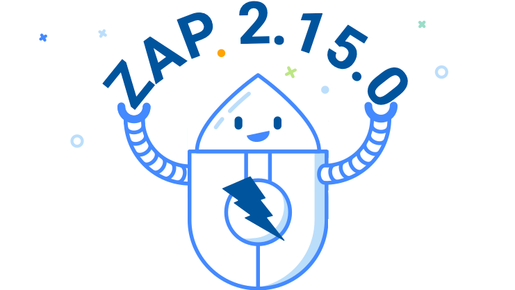
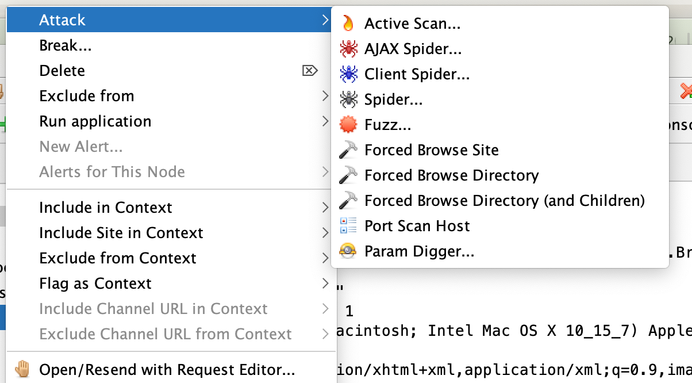

ZAP 2.15.0 has just been [released](/docs/desktop/releases/2.15.0/), and adds support for 
scripts as first class scan rules, restructured desktop menu items, and more...

This release was made possible thanks to our biggest supporter: [Crash Override](https://crashoverride.com/?zap=web).

### Scripts as First Class Scan Rules

Active and passive scan script rules can now be treated as "first class" scan rules.
This means that they can be individually referenced in an 
[active scan policy](/docs/desktop/start/features/scanpolicy/), in the 
[passive scan rules](/docs/desktop/ui/dialogs/options/pscanrules/) options, and in 
[Automation Framework](/docs/automate/automation-framework/) plans.

Scripts will need suitable [metadata](/docs/desktop/addons/script-console/scanrules/) - 
a blog post will give more details and examples in the near future.

In addition directories of scripts can now be added with [all of the scripts enabled](/docs/desktop/ui/dialogs/options/script/) -
this will make it much more straightfoward to manage script rules in automation.

### Menu Items Restructured

The desktop context sensitive menu items have been reordered, and grouped in a more logical way.
This should make it much easier to find the menu item you want, when you want it.

### Set Logging Levels

A new `-loglevel` [Command Line option](/docs/desktop/cmdline/) allows you to set the log level, 
overriding the values specified in the log4j2.properties file in the home directory.

New API calls also allow you to set and view the current logging levels:

* `Action / core / setLogLevel` : Sets the logging level for a given name
* `View / core / getLogLevel` : Gets the detailed logging config, optionally filtered by name

### Automation Framework GitHub Action

There is a brand new ZAP GitHub action - the 
[ZAP Automation Framework Scan](https://github.com/marketplace/actions/zap-automation-framework-scan).
This allows you run an [Automation Framework](/docs/automate/automation-framework/) plan in a GitHub action.

Why is this important?
Because the Automation Framework provides a [great balance](/docs/getting-further/automation/automation-options/)
between ease of use and flexibility + functionality.
 
If you want to perform any non-trivial automation with ZAP then the
[Automation Framework](/docs/automate/automation-framework/) is probably your best bet.

There are more enhancements planned for this action, including the ability to raise GitHub issues.
More details in another blog post .. coming soon!

### New Docker Hub Organisation

As mentioned in the [April 2024](/blog/2024-05-01-zap-updates-april-2024/) update, 
we have a new DockerHub organisation for the ZAP Docker images: https://hub.docker.com/u/zaproxy

We are still using the [softwaresecurityproject](https://hub.docker.com/u/softwaresecurityproject) org for 2.15.0 but we will probably not use it for the following releases.

We do recommend that you switch from `softwaresecurityproject` to [zaproxy](https://hub.docker.com/u/zaproxy) sooner rather than later.

### Support

While the main funding for ZAP development is thanks to [Crash Override](https://crashoverride.com/?zap=web),
we are continuing to work towards self sustainability.

If you need ZAP support then head over to the [Support](/support/) page. All of the money raised via the professional services will help fund ZAP development - ZAP is a non-profit open source project.
 
### Release Notes

See the [release notes](/docs/desktop/releases/2.15.0/) for dependency updates, other enhancements, and fixes.  
  
Thank you to everyone who contributed to this release.
