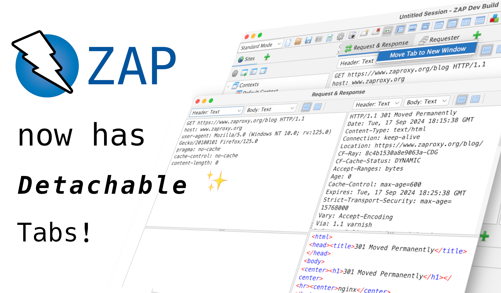

ZAP tabs can now be opened in new windows.
This includes the tabs in the workspace, tree, and information panels.

To pop out a tab into a new window, simply right click on it, and select "Move Tab to New Window".

We hope that this addition to ZAP improves its usability and allows you to better manage your workflow.
This should be especially useful for people with multiple monitors.

Try out this change by [downloading the latest ZAP weekly](/download/#weekly) and let us know what you think on the [ZAP User Group](https://groups.google.com/group/zaproxy-users)!
