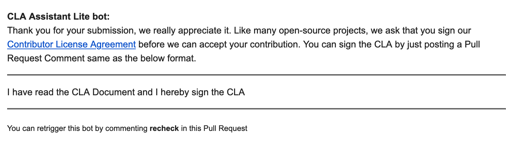

We are in the process of introducing a ZAP [Contributor License Agreement](http://oss-watch.ac.uk/resources/cla),
which is something many other large open source projects have in place.

For now we are only introducing an "Individual CLA" - we are happy to add a "Corporate CLA" if the need arises.

### Why Add a CLA?

As stated in the link above:

> The purpose of a CLA is to ensure that the guardian of a project’s outputs has the necessary ownership or grants of rights over all contributions to allow them to distribute under the chosen licence. In some cases this will mean that the contributor will assign the copyright in all contributions to the project owner; in other cases, they will grant an irrevocable licence to allow the project maintainer to use the contribution. CLAs also have roles in raising awareness of IPR issues within a project.
    
### The CLA Pull Request

The CLA will be introduced by PR [#8317](https://github.com/zaproxy/zaproxy/pull/8317). The actual wording of the CLA is heavily based on the [Netty Project Individual CLA](https://docs.google.com/forms/d/e/1FAIpQLSd7Bzje39G__THDJLRgKpQZ4gODNE26x_hZW3ofQOkgL6RGCA/viewform?formkey=dHBjc1YzdWhsZERUQnhlSklsbG1KT1E6MQ).

This PR adds a new action which runs when you submit a PR to the [zaproxy](https://github.com/zaproxy/zaproxy) repo.
One or more PRs will then add the action to the other ZAP repos. 

### The CLA Process

We're trying to make this as lightweight as possible.

The new "CLA Assistant" action uses the [cla-assistant](https://github.com/cla-assistant/cla-assistant) action and checks to 
see if the author of the PR has already signed the CLA. If they have not then it will fail the PR, explaining why:

As you will see, all you will need to do is to reply stating: 

    I have read the CLA Document and I hereby sign the CLA
    
That's it!

Hopefully you will agree that is pretty lightweight :wink:

The fact you have agreed to the CLA is recorded in the [cla](https://github.com/zaproxy/cla/) repo - as you can see, the only personal details recorded is your GitHub username.

### Past Contributions

If you have contributed to ZAP in the past we would appreciate it if you would sign the CLA.
You can do that by submitting a dummy PR to the ZAP [cla](https://github.com/zaproxy/cla/) repo and then replying to the prompt as above.
We don't need the PR to be merged so can then just close it.

### Feedback

If you have any feedback then you can either comment on PR [#8317](https://github.com/zaproxy/zaproxy/pull/8317)
or post to the associated ZAP Dev Group conversation (link to be added after this blog has been published).
