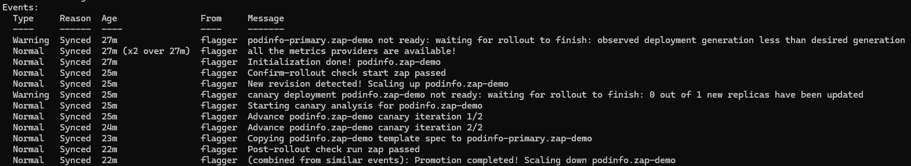
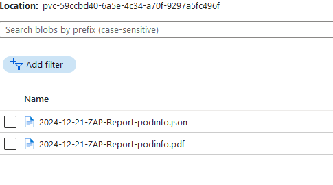
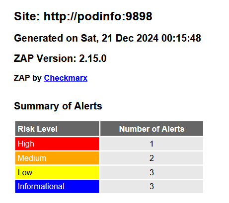
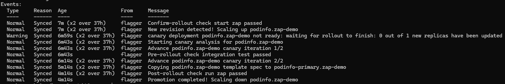
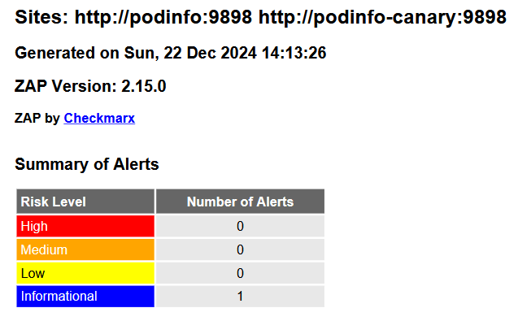

Flagger is a tool for deploying applications to Kubernetes cluster using safer patterns like Canary, Blue/Green, and A/B Testing deployments. When ZAP is integrated with the deployment process, it can scan the security of each new deployment. Furthermore, if a test suite of requests is used during the deploy, ZAP can utilize those requests for more informed attacks.

## Prerequisites
This demo assumes a few things are already available
- A Kubernetes cluster
- [Flagger](https://docs.flagger.app/) installed and running in the Kubernetes cluster 
- [Helm CLI](https://helm.sh/docs/intro/install/)
- [Kubectl](https://kubernetes.io/docs/tasks/tools/#kubectl)

## Set up the Kubernetes namespace
1. Create the `zap-demo` namespace where we will be deploying all of our resources to
    ```
    kubectl create namespace zap-demo
    ```

## Install the Flagger Load Tester with Helm
I'll be using the Flagger Load Tester to generate some traffic to a test service during deployments. I will also be using it to start ZAP off of a webhook. ZAP is currently not designed as a long running proxy. If you have alternate solutions for triggering Pods using webhooks, you can use that instead of the Flagger Load Tester.

1. Add the Flagger helm repository
    ```
    helm repo add flagger https://flagger.app
    ```
2. The Flagger Load Tester will need permission to create Jobs in the cluster, so we'll install it with the option to set up a role for itself.
    ```
    helm install flagger-loadtester flagger/loadtester --namespace zap-demo --set rbac.create=true --set rbac.rules[0].apiGroups[0]="batch" --set "rbac.rules[0].resources={jobs,jobs/log,cronjobs,cronjobs/log}" --set "rbac.rules[0].verbs={get,create,list,watch}"
    ```

## Deploy Testing Service
The podinfo container will be used as our application that Flagger will be coordinating for deployment.
1. Copy the podinfo `Deployment` and `Service` into a `podinfo.yaml` file and run `kubectl apply -f podinfo.yaml`
    ```
    apiVersion: apps/v1
    kind: Deployment
    metadata:
      name: podinfo
      namespace: zap-demo
    spec:
      selector:
        matchLabels:
          app: podinfo
      template:
        metadata:
          labels:
            app: podinfo
        spec:
          containers:
          - name: podinfod
            image: ghcr.io/stefanprodan/podinfo:6.7.0
            ports:
            - name: http
              containerPort: 9898
              protocol: TCP
            command:
            - ./podinfo
            - --port=9898
            - --level=info
    ---
    apiVersion: v1
    kind: Service
    metadata:
      name: podinfo
      namespace: zap-demo
    spec:
      type: ClusterIP
      selector:
        app: podinfo
      ports:
        - name: http
          port: 9898
          protocol: TCP
          targetPort: http
    ```

## Deploy ZAP resources
Flagger will be triggering ZAP, but we need to set up the resources ahead of time.

1. Copy the following `PersistentVolumeClaim`, substituting the `storageClassName` value with an appropriate `StorageClass` on your cluster. Save as `zap-pvc.yaml` and apply with `kubectl apply -f zap-pvc.yaml`. This is where the ZAP reports will be saved. I'm saving mine to Azure Blob Storage, which is where I will be reading the report from.
    ```
    apiVersion: v1
    kind: PersistentVolumeClaim
    metadata:
      labels:
        app.kubernetes.io/name: zap
      name: zap-pvc
      namespace: zap-demo
    spec:
      accessModes:
      - ReadWriteOnce
      resources:
        requests:
          storage: 50Mi
      storageClassName: dynamic-slrs-blob-fuse
    ```
2. Create the following `CronJob` as `zap.yaml` and apply with `kubectl apply -f zap.yaml`. We are creating it suspended, so it will never run on the schedule, however we will be using it for Flagger to create the ZAP `Job`.
    ```
    apiVersion: batch/v1
    kind: CronJob
    metadata:
      name: zap
      namespace: zap-demo
    spec:
      schedule: "* * * * *"
      suspend: true
      jobTemplate:
        spec:
          backoffLimit: 0
          template:
            metadata:
              labels:
                app.kubernetes.io/name: zap
            spec:
              containers:
              - args:
                - ./zap.sh
                - -cmd
                - -autorun
                - /zap/config/af-plan.yaml
                - -host
                - 0.0.0.0
                - -config
                - api.disablekey=true
                - -config
                - api.addrs.addr.name=.*
                - -config
                - api.addrs.addr.regex=true
                image: ghcr.io/zaproxy/zaproxy:stable
                name: zaproxy
                ports:
                - containerPort: 8080
                  name: zaproxy
                  protocol: TCP
                startupProbe:
                  failureThreshold: 3
                  httpGet:
                    path: /
                    port: 8080
                    scheme: HTTP
                  initialDelaySeconds: 60
                  periodSeconds: 10
                  successThreshold: 1
                  timeoutSeconds: 3
                volumeMounts:
                - mountPath: /zap/config
                  name: config
                - mountPath: /zap/reports
                  name: pvc
              restartPolicy: Never
              volumes:
              - name: config
                configMap:
                  name: zap-config
              - name: pvc
                persistentVolumeClaim:
                  claimName: zap-pvc
    ```
    - **Note**: ZAP's authentication features are being disabled to make this demo straightforward.
3. Create the following `Service` as `zap-service.yaml` and apply with `kubectl apply -f zap-service.yaml`
    ```
    apiVersion: v1
    kind: Service
    metadata:
      labels:
        app.kubernetes.io/name: zap
      name: zap
      namespace: zap-demo
    spec:
      ports:
      - name: zaproxy
        port: 8080
        protocol: TCP
        targetPort: 8080
      selector:
        app.kubernetes.io/name: zap
    ```

## Create ZAP Automation Plan
The ZAP Automation Plan is created as a `ConfigMap` which then Kubernetes attaches as the `af-plan.yaml` file to the ZAP Pod.

1. Create the following `ConfigMap` as `zap-config.yaml` and apply with `kubectl apply -f zap-config.yaml`
    ```
    apiVersion: v1
    kind: ConfigMap
    metadata:
      labels:
        app.kubernetes.io/name: zap
      name: zap-config
      namespace: zap-demo
    data:
      af-plan.yaml: |
        env:
          contexts:
          - authentication:
              parameters: {}
              verification:
                method: response
                pollFrequency: 60
                pollUnits: seconds
            excludePaths:
            - http://podinfo:9898/panic
            - http://podinfo:9898/status/10
            includePaths:
            - http://podinfo:9898.*
            name: Default Context
            sessionManagement:
              method: cookie
              parameters: {}
            technology:
              exclude: []
            urls:
            - http://podinfo:9898
          parameters:
            failOnError: false
            failOnWarning: false
            progressToStdout: true
          vars: {}
        jobs:
        - name: delay
          parameters:
            fileName: ""
            time: "600"
          type: delay
        - name: openapi
          parameters:
            apiUrl: http://podinfo:9898/swagger.json
            targetUrl: http://podinfo:9898
            context: Default Context
          type: openapi
        - name: activeScan
          parameters:
            context: Default Context
            maxAlertsPerRule: 0
            maxRuleDurationInMins: 0
            maxScanDurationInMins: 0
            policy: ""
            threadPerHost: 2
            user: ""
          policyDefinition:
            defaultStrength: medium
            defaultThreshold: medium
            rules: []
          type: activeScan
        - name: pdf-report
          parameters:
            reportDescription: ""
            reportDir: /zap/reports
            reportTitle: ZAP Scanning Report
            template: traditional-pdf
          risks:
          - info
          - low
          - medium
          - high
          confidences:
          - low
          - medium
          - high
          - confirmed
          sections:
          - instancecount
          - alertdetails
          - alertcount
          type: report
        - name: sarif-report
          parameters:
            template: sarif-json
            reportDir: /zap/reports
            reportTitle: ZAP Scanning Report
            reportDescription: ""
            displayReport: false
          risks:
          - low
          - medium
          - high
          confidences:
          - low
          - medium
          - high
          - confirmed
          sites: []
          type: report
    ```
    - `af-plan.yaml` is an Automation Plan that was generated using the ZAP GUI.
    - The context we are using is `http://podinfo:9898` with everything `http://podinfo:9898.*` in scope with the exclusion of `http://podinfo:9898/panic` and `http://podinfo:9898/status/10`. (podinfo has some testing features that ZAP can trigger and disrupt the pod)
- The first job is a delay, this is so that Flagger can spin up ZAP when a deployment starts, but wait until the deployment is finished before triggering attacks. Attacks during the deployment process could potentially impact metrics and trigger a rollback.
- After the delay, ZAP inspects the OpenAPI spec and then uses it to attack podinfo.
- The results is then generated as a pdf report as well as a SARIF report.

## Create the Flagger Canary
The Flagger Canary definition will provide the instructions that Flagger needs to know to perform a deployment. The one below is configured as a [Blue/Green deployment](https://docs.flagger.app/usage/deployment-strategies#blue-green-deployments). 

1. Save the `Canary` as `podinfo-canary.yaml` and apply with `kubectl apply -f podinfo-canary.yaml`
    ```
    apiVersion: flagger.app/v1beta1
    kind: Canary
    metadata:
      name: podinfo
      namespace: zap-demo
    spec:
      provider: kubernetes
      targetRef:
        apiVersion: apps/v1
        kind: Deployment
        name: podinfo
      # the maximum time in seconds for the canary deployment
      # to make progress before it is rollback (default 600s)
      progressDeadlineSeconds: 600
      service:
        port: 9898
        targetPort: http
        portDiscovery: true
      skipAnalysis: false
      analysis:
        # schedule interval (default 60s)
        interval: 30s
        # max number of failed metric checks before rollback
        threshold: 2
        # total number of iterations
        iterations: 2
        webhooks:
        - name: start zap
          type: confirm-rollout
          url: http://flagger-loadtester.zap-demo/
          timeout: 3m
          metadata:
            type: bash
            cmd: "r=$RANDOM && kubectl create job -n zap-demo --from=cronjob/zap zap-job-${r} && kubectl wait --for=jsonpath='{.status.ready}'=1 -n zap-demo job/zap-job-${r} --timeout=2m"
        - name: load test
          url: http://flagger-loadtester.zap-demo/
          timeout: 5s
          metadata:
            cmd: "hey -z 1m -q 10 -c 2 http://podinfo-canary:9898/"
        - name: run zap
          type: post-rollout
          url: http://flagger-loadtester.zap-demo/
          timeout: 3m
          metadata:
            cmd: "curl http://zap:8080/JSON/automation/action/endDelayJob"
    ```
    - The Canary targets the podinfo deployment. It then takes control over the podinfo `Service` as well as creates a `podinfo-canary` and `podinfo-primary` service.
    - When a change to the podinfo deployment is detected, Flagger will first send a webhook to our flagger-loadtester service, with instructions for it to create the ZAP job, and then wait for the job to be ready.
    - After ZAP gets started up, the loadtester is given instructions to send over some traffic to the canary service, which sends traffic to the new deployment. Flagger looks at the metrics of that traffic to ensure it was successful before moving on.
    - After it's done 2 iterations of the load test (as we've defined), Flagger spins up new pods with the new deployment configuration to replace the primary deployment.
    - After the rollout is completed, the flagger-loadtester is used once again for the webhook, which then instructs it to hit the `endDelayJob` endpoint on our ZAP deployment. Which will end the delay in the ZAP Automation Plan. (Flagger is not being used to hit the `endDelayJob` endpoint directly because it includes a payload with the content type of `application/json`)
    - Now that the Flagger rollout is complete, ZAP will begin to attack the new deployment.

## Trigger A Deployment

1. Run the following command to update the podinfo image
    ```
    kubectl set image deployment -n zap-demo podinfo podinfod=ghcr.io/stefanprodan/podinfo:6.7.1
    ```
2. Check on the `Canary` in order to get the status of the deployment
    ```
    kubectl describe canary -n zap-demo podinfo
    ```
    

3. Once the canary is successful, monitor the ZAP job to see when it completes
    ```
    kubectl get job -n zap-demo
    ```

4. Once completed, the reports should be present in the volume
    

5. And ZAP has created some results

    

## Proxy Requests Through ZAP
Integration and smoke tests can be run during Flagger's deployment process when they are triggered off of a webhook. The requests from those tests can be proxied through ZAP and ZAP can use those endpoints and payloads to start its attacks using valid requests, giving ZAP the opportunity to find more vulnerabilities. The ZAP Automation Plan and the Canary definition can be updated to support this.

1. Update  `zap-config.yaml` and apply with `kubectl apply -f zap-config.yaml`
    ```
    apiVersion: v1
    kind: ConfigMap
    metadata:
      labels:
        app.kubernetes.io/name: zap
      name: zap-config
      namespace: zap-demo
    data:
      af-plan.yaml: |
        env:
          contexts:
          - authentication:
              parameters: {}
              verification:
                method: response
                pollFrequency: 60
                pollUnits: seconds
            excludePaths:
            - http://podinfo:9898/panic
            - http://podinfo:9898/status/10
            includePaths:
            - http://podinfo:9898.*
            - http://podinfo-canary:9898.*
            name: Default Context
            sessionManagement:
              method: cookie
              parameters: {}
            technology:
              exclude: []
            urls:
            - http://podinfo:9898
            - http://podinfo-canary:9898
          parameters:
            failOnError: true
            failOnWarning: false
            progressToStdout: true
          vars: {}
        jobs:
        - name: delay
          parameters:
            fileName: ""
            time: "600"
          type: delay
        - name: replacer
          rules:
          - description: podinfo
            matchRegex: false
            matchString: podinfo-canary:9898
            matchType: req_header_str
            replacementString: podinfo:9898
            tokenProcessing: false
            url: ""
          type: replacer
        - name: activeScan
          parameters:
            context: Default Context
            maxAlertsPerRule: 0
            maxRuleDurationInMins: 0
            maxScanDurationInMins: 0
            policy: ""
            threadPerHost: 2
            user: ""
          policyDefinition:
            defaultStrength: medium
            defaultThreshold: low
            rules: []
          type: activeScan
        - name: pdf-report
          parameters:
            reportDescription: ""
            reportDir: /zap/reports
            reportTitle: ZAP Scanning Report
            template: traditional-pdf
          risks:
          - info
          - low
          - medium
          - high
          confidences:
          - low
          - medium
          - high
          - confirmed
          sections:
          - instancecount
          - alertdetails
          - alertcount
          type: report
        - name: sarif-report
          parameters:
            template: sarif-json
            reportDir: /zap/reports
            reportTitle: ZAP Scanning Report
            reportDescription: ""
            displayReport: false
          risks:
          - low
          - medium
          - high
          confidences:
          - low
          - medium
          - high
          - confirmed
          sites: []
          type: report
    ```
    - `podinfo-canary` was added to be in scope since the requests will be proxied through ZAP using the canary host.
    - The `replacer` job changes the host header so that requests sent to `podinfo-canary` will be used to attack `podinfo`

2. Update  `podinfo-canary.yaml` and apply with `kubectl apply -f podinfo-canary.yaml`
    ```
    apiVersion: flagger.app/v1beta1
    kind: Canary
    metadata:
      name: podinfo
      namespace: zap-demo
    spec:
      provider: kubernetes
      targetRef:
        apiVersion: apps/v1
        kind: Deployment
        name: podinfo
      # the maximum time in seconds for the canary deployment
      # to make progress before it is rollback (default 600s)
      progressDeadlineSeconds: 600
      service:
        port: 9898
        targetPort: http
        portDiscovery: true
      skipAnalysis: false
      analysis:
        # schedule interval (default 60s)
        interval: 30s
        # max number of failed metric checks before rollback
        threshold: 2
        # total number of iterations
        iterations: 2
        webhooks:
        - name: start zap
          type: confirm-rollout
          url: http://flagger-loadtester.zap-demo/
          timeout: 3m
          metadata:
            type: bash
            cmd: "r=$RANDOM && kubectl create job -n zap-demo --from=cronjob/zap zap-job-${r} && kubectl wait --for=jsonpath='{.status.ready}'=1 -n zap-demo job/zap-job-${r} --timeout=2m"
        - name: integration test
          type: pre-rollout
          url: http://flagger-loadtester.zap-demo/
          metadata:
            cmd: "curl --proxy http://zap:8080 http://podinfo-canary:9898/api/info"
          timeout: 3m
        - name: load test
          url: http://flagger-loadtester.zap-demo/
          timeout: 5s
          metadata:
            cmd: "hey -z 1m -q 10 -c 2 http://podinfo-canary:9898/"
        - name: run zap
          type: post-rollout
          url: http://flagger-loadtester.zap-demo/
          timeout: 3m
          metadata:
            cmd: "curl http://zap:8080/JSON/automation/action/endDelayJob"
    ```
    - Before the load test, an integration test was added. This is just a placeholder running a test suite. It's using the flagger-loadtester for the webhook and giving it instructions to send a request to the podinfo-canary service, proxying the request through ZAP. If using a container with a test suite, the proxy server can often be set using the HTTP_PROXY environment variable.
    - The outcome of the defined webhooks is that the ZAP Job gets started up, then the integration test is ran on podinfo-canary while being proxied through ZAP. The load test then runs on the podinfo-canary, and when the rollout is complete, ZAP's Automation Plan's delay is ended and ZAP uses the requests to podinfo-canary to attack podinfo.

3. To see this in action, update the podinfo image back to the previous version
    ```
    kubectl set image deployment -n zap-demo podinfo podinfod=ghcr.io/stefanprodan/podinfo:6.7.0
    ```
4. And check on the canary results
    ```
    kubectl describe canary -n zap-demo podinfo
    ```
    
5. When ZAP finished, we can take a look at the report. Since we only had one endpoint in the test suite, there's not much here.
    
6. However, it does prove that it was able to attack podinfo with the podinfo-canary request we proxied through it.
    

## Conclusion
ZAP can be integrated with Flagger in a Kubernetes cluster by triggering off a webhook. It can be used with OpenAPI specs to attack each new deployment, or requests from a test suite meant to test the canary service can be proxied through ZAP and used to attack the new deployment.
