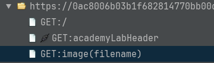

The lab tells you to retrieve the content of the `/etc/passwd` file with a path traversal vulnerability on the display of product images.

The path traversal vulnerability allows you to retrieve any file from the file system of the machine.

To do that:
- Access the URL with the proxy enabled.
- Look in the site Tree the request made by your browser.

- Notice there is a `GET: image(filename)` on those requests, that loads the image for the products.
- Send that request to the requester (`Ctrl+W`).
- Change what's behind the `filename` parameter to `../../../etc/passwd` to trigger the vulnerability.
- Change the `Body` type of the response to `Text` to see that the `/etc/passwd` is returned.

