This article describes how to solve the PortSwigger lab, “[Broken brute-force protection, IP block](https://portswigger.net/web-security/authentication/password-based/lab-broken-bruteforce-protection-ip-block)”, using ZAP rather than Burp Suite. You can find this lab on the [Authentication vulnerabilities](https://portswigger.net/web-security/authentication) learning path in the PortSwigger Web Security Academy.

If you’re familiar with Burp Suite already, it might be helpful to take a look at the [Burp to ZAP Feature Map](https://www.zaproxy.org/docs/burp-to-zap-feature-map/) for a mapping of Burp features to ZAP equivalents. However, this article assumes little to no familiarity with ZAP,  and I’ve attempted to make it as easy as possible to follow along.

## Prerequisites

To continue with the rest of the article, you’ll need the following:

1. A [PortSwigger Academy](https://portswigger.net/web-security) account
2. A [ZAP](https://www.zaproxy.org/download/) installation
3. Basic JavaScript knowledge (See [Scripts](https://www.zaproxy.org/docs/desktop/start/features/scripts/) for other scripting languages you can use in ZAP)

If you’re all set, let’s jump in!

## Have Username, Want Password

We’ll begin with a review of the lab’s instructions:

> This lab is vulnerable due to a logic flaw in its password brute-force protection. To solve the lab, brute-force the victim's password, then log in and access their account page.
> 
> - Your credentials: `wiener:peter`
> - Victim's username: `carlos`
> - [Candidate passwords](https://portswigger.net/web-security/authentication/auth-lab-passwords)

Brute-force protection is especially important for applications that rely solely on password-based authentication. Without additional guard rails like multi-factor authentication (MFA), an attacker who can make multiple or unlimited guesses of users’ login credentials could eventually gain access to their accounts.

However, even the best defense mechanisms can be undermined by poor implementation. If developers make incorrect assumptions about how users will interact with their application, they may unintentionally create vulnerabilities that attackers can exploit. For example, an attacker could manipulate normal application functionality to achieve results the developer neither intended nor expected.

In this lab, we’ll use manipulate normal application functionality to access another user’s account. The lab provides us with a specific username, “carlos”, so we do not need to guess a valid username — we can focus on brute-forcing the password.

Visit [the lab page](https://portswigger.net/web-security/authentication/password-based/lab-broken-bruteforce-protection-ip-block) and click the “Access the Lab” button to launch the test site. The URL for the lab will look something like “[https://0a19000b0319d4b784b7a40400f800ed.web-security-academy.net/](https://0a19000b0319d4b784b7a40400f800ed.web-security-academy.net/)”. You’ll want to copy it.

For eagle-eyed readers, you may notice that the URLs in the screenshots vary slightly. This is because this article was written using multiple lab instances:

&nbsp;
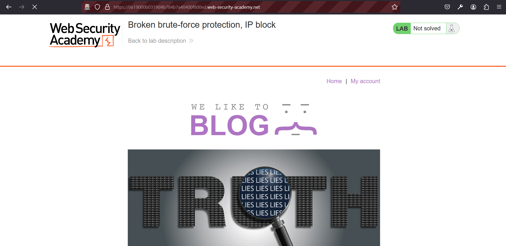
&nbsp;

Now, let’s open the lab URL we just copied via ZAP. Click *Manual Explore* in the *Quick Start* tab:

&nbsp;
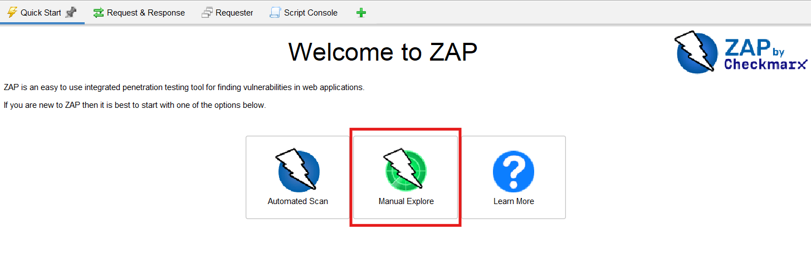
&nbsp;

Copy-paste the lab URL into the *URL to explore* field and click *Launch Browser*. Alternatively, launch your browser using the browser icon in the main toolbar:

&nbsp;
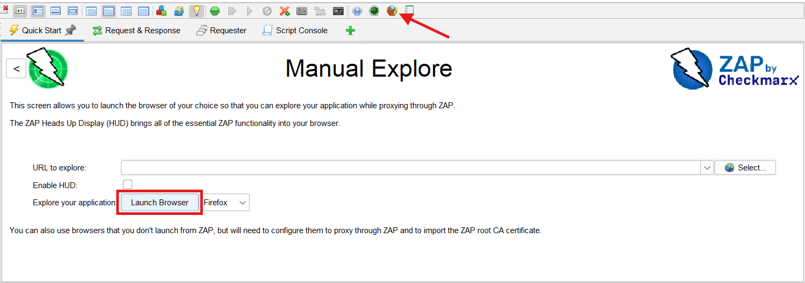
&nbsp;

<!-- > [!NOTE]
> Useful information that users should know, even when skimming content. -->

<aside>

💡 If you have any issues launching your browser from ZAP, see the following pages for help debugging the problem. Note that ZAP uses add-ons to enhance its core features, and one of these is the Selenium add-on, which provides drivers for interfacing with supported browsers. It is installed by default and exposes some configurable options:

1. [How can I fix 'browser was not found'?](https://www.zaproxy.org/faq/how-can-i-fix-browser-was-not-found/) - Zaproxy Docs (FAQ)
2. [Manual Explore](https://www.zaproxy.org/docs/desktop/addons/quick-start/#manual-explore) - Zaproxy Docs
3. [Selenium](https://www.zaproxy.org/docs/desktop/addons/selenium/) - Zaproxy Docs
</aside>

Assuming you’ve opened the lab in a browser configured to proxy through ZAP, let’s try to log in with a random password. We want to capture a POST request we can work with in ZAP. I’ll try “randompass”. We’re notified that this is an “Incorrect password”, which is expected:

&nbsp;
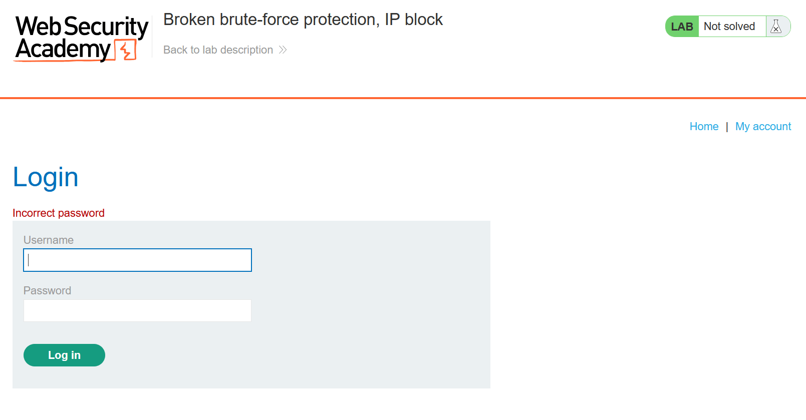
&nbsp;

We’ll come back to the captured POST request in a bit. We want to explore the site’s brute-force protection mechanisms to understand how they work and how we can bypass them.

## Probing the Defence

An app can defend against brute-force attacks by locking accounts that have attempted — and failed — too many logins. With this approach, unlocking the account might simply involve waiting a fixed amount of time, after which you can attempt another login. Or, a locked account might be unlocked by entering correct credentials, in which case bypassing the lock just requires mixing your own credentials at intervals into your wordlist.

A second way to defend against brute-force attacks is by blocking the IP address of users who attempt too many failed logins within a defined timeframe. Again, bypassing this is simple: we just need to change our IP address.

Let’s make a few requests in the Request Editor (ZAP’s equivalent of Burp Suite’s Repeater) to determine which approach we’re up against.

Head over to ZAP and open the POST request we captured earlier. You’ll find it in the Sites Tree under the *Sites* tab. It’ll look something like “POST:login()(password, username)”. You’ll want to make sure you’re selecting the correct site in case you’ve opened multiple sites:

&nbsp;
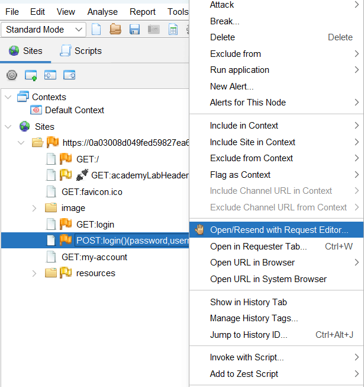
&nbsp;

We already made one login attempt earlier in the browser. We’ll make a few more to see how many requests we can make before we’re locked out.

I’ll make two more login attempts, entering “sempastic” and then “brouhaha”. We aren’t locked out yet, so we’ll keep going.

Next, I’ll try “lickety”. And this is where we hit our limit. “You have made too many incorrect login attempts. Please try again in 1 minute(s).”

The app says to wait a minute before we can try again. After one minute, the account is indeed unlocked and we can make four more login attempts before we’re locked out again. So, the magic number is three.

Naturally, we could explore other ways to bypass the account lockout. We have our credentials, `wiener:peter`:

&nbsp;
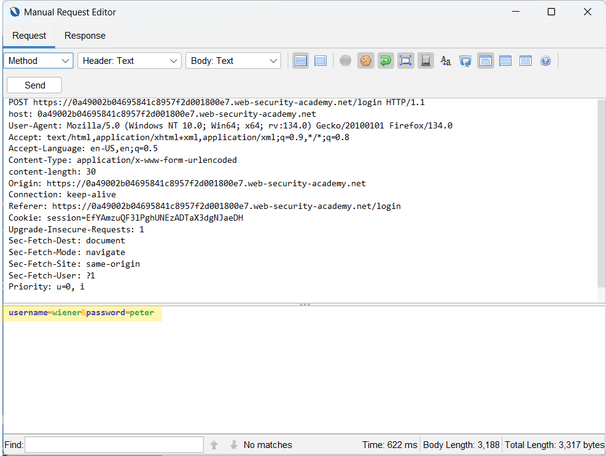
&nbsp;

However, entering correct credentials doesn’t unlock the account. We’re still shown “You have made too many incorrect login attempts. Please try again in 1 minute(s).”:

&nbsp;
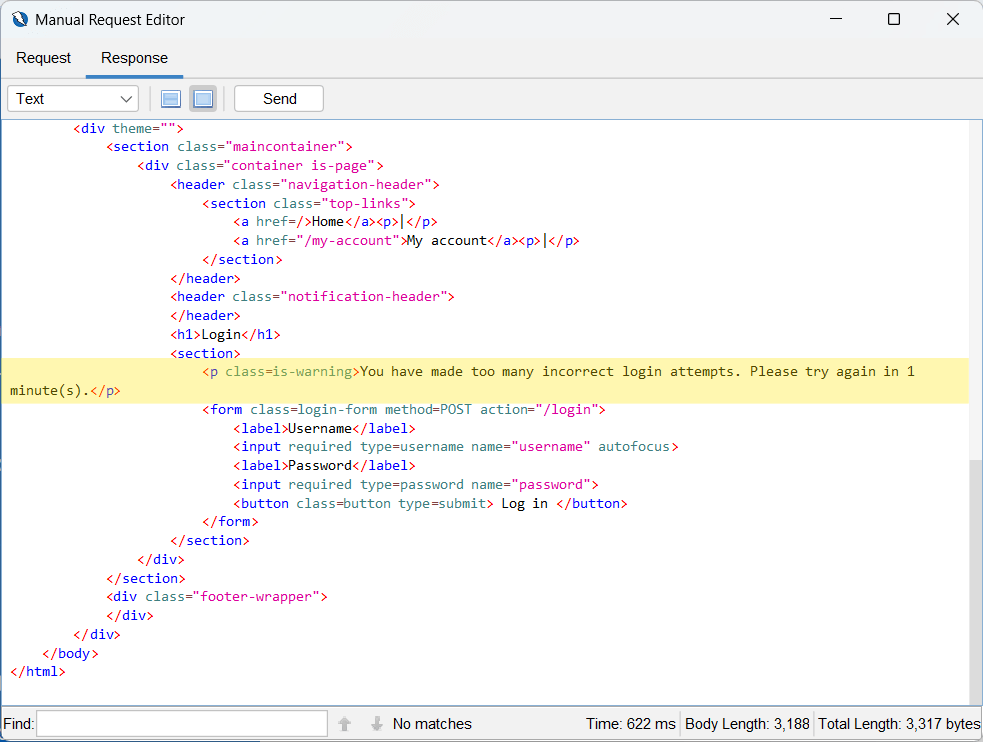
&nbsp;

What about changing our IP address? In the screenshot below,  I’ve added and set the “X-Forwarded-For” header to a random integer: 

&nbsp;
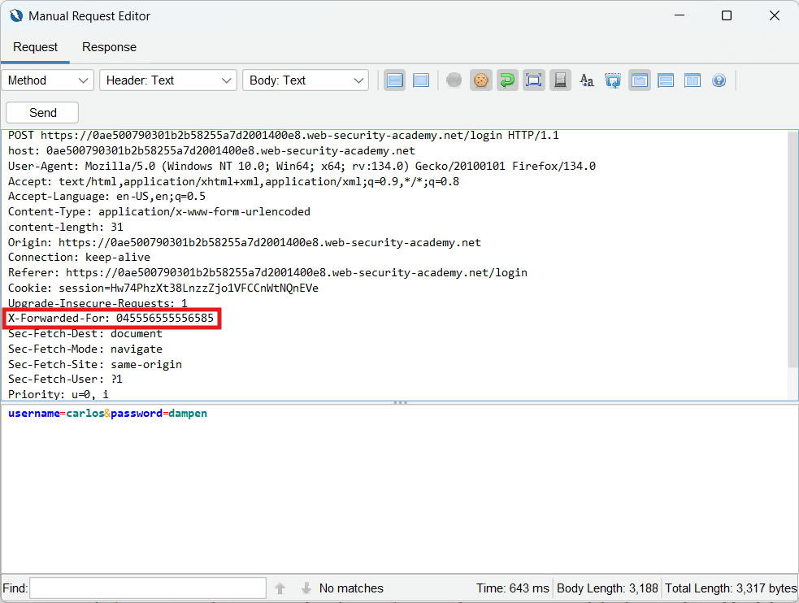
&nbsp;

However, we still get the same error message: “You have made too many incorrect login attempts. Please try again in 1 minute(s).”. This indicates that changing our IP won’t work here either. So, what we can do is wait one minute between requests.

<aside>

💡 Make sure to test with the correct credentials and the "X-Forwarded-For" header within one minute of the last failed login attempt. Since the account lockout resets automatically after one minute, waiting too long will make it difficult to verify whether the bypass works.

</aside>

## Brute-forcing the Password

ZAP allows us to automate attacks using scripts that can modify requests in real-time. If we needed a per-request delay, we could have set it directly in the Fuzzer *Options* tab (the Fuzzer is ZAP’s equivalent of Burp Suite’s Intruder):

&nbsp;
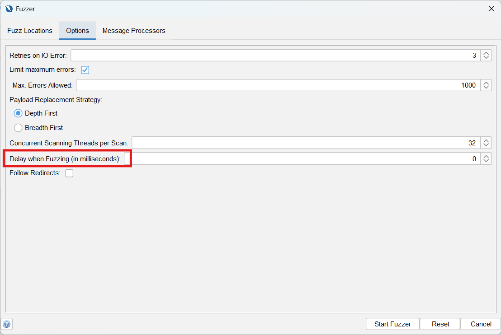
&nbsp;

Since a per-request delay is not what we want, we’ll use JavaScript to process our requests before they’re sent out to the server. Our script will add a delay after every three requests, preventing account lockouts. Let’s create the script.

### Create a New Script

We’re creating our script before opening the Fuzzer because the Fuzzer dialog cannot be backgrounded to interact with the main UI once activated.

Create a new Fuzzer HTTP Processor script by right-clicking the “Fuzzer HTTP Processor” type in the *Scripts* tab and hitting *New Script*. Alternatively, use the *New Script* icon in the top-left corner:

&nbsp;
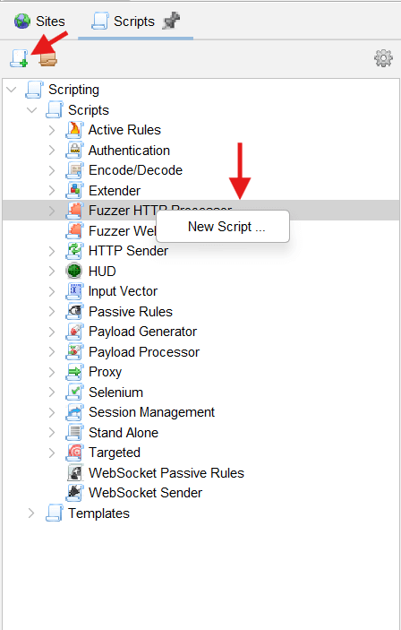
&nbsp;

This will bring up the *New Script* dialog where you can enter the name of your script (e.g, *lockout-handler.js*). You can also set a script type manually if you didn’t create your script by right-clicking directly on the type. If you selected the “Fuzzer HTTP Processor” type directly, the type field should already be populated.

Next, select “Graal.js” as the script engine:

&nbsp;
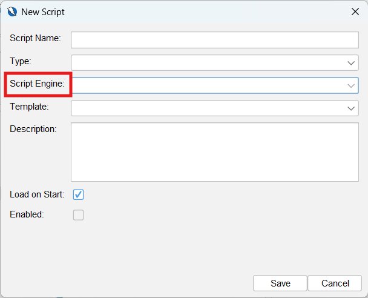
&nbsp;

Depending on the version of ZAP you have installed, you may have either the Nashorn and Graal.js JavaScript engines available, or just Graal.js. Any engine you have available works. However, since our script is written for Graal.js, you might need to tweak it slightly if you’re using Nashorn or another JavaScript engine. See [Migration Guide from Nashorn to GraalJS](https://www.graalvm.org/latest/reference-manual/js/NashornMigrationGuide/) for more details.

Finally, check the *Enabled* checkbox. Everything else can be left as-is.

### Account for the 1-Minute Lockout

Once you’ve saved your options and created a new script, navigate to the *Script Console* to view the new file. Clear the file and enter the following code snippet:

&nbsp;
```js
// Auxiliary variables/constants needed for processing.
var count = 1;

var Thread = Java.type("java.lang.Thread");

/**
    * Processes the fuzzed message (payloads already injected).
    *
    * Called before forwarding the message to the server.
    *
    * @param {HttpFuzzerTaskProcessorUtils} utils - A utility object that contains functions that ease common tasks.
    * @param {HttpMessage} message - The fuzzed message, that will be forward to the server.
    */
function processMessage(utils, message) {
    try {
        print(count);

        if (count % 3 === 0) {
            print("Pausing to avoid lockout...");
            Thread.sleep(60000); // Pause for 60 seconds
        }
    } catch (error) {
        print("Error in processMessage: " + error.message);
        throw error;
    }

    count++;
}

/**
    * Processes the fuzz result.
    *
    * Called after receiving the fuzzed message from the server.
    *
    * @param {HttpFuzzerTaskProcessorUtils} utils - A utility object that contains functions that ease common tasks.
    * @param {HttpFuzzResult} fuzzResult - The result of sending the fuzzed message.
    * @return {boolean} Whether the result should be accepted, or discarded and not shown.
    */
function processResult(utils, fuzzResult) {
    return true;
}

/**
    * This function is called during the script loading to obtain a list of the names of the required configuration parameters,
    * that will be shown in the Add Message Processor Dialog for configuration. They can be used
    * to input dynamic data into the script, from the user interface
    */
function getRequiredParamsNames() {
    return [];
}

/**
    * This function is called during the script loading to obtain a list of the names of the optional configuration parameters,
    * that will be shown in the Add Message Processor Dialog for configuration. They can be used
    * to input dynamic data into the script, from the user interface
    */
function getOptionalParamsNames() {
    return [];
}

```
&nbsp;

There are a few points to note here. First, ZAP requires specific functions to be implemented for different script types. For our Fuzzer HTTP Processor type, we have four functions to implement. We’re really only interested in `processMessage`; however, the other three functions must still be implemented and return truthy values.

<aside>

💡 Refer to the default templates for the functions that must be implemented for each script type. You can find these in the Templates section of the Scripts tab; they contain documentation comments describing each function and its parameters. You can also create new scripts from the templates. 

</aside>

`processMessage` is executed on each message before it is sent to the server. This allows us to dynamically alter our payloads or add delays between requests.

Although we didn’t need to use the `utils` and `message` parameters passed to `processMessage`, it’s worth mentioning that these parameters are injected by default when `processMessage` is called. This is similar to how the `resolve` and `reject` functions are passed as arguments to the executor function in the JavaScript Promise API. In other words, these parameters are not defined in the script’s global scope. Instead, their scope is limited to `processMessage`.

Since our script manages the entire fuzzing session and `processMessage` is executed on every message, we are able to use the `count` variable as an iteration counter to track the number of times `processMessage` is called.  Or, in other words, how many messages have been processed. After every three requests, we pause for one minute before sending the next.

Finally, because ZAP runs on the Java Virtual Machine (JVM), we have access to the Java API when using guest languages like JavaScript. Depending on how you installed ZAP, you may have manually installed a JVM beforehand, or it may have been installed automatically as a dependency. 

Our code snippet above imports the `Thread` class using `Java.type('java.lang.Thread')`. We’ve used it to implement the one-minute delay between requests. For more details on available JavaScript features and the Java APIs accessible in your script, see [GraalJS Compatibility](https://www.graalvm.org/latest/reference-manual/js/JavaScriptCompatibility/) and [Java Interoperability](https://www.graalvm.org/jdk21/reference-manual/js/JavaInteroperability/).

At this point, save the file and ensure the script is enabled if you didn’t select the *Enable* checkbox when creating the script earlier.  Disabled scripts won’t be available for selection when needed. To enable it, right-click the filename in the *Scripts* tab and select *Enable Script(s)*.

### Select a Fuzz Location, Enter the Payload

Now, we can bring up the Fuzzer dialog. Right-click the POST request we were working on in the Request Editor and select *Fuzz*. Alternatively, right-click the original captured POST request from the *Sites* tab and select *Attack* > *Fuzz*.

In the *Fuzzer Locations* tab, we can choose the position we want to fuzz and add our payload. The fuzz position (or location) here is our password field. Highlight the password value to activate the *Add* button:

&nbsp;
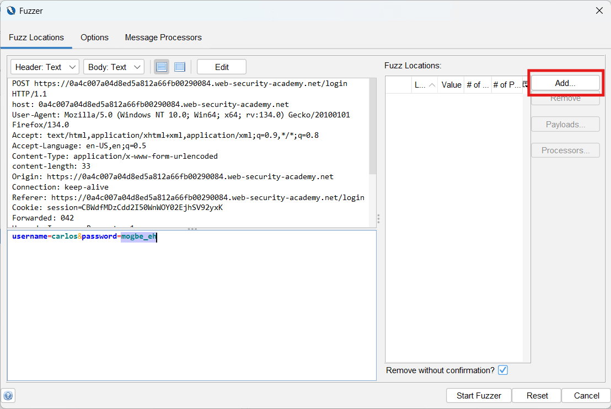
&nbsp;

Clicking *Add* will bring up the *Payloads* dialog. Here, we can enter [our password wordlist](https://portswigger.net/web-security/authentication/auth-lab-passwords). Click *Add* to open the *Add Payload* sub-dialog. Leave the default “Strings” payload generator type and copy-paste the password wordlist from the lab page into the *Contents* field:

&nbsp;
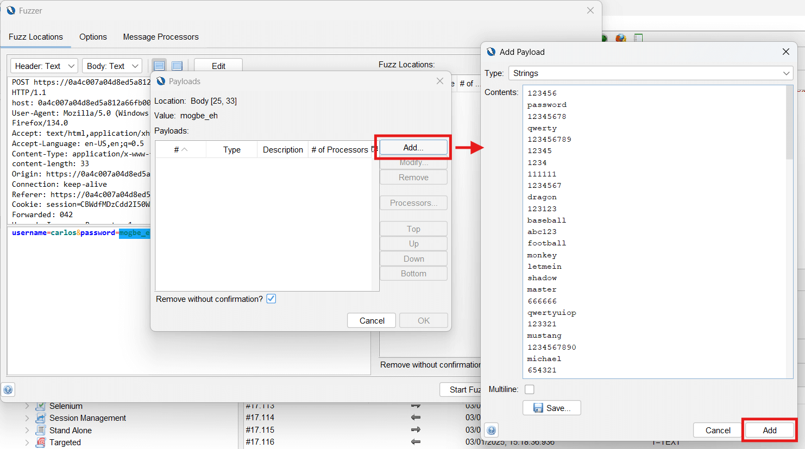
&nbsp;

Click *Okay* in the *Payloads* dialog to return to the main Fuzzer dialog.

### Add Lockout Handler Script as a Message Processor, Run Fuzzer

Finally, we want to switch to the *Message Processors* tab. Message processors can control the fuzzing process and modify messages. This is where we will add our lockout handler script. Click *Add* to bring up the *Add Message Processor* dialog and select your script:

&nbsp;
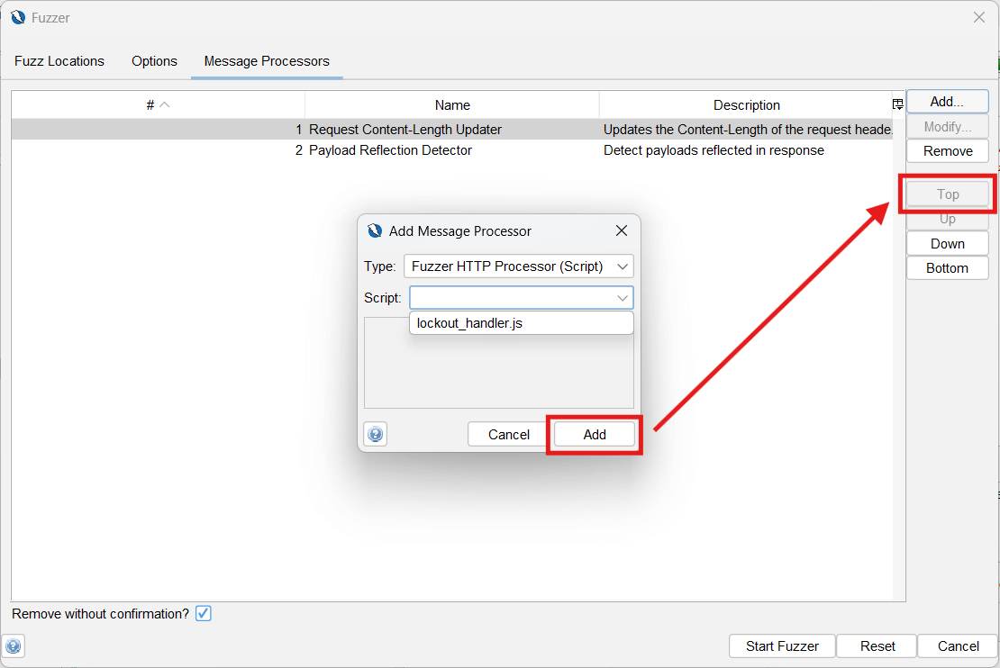
&nbsp;

You can optionally move the script to the top of the processor list. Then, click *Start Fuzzer* to run the Fuzzer.

## Have Username, Got Password

Once the Fuzzer is done, we can inspect the results. We’re looking for indications of a successful login, so we’ll sort the results in descending order using the status code column (simply “*Code”* in the UI). At the top of our sorted results is a `302 Found`, indicating a successful login:

&nbsp;
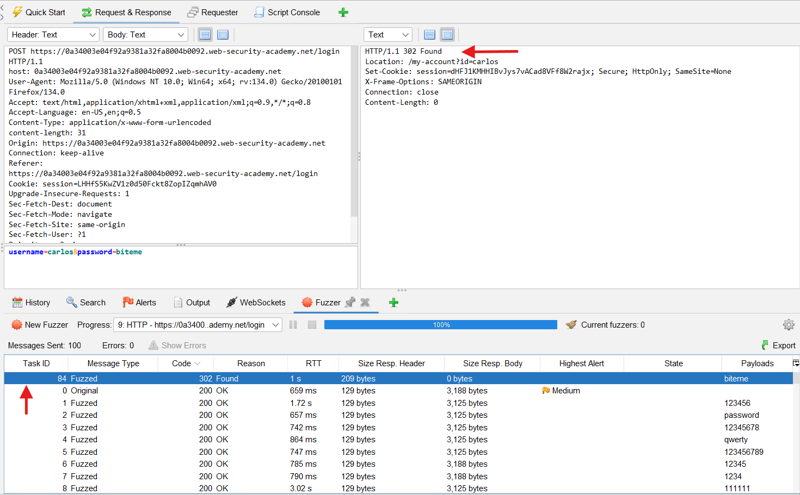
&nbsp;

Our password for our current site is “biteme”, as we can see either through the *Payloads* column or in the request body:

&nbsp;
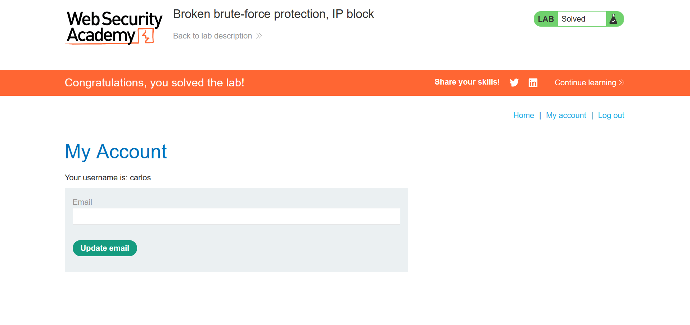
&nbsp;

We’ll confirm by logging in to solve the lab (the lab may also have been marked solved automatically after the request logged you in).

## Takeaway, Next Steps

Rate-limiting and IP blocking are common brute-force defenses, but can be bypassed when implemented poorly. Explore other labs to learn additional ways attackers can exploit authentication mechanisms and workflows. You can also find more [PortSwigger lab walkthroughs](https://www.zaproxy.org/tags/portswigger-lab/) using ZAP in the Docs.

## Resources

1.  [Authentication vulnerabilities](https://portswigger.net/web-security/authentication) - PortSwigger Web Security Academy
2. [Burp to ZAP Feature Map](https://www.zaproxy.org/docs/burp-to-zap-feature-map/) - Zaproxy Docs
3. [PortSwigger Lab Walkthroughs With ZAP](https://www.zaproxy.org/tags/portswigger-lab/) - Zaproxy Docs
4. [Zaproxy Docs](https://www.zaproxy.org/docs/)
5. [Migration Guide from Nashorn to GraalJS](https://www.graalvm.org/latest/reference-manual/js/NashornMigrationGuide/) - GraalJS Docs
6. [GraalJS Compatibility](https://www.graalvm.org/latest/reference-manual/js/JavaScriptCompatibility/) - GraalJS Docs
7. [Java Interoperability](https://www.graalvm.org/jdk21/reference-manual/js/JavaInteroperability/) - GraalJS Docs
