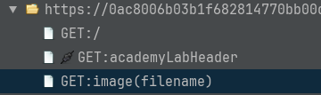

This [Portswigger Lab](https://portswigger.net/web-security/file-path-traversal/lab-simple) has a path traversal vulnerability, which allows anyone to retrieve any file from the system the webpage is hosted in. In this particular case the laboratory consist on retrieving the `/etc/passwd` file, demonstrating this way the vulnerability.

If you want to know more about Path Traversal, I suggest looking at the [ZAP Path Traversal](/docs/alerts/6-2/) alert page.

To solve the lab, you have to do the following steps:
- Access the URL provided by Portswigger, which is something like `https:[random_letter_numbers].web-security-academy.net/`, with the proxy enabled.
- Look in the Site Tree for the requests made by your browser.

- Notice there is a `GET: image(filename)` on those requests, that loads the image for the products.
- Send that request to the requester (`Ctrl+W`).
- Change the value of the `filename` parameter to `../../../etc/passwd` to trigger the vulnerability.
- In the Response tab, change the `Body` type of the response to `Text` to see that the `/etc/passwd` is returned.

Congratulations, you solved the lab!! 

Here is a video step by step with the explanations:


