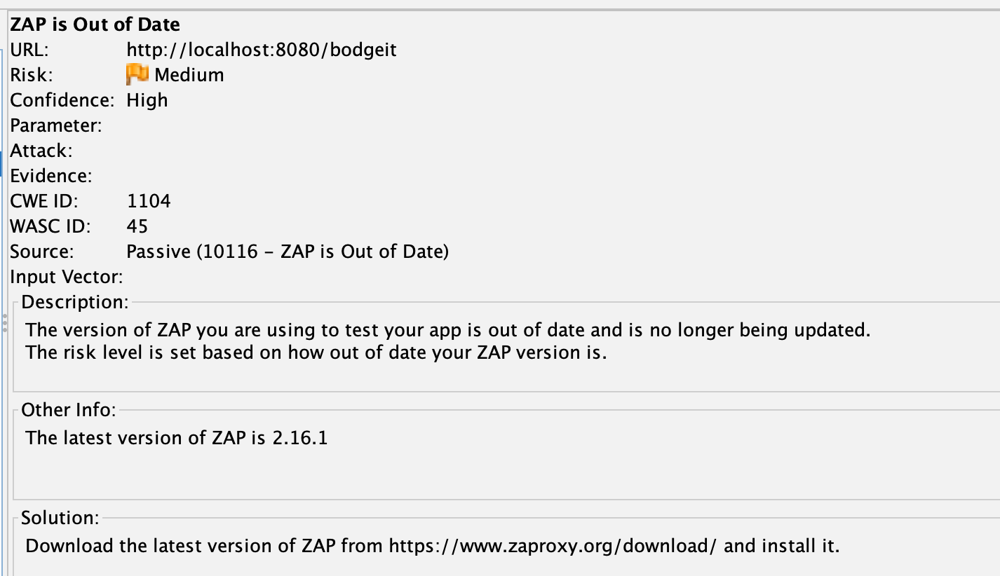

We have a new passive scan alert which we hope very few of you actually see: 
[ZAP is Out of Date](/docs/alerts/10116/).

### Why Have We Added This Rule?

If you run an old version of the ZAP Desktop (and are not using the `-silent` option), then you should see a warning like this:

However if you automate ZAP then you will not be using the desktop and so will not get this message.

Based on [our stats](/docs/statistics/bar-charts/#check-for-updates) quite a few of you are using older versions of ZAP, 
especially 2.14 and 2.15.

As we are a relatively small team we can only maintain the very latest version of ZAP, which means that anyone using an older
version will not get any updates.

In order to make this clear the new rule will raise one alert on each domain with a severity based on how many versions
out of date it is.

* 1 version: Low Risk
* 2 versions: Medium Risk
* 3+ versions: High Risk
* More than one year: High Risk (just for date stamped versions, such as the nightly or weekly releases)

### Why Raise it on All Domains?

Because in automation the alerts from ZAP are often fed into other systems, and may well be filtered to ignore the domains
that are not of interest. 

### Back-Porting

Obviously as this rule has only just been released on 2.16 then it will not be raising any alerts.

But we have started to back-port it to older releases, so if you are using one of those releases and are updating your scan rules then you should start to see these alerts.

You are of course free to ignore them, but don't say we didn't warn you!

### Feedback

Are there specific reasons why you have not upgraded from an old version of ZAP?

If so please let us know via the [User Group](https://groups.google.com/group/zaproxy-users).
