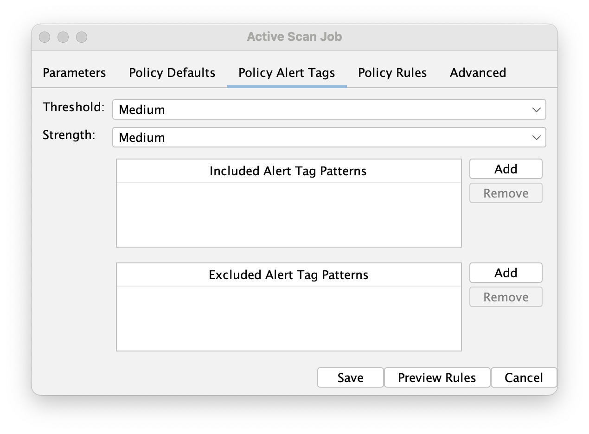

## Highlights

It has been another busy month!

### Microsoft Online Login Support

As you may well know, making authentication easier has been a big focus for us recently.

We have 2 recommended ways to handle web app authentication (as opposed to APIs):

* [Browser Based Authentication](/docs/desktop/addons/authentication-helper/browser-auth/) (BBA) - which tries to login in the same way a user would
* [Client Script Authentication](/docs/desktop/addons/authentication-helper/client-script/) (CSA) - which replays an authentication script that you have recorded in your browser

BBA only needs the login URL and the user's credentials, it then tries to identify which fields to fill in.
For complex authentication sequences you will need to use CSA.

We have recently been working with a set of ZAP users who use Microsoft Online Logins.
Initially we recommended using CSA, but it turns out that Microsoft Online Login sequences are "challenging"!

The initial screens which take the user name and password are easy to handle, but then there are a set of screens which may or may not appear, including:

* Stay Signed In
* Lets Keep Your Account Secure
* No Methods Available 

The random nature of these screens breaks CSA, we need to have predictable sequences for recordings to work.

To solve this problem we have enhanced BBA to recognise and handle the Microsoft Online Login sequences as a special case, and handle all of the combinations we know about.

Obviously if (when) Microsoft change their login flows then this will break, but so would recordings!

We have reached out to Microsoft to try to talk to the right people as we know other tools will have the same problems, but so far we have not been able to make the right connections.
If you know someone who you think might be able to help then ask them to reach out to us :grin:

If any of your apps use Microsoft Online Login then please give it a go and let us know how you get on.
If it does not succeed then please share details of the screen it fails on.

### ZAP Fork of Wavsep

We have decided to fork [wavsep](https://github.com/sectooladdict/wavsep) and plan to maintain it going forwards: https://github.com/zaproxy/wavsep

The Web Application Vulnerability Scanner Evaluation Project is a vulnerable web application designed to help assessing the features, quality and accuracy of web application vulnerability scanners.

We will be publishing another blog post soon explaining why we have done this, what we have done so far and what we plan to do next.

### Automation Framework: Policy Alert Tags

The [Automation Framework](/docs/automate/automation-framework/) activeScan and activeScan-Policy jobs now support Policy Alert Tags:

These allow you to specify Alert Tag Patterns which will define which active scan rules are used.

Look out for another blog post explaining this in more detail soon.

### Automation Framework: Stop Plan

The [Automation Framework](/docs/automate/automation-framework/) has also been updated to allow you to stop running plans.

You can stop them via a new "Stop Plan" button on the "Automation" tab in the desktop or via the API.

### Auth Diags Tab

There is a new "Auth Diags" tab which allows you to import a [JSON Authentication Report](/docs/desktop/addons/authentication-helper/auth-report-json/).

This is primarily for our benefit, but if you would like more information about it then let us know and we can cover it in more detail.

## GitHub Pulse
Here are some statistics for the two main ZAP repositories:

[zaproxy](https://github.com/zaproxy/zaproxy/pulse/monthly)  
Excluding merges, 4 authors have pushed 6 commits to main and 6 commits to all branches. On main, 30 files have changed and there have been 158 additions and 120 deletions.

[zap-extensions](https://github.com/zaproxy/zap-extensions/pulse/monthly)  
Excluding merges, 7 authors have pushed 54 commits to main and 54 commits to all branches. On main, 592 files have changed and there have been 6,221 additions and 42,449 deletions.

A total of [67 human PRs were merged](https://github.com/search?q=org%3Azaproxy+type%3Apr+-author%3Azapbot+-author%3Aapp%2Fdependabot+sort%3Aupdated-asc+closed%3A2025-08+is%3Amerged&type=pullrequests) on the ZAP repos.

## Released Add-ons - Full Changelog
In August 2025, we released updated versions of 4 add-ons:

##### Forced Browse
**v18**  
Fixed
- Error logs to always include stack trace.
- Address performance issue when checking responses.

##### Linux WebDrivers
**v154**  
Changed
- Update ChromeDriver to 139.0.7258.154.

**v153**  
Changed
- Update ChromeDriver to 139.0.7258.138.

**v152**  
Changed
- Update ChromeDriver to 139.0.7258.68.

**v151**  
Changed
- Update ChromeDriver to 139.0.7258.66.

##### MacOS WebDrivers
**v154**  
Changed
- Update ChromeDriver to 139.0.7258.154.

**v153**  
Changed
- Update ChromeDriver to 139.0.7258.138.

**v152**  
Changed
- Update ChromeDriver to 139.0.7258.68.

**v151**  
Changed
- Update ChromeDriver to 139.0.7258.66.

##### Windows WebDrivers
**v154**  
Changed
- Update ChromeDriver to 139.0.7258.154.

**v153**  
Changed
- Update ChromeDriver to 139.0.7258.138.

**v152**  
Changed
- Update ChromeDriver to 139.0.7258.68.

**v151**  
Changed
- Update ChromeDriver to 139.0.7258.66.

